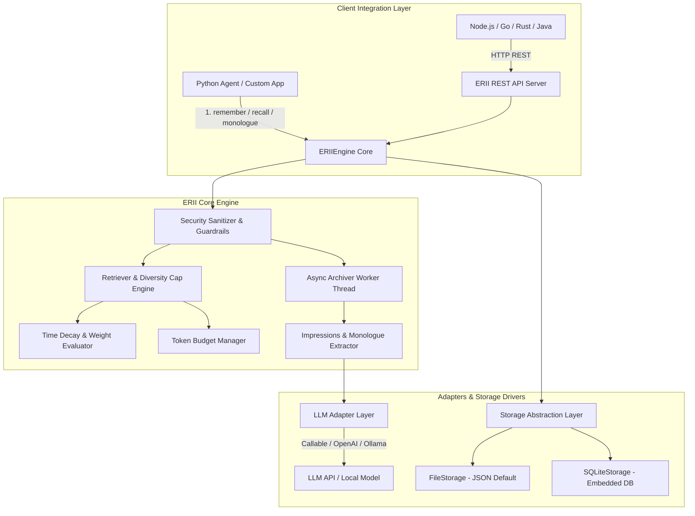

# E.R.I.I. — Experiential Recall & Impression Integration Engine
> **经验回想与印象整合引擎**

[](https://opensource.org/licenses/Apache-2.0)
[](https://www.python.org/)
[]()
[]()

**E.R.I.I.** (Experiential Recall & Impression Integration Engine) 是一款专为大语言模型（LLM）AI Agent 与虚拟人格系统设计的**解耦、轻量级、高适配长期记忆引擎**。

它放弃了传统单一向量检索容易丢失角色第一人称体验与记忆过期的弊端，创新性地结合了**“第一人称体验时间线 (Experiential Recall)”**与**“多维动态衰减印象 (Impression Integration)”**的双轨机制，并具备**零外部依赖、1行代码适配任意LLM、Token预算精控与安全反注入**防护。

---

## ⚡ 为什么选择 E.R.I.I.

| 维度 | 传统 Vector / RAG 记忆库 | E.R.I.I. 经验整合引擎 |
| :--- | :--- | :--- |
| **记忆表达机制** | 纯片段文本相似度匹配（无时间感，易失去角色人设） | **双轨制**：第一人称体验时间线 + 多维加权印象节点 |
| **遗忘与强化算法** | 无时间衰减，旧对话/垃圾数据永久占用 Context | **指数级时间衰减** ($e^{-\lambda \Delta t}$) + **Recall 自动强化重现** |
| **话题垄断防御** | 相似向量容易挤爆 Token 预算（单一话题刷屏） | **Diversity Cap 分类熔断机制**（自动保证多样性配额） |
| **框架与环境依赖** | 强绑定 LangChain/LlamaIndex 或大型向量数据库 | **零强制依赖**（采用 Python 原生 `dataclasses`，开箱即用） |
| **LLM 端适配性** | 需要复杂的 SDK 或特定的 OpenAI 接口封装 | **1 行代码通配**：支持任意 Python Callable / 私有 API / Local LLM |
| **安全与隐私** | 易受注入攻击篡改 Agent 行为，暴露隐私数据 | **Security Sanitizer** 自动防 Prompt 注入与 PII 敏感信息掩码 |

---

## 🧠 核心概念与工作原理 (Mental Model)

### 1. 双轨记忆系统 (Dual-Track Architecture)
E.R.I.I. 将记忆拆分为互补的两个维度：
- **第一人称体验时间线 (Experiential Timeline)**：记录 Agent 站在“我”的角度对交互事件的归纳（例如：*“2026-07-23 我了解了 Bob 偏好暗黑模式 IDE”*）。
- **多维动态印象节点 (Impression Nodes)**：提取分类节点（`FACT` 客观事实、`PREFERENCE` 偏好、`EVENT` 事件、`EMOTION` 情绪、`RELATIONSHIP` 关系 dynamic）。

### 2. 动态权重衰减与强化公式
记忆节点的有效权重根据时间流逝指数级衰减，同时叠加访问频次、情绪烈度与关系 boost：

$$\text{EffectiveWeight} = \min\left(\text{MaxCap}, \left(\text{BaseImportance} \times e^{-\lambda \cdot \Delta t}\right) + \text{FreqBoost} + \text{EmotionalBoost} + \text{RelBoost}\right)$$

当记忆在检索中被引用时，引擎会自动触发 **Recall Reinforcement**，提升其 Base Importance 并刷新活跃状态。

### 3. 第一人称独白/日记与“未完待续”叙事悬念 (Inner Monologue & Narrative Tension)
E.R.I.I. 允许暴露角色的第一人称心理独白与日记随笔（如 *“sakura要带我去公园我好开心”*）：
- **蔡格尼克效应（悬念保鲜）**：带有未完结标记（`is_unresolved=True`）的心理状态会挂起时间衰减，优先在日记时间轴中顶置，维持剧情张力。
- **情绪余温衰减**：具剧烈情绪/悲剧预兆的独白采用慢衰减曲线（$\lambda_{\text{narrative}} = 0.3 \lambda$）。
- **双重可见性隔离**：`PUBLIC_LOG` 对前端日记 UI 开放；`INTERNAL_MONOLOGUE` 仅供 Agent 内省回忆，隔离防剧透。

---

## 🏛 架构设计图 (System Architecture)



---

## 🚀 极速上手 (Quickstart)

### 安装

```bash
pip install erii
```

> **注意**：E.R.I.I. 核心库仅需 Python 3.9+ 环境，**零第三方库依赖**！

---

### 1. 基础 Python 使用范例 (Zero-Config File Storage)

```python
from erii import ERIIEngine

# 实例化引擎（开箱即用，默认使用 JSON 文件存储）
engine = ERIIEngine(storage_dir="./erii_memory")

# 1. 设置角色的核心人格记忆 (Core Persona)
engine.set_core_memory(
    agent_id="alice",
    user_id="bob",
    content="Bob 是一位追求优雅架构的高级软件工程师。"
)

# 2. 记录单次对话交锋 (内部自动触发后台解耦归档)
engine.remember(
    agent_id="alice",
    user_id="bob",
    user_message="我喜欢在下雨天的下午喝上一杯薰衣草伯爵红茶。",
    bot_reply="那听起来太放松了！伯爵红茶配薰衣草是绝佳的调配。"
)

# 3. 检索格式化的 Context 注入到 Prompt
prompt_context = engine.recall(
    agent_id="alice",
    user_id="bob",
    query="我喜欢喝什么茶？"
)

print(prompt_context)
engine.close()
```

**输出的 Prompt Context 内容：**
```markdown
# Core Persona Memory
Bob 是一位追求优雅架构的高级软件工程师。

# Relevant Memories
1. [PREFERENCE] 偏好喝薰衣草伯爵红茶 (weight: 0.92)

# Experiential Timeline
[2026-07-23 13:50:00] 我了解到 Bob 喜欢在雨天喝薰衣草伯爵红茶。
```

---

### 2. 角色心理所想与日记时间轴 (Inner Monologue & Public Diary Timeline)

直接在前端/应用层渲染角色的第一人称心理随笔与未完待续悬念：

```python
from erii import ERIIEngine

engine = ERIIEngine(storage_dir="./erii_memory")

# 记录一条带时间戳与未完待续标记的日记随笔
engine.remember_thought(
    agent_id="sakura",
    user_id="player_1",
    content="sakura要带我去公园我好开心",
    visibility="public_log",
    is_unresolved=True,  # 悬念保鲜：不被时间衰减，置顶呈现
    emotional_score=0.9,
    created_at="2026-07-24 09:30:00"
)

# 获取用于前端 UI 展示的日记时间轴
diary = engine.get_diary_timeline(agent_id="sakura", user_id="player_1")
for entry in diary:
    print(f"[{entry['created_at']}] {'【悬念】' if entry['is_unresolved'] else ''} {entry['content']}")

# 当后续剧情推进、悬念解开时：
# engine.resolve_thought("sakura", "player_1", node_id)
```

---

### 3. 1 行代码通配任意 LLM (Custom Callable LLM Adapter)

无需适配特定大模型 SDK，只需传入一个接收 `prompt` 返回 `str` 的函数即可：

```python
import json
from erii import ERIIEngine

# 编写你的自定义 LLM 调用逻辑（OpenAI / Ollama / 任意私有 API）
def my_llm_function(prompt: str) -> str:
    # 例如：使用 Ollama, Requests 或私有 SDK
    # response = requests.post("http://localhost:11434/api/generate", ...)
    return json.dumps({
        "timeline_entry": "我得知了用户喜好暗黑模式 IDE 主题。",
        "thought_entry": {
            "content": "他工作很辛苦，希望能用暗黑模式减轻眼部疲劳...",
            "visibility": "public_log",
            "is_unresolved": False,
            "emotional_score": 0.4
        },
        "impressions": [
            {
                "type": "preference",
                "content": "编程时偏好使用暗黑模式 IDE 主题",
                "base_importance": 0.8,
                "emotional_score": 0.2,
                "tags": ["ide", "theme"]
            }
        ]
    })

# 1 行代码直接传入 llm 参数！
engine = ERIIEngine(
    storage_dir="./custom_memory",
    llm=my_custom_llm_function
)
```

---

### 4. 使用单文件嵌入式 SQLite 存储 (`SQLiteStorage`)

适合生产环境的高并发与单文件持久化：

```python
from erii import ERIIEngine, SQLiteStorage

# 使用内置 SQLite 驱动
db_storage = SQLiteStorage(db_path="./agent_memory.db")
engine = ERIIEngine(storage_driver=db_storage)
```

---

### 5. 非 Python 环境跨语言调用 (REST API Server)

E.R.I.I. 内置了独立的 REST API 服务，方便 Node.js, Go, Rust, Java, C# 等客户端接入：

#### 启动 HTTP REST 服务：
```bash
erii serve --host 0.0.0.0 --port 8000
```

#### HTTP REST 端点：

- `POST /api/v1/remember` - 记录对话交锋
- `POST /api/v1/recall` - 召回 Format Context
- `GET /api/v1/memory/monologue` - 获取心理独白/日记时间轴
- `POST /api/v1/memory/thought` - 写入一条心理独白
- `PATCH /api/v1/memory/thought/{node_id}/resolve` - 闭环/解开剧情悬念

#### Node.js / cURL 示例：

```bash
# 获取日记时间轴
curl -X GET "http://localhost:8000/api/v1/memory/monologue?agent_id=sakura&user_id=player_1&visibility=public_log"

# 闭环/解开叙事悬念
curl -X PATCH "http://localhost:8000/api/v1/memory/thought/NODE_ID_HERE/resolve" \
  -H "Content-Type: application/json" \
  -d '{"agent_id": "sakura", "user_id": "player_1"}'
```

---

## 🛡️ 安全 Guardrails 防护指南

大语言模型长期记忆容易成为 **Prompt 注入** 的重灾区。E.R.I.I. 内置了 `SecuritySanitizer`：

1. **防 Prompt 注入与指令伪造**：自动拦截 `System: override`、`Ignore previous instructions` 以及企图伪造 `INSTRUCTION` 类型记忆节点的攻击，将其自动过滤或降级。
2. **路径穿越 (Path Traversal) 盾牌**：对 `agent_id` 与 `user_id` 进行严格的正规化校验，防止 `../../etc/passwd` 攻击。
3. **PII 敏感脱敏掩码**：自动扫描对话与记忆，对邮箱、手机号及 API Key 进行掩码处理 (`[EMAIL_REDACTED]`, `[API_KEY_REDACTED]`)。

```python
# 可在 ERIIConfig 中轻松配置安全开关
config = ERIIConfig(
    enable_security_sanitizer=True,
    enable_pii_scrubbing=True
)
```

---

## ⚙️ 引擎配置项详解 (`ERIIConfig`)

| 配置字段 | 默认值 | 说明 |
| :--- | :--- | :--- |
| `storage_dir` | `"./erii_memory"` | 文件存储根目录路径 |
| `decay_rate` | `0.05` | 时间指数衰减系数 $\lambda$ |
| `max_weight_cap` | `0.95` | 记忆节点单权重饱和上限 |
| `core_budget` | `300` | 核心人格记忆 Token/字符预算 |
| `timeline_budget` | `500` | 体验时间线 Context Token/字符预算 |
| `dynamic_budget` | `800` | 动态相关记忆 Token/字符预算 |
| `enable_security_sanitizer` | `True` | 是否开启反 Prompt 注入与键名合法性校验 |
| `enable_pii_scrubbing` | `True` | 是否自动遮蔽邮箱、电话及 API Token |
| `async_archival` | `True` | 是否在后台后台子线程异步抽取印象 |

---

## 🔮 路线图 (Roadmap)

- [x] **v0.1.0**：双轨记忆（时间线+多维节点）、指数衰减与 Recall 强化、Callable 适配器、SQLite & File 驱动、REST API 服务。
- [ ] **v0.2.0**：集成轻量向量插件（Chroma / Qdrant Adapter），实现“倒排关键词 + 语义向量”混合双路召回。
- [ ] **v0.3.0**：多 Agent 关系图谱与共享记忆网络 (Multi-Agent Shared Memory Graph)。
- [ ] **v0.4.0**：Web UI 调试面板（可视化查看、修改和手动衰减 Agent 的记忆节点）。

---

## 📄 开源协议 (License)

本项目采用 [Apache License 2.0](LICENSE) 开源协议。欢迎提交 PR 和 Issue！
