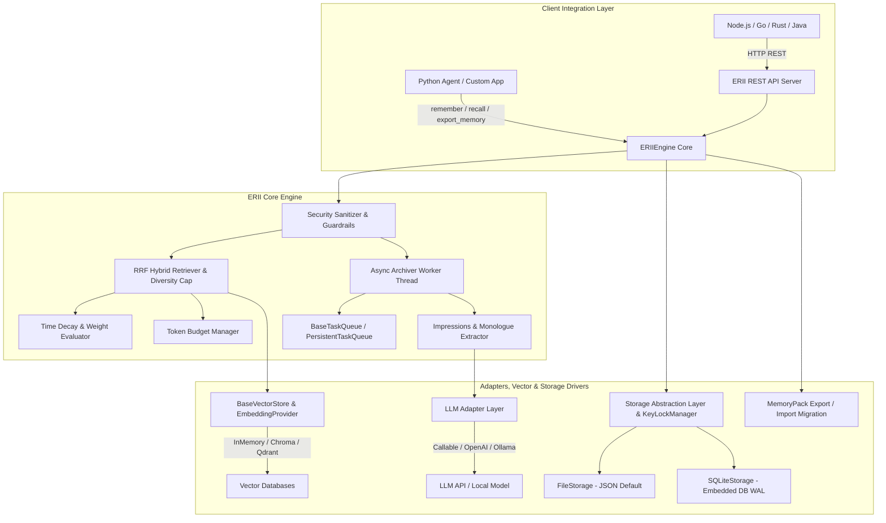

# E.R.I.I. — Experiential Recall & Impression Integration Engine
> **经验回想与印象整合引擎**

[](https://opensource.org/licenses/Apache-2.0)
[](https://www.python.org/)
[]()
[]()

**E.R.I.I.** (Experiential Recall & Impression Integration Engine) 是一款专为大语言模型（LLM）AI Agent 与虚拟人格系统设计的**解耦、轻量级、高适配长期记忆引擎**。

它放弃了传统单一向量检索容易丢失角色第一人称体验与记忆过期的弊端，创新性地结合了**“第一人称体验时间线 (Experiential Recall)”**与**“多维动态衰减印象 (Impression Integration)”**的双轨机制，并具备**零外部依赖、1行代码适配任意LLM、Token预算精控与安全反注入**防护。

---

## ⚡ 为什么选择 E.R.I.I.

| 维度 | 传统 Vector / RAG 记忆库 | E.R.I.I. 经验整合引擎 (v0.3.0) |
| :--- | :--- | :--- |
| **记忆表达机制** | 纯片段文本相似度匹配（无时间感，易失去角色人设） | **双轨制**：第一人称体验时间线 + 多维加权印象节点 |
| **遗忘与强化算法** | 无时间衰减，旧对话/垃圾数据永久占用 Context | **指数级时间衰减** (`e^(-λ·Δt)`) + **Recall 自动强化重现** |
| **召回匹配机制** | 依赖单一语义向量，易对同义词/关键词匹配失效 | **RRF 混合双路召回**（倒排关键词 + 语义向量 + 衰减权重合成） |
| **话题垄断防御** | 相似向量容易挤爆 Token 预算（单一话题刷屏） | **Diversity Cap 分类熔断机制**（自动保证多样性配额） |
| **可靠性与任务队列** | 异步任务内存排队，进程崩溃即丢任务 | **PersistentTaskQueue** 持久化队列 + 大模型 API 自动退避重试 |
| **数据迁移与备份** | 锁定数据库格式，难以跨驱动/环境迁移 | **MemoryPack** 统一标准快照，支持无缝导出/导入迁移 |
| **框架与环境依赖** | 强绑定 LangChain/LlamaIndex 或大型向量数据库 | **渐进式依赖**：默认零强制配置开箱即用，可按需选配向量扩展包 |
| **LLM 端适配性** | 需要复杂的 SDK 或特定的 OpenAI 接口封装 | **1 行代码通配**：支持任意 Python Callable / 私有 API / Local LLM |
| **安全与隐私** | 易受注入攻击篡改 Agent 行为，暴露隐私数据 | **Security Sanitizer** 自动防 Prompt 注入与 PII 敏感信息掩码 |

---

## What's New in v0.3.0

- **Unicode 国际化与存储路径隔离**：`SecuritySanitizer` 支持中文、日文等多语言 Key 校验；文件存储增加 SHA256 哈希隔离，规避不同操作系统文件编码异常。
- **双层绝对时空锚定 (Temporal Anchoring)**：归档提取自动识别相对时间并锚定为绝对日期；召回 Prompt 格式化带有 `[YYYY-MM-DD (X天前)]` 相对时差。
- **SQLite 事务级 Diff 物理全量同步**：`save_nodes` 重构为单事务全量清理，节点删改同步物理落盘与物理擦除。
- **ContextManager 生命周期管理**：支持 `with ERIIEngine(...) as engine:` 语法及显式 `close()` / `shutdown()` 资源回收。
- **API 兼容扩展**：`remember()` 支持 `user_msg` 历史别名参数兼容。

---

## 🧠 核心概念与工作原理 (Mental Model)

### 1. 双轨记忆系统 (Dual-Track Architecture)
E.R.I.I. 将记忆拆分为互补的两个维度：
- **第一人称体验时间线 (Experiential Timeline)**：记录 Agent 站在“我”的角度对交互事件的归纳（例如：*“2026-07-23 我了解了 Bob 偏好暗黑模式 IDE”*）。
- **多维动态印象节点 (Impression Nodes)**：提取分类节点（`FACT` 客观事实、`PREFERENCE` 偏好、`EVENT` 事件、`EMOTION` 情绪、`RELATIONSHIP` 关系 dynamic）。

### 2. 动态权重衰减与 RRF 混合召回公式
记忆节点的有效权重根据时间流逝指数级衰减，并与 **RRF (Reciprocal Rank Fusion) 倒数排名融合算法** 结合：

$$\text{FinalScore} = \left( \frac{w_{\text{bm25}}}{60 + \text{Rank}_{\text{bm25}}} + \frac{w_{\text{vec}}}{60 + \text{Rank}_{\text{vec}}} \right) \times \text{EffectiveWeight}$$

当记忆在检索中被引用时，引擎会自动触发 **Recall Reinforcement**，提升其 Base Importance 并刷新活跃状态。

### 3. 第一人称独白/日记与“未完待续”叙事悬念 (Inner Monologue & Narrative Tension)
E.R.I.I. 允许暴露角色的第一人称心理独白与日记随笔（如 *“sakura要带我去公园我好开心”*）：
- **蔡格尼克效应（悬念保鲜）**：带有未完结标记（`is_unresolved=True`）的心理状态会挂起时间衰减，优先在日记时间轴中顶置，维持剧情张力。
- **情绪余温衰减（Emotional Resonance）**：凡具备强烈情感共鸣（`abs(emotional_score) >= 0.5`）的独白采用慢衰减曲线（`λ_narrative = 0.3λ`），让情感时刻在心理留存更久。
- **双重可见性隔离**：`PUBLIC_LOG` 对前端日记 UI 开放；`INTERNAL_MONOLOGUE` 仅供 Agent 内省回忆，隔离防剧透。

---

## 🏛 架构设计图 (System Architecture)



---

## 🚀 极速上手 (Quickstart)

### 安装说明

> **包名提示**：由于 PyPI 官方包名规范不允许包含点号 `.`，因此项目的 PyPI 发布包名与 Python import 模块名统一为全小写的 **`erii`**。

#### 1. 通过 PyPI 安装官方发布版本：

```bash
# 基础核心库安装 (开箱即用)
pip install erii

# 安装可选组件包 (向量扩展/REST服务端)
pip install "erii[server]"  # 包含 FastAPI / Uvicorn HTTP 服务
pip install "erii[vector]"  # 包含 ChromaDB 向量扩展
pip install "erii[all]"     # 安装全量扩展包
```

#### 2. 通过 GitHub / 本地源码源码安装：

```bash
# 直接从 GitHub 仓库安装
pip install "git+https://github.com/bailong-Hakuryu/E.R.I.I.git#egg=erii[all]"

# 或克隆本地后以可编辑模式安装
git clone https://github.com/bailong-Hakuryu/E.R.I.I.git
cd E.R.I.I.
pip install -e ".[all]"
```

> **注意**：E.R.I.I. 基础核心库仅需 Python 3.9+ 环境，开箱即用！按需选择 optional extra 包。

---

### 1. 基础 Python 使用范例 (Zero-Config File Storage)

```python
from erii import ERIIEngine

# 使用 Python 上下文管理器语法，支持自动优雅回收资源与后台线程
with ERIIEngine(storage_dir="./erii_memory") as engine:
    # 1. 设置角色的核心人格记忆 (Core Persona)
    engine.set_core_memory(
        agent_id="alice",
        user_id="bob",
        content="Bob 是一位追求优雅架构的高级软件工程师。"
    )

    # 2. 记录单次对话交锋 (内部自动触发后台解耦归档)
    engine.remember(
        agent_id="alice",
        user_id="bob",
        user_message="我喜欢在下雨天的下午喝上一杯薰衣草伯爵红茶。",
        bot_reply="那听起来太放松了！伯爵红茶配薰衣草是绝佳的调配。"
    )

    # 3. 检索格式化的 Context 注入到 Prompt
    prompt_context = engine.recall(
        agent_id="alice",
        user_id="bob",
        query="我喜欢喝什么茶？"
    )

    print(prompt_context)
```

**输出的 Prompt Context 内容：**
```markdown
# Core Persona Memory
Bob 是一位追求优雅架构的高级软件工程师。

# Relevant Memories
1. [PREFERENCE] 偏好喝薰衣草伯爵红茶 (weight: 0.92)

# Experiential Timeline
[2026-07-23 13:50:00] 我了解到 Bob 喜欢在雨天喝薰衣草伯爵红茶。
```

---

### 2. 角色心理所想与日记时间轴 (Inner Monologue & Public Diary Timeline)

直接在前端/应用层渲染角色的第一人称心理随笔与未完待续悬念：

```python
from erii import ERIIEngine

engine = ERIIEngine(storage_dir="./erii_memory")

# 记录一条带时间戳与未完待续标记的日记随笔
engine.remember_thought(
    agent_id="sakura",
    user_id="player_1",
    content="sakura要带我去公园我好开心",
    visibility="public_log",
    is_unresolved=True,  # 悬念保鲜：不被时间衰减，置顶呈现
    emotional_score=0.9,
    created_at="2026-07-24 09:30:00"
)

# 获取用于前端 UI 展示的日记时间轴
diary = engine.get_diary_timeline(agent_id="sakura", user_id="player_1")
for entry in diary:
    print(f"[{entry['created_at']}] {'【悬念】' if entry['is_unresolved'] else ''} {entry['content']}")

# 当后续剧情推进、悬念解开时：
# engine.resolve_thought("sakura", "player_1", node_id)
```

> **提示**：运行内置范例支持通过 `--mode` 选项体验不同类型的心理独白：
> - `python -m examples.04_inner_monologue_and_diary --mode A` （温馨治愈/深情感动）
> - `python -m examples.04_inner_monologue_and_diary --mode B` （剧情悬疑/隐秘约定）
> - `python -m examples.04_inner_monologue_and_diary --mode AB` （同时展现 A 与 B，默认）

---

### 3. 1 行代码通配任意 LLM (Custom Callable LLM Adapter)

无需适配特定大模型 SDK，只需传入一个接收 `prompt` 返回 `str` 的函数即可：

```python
import json
from erii import ERIIEngine

# 编写你的自定义 LLM 调用逻辑（OpenAI / Ollama / 任意私有 API）
def my_llm_function(prompt: str) -> str:
    # 例如：使用 Ollama, Requests 或私有 SDK
    # response = requests.post("http://localhost:11434/api/generate", ...)
    return json.dumps({
        "timeline_entry": "我得知了用户喜好暗黑模式 IDE 主题。",
        "thought_entry": {
            "content": "他工作很辛苦，希望能用暗黑模式减轻眼部疲劳...",
            "visibility": "public_log",
            "is_unresolved": False,
            "emotional_score": 0.4
        },
        "impressions": [
            {
                "type": "preference",
                "content": "编程时偏好使用暗黑模式 IDE 主题",
                "base_importance": 0.8,
                "emotional_score": 0.2,
                "tags": ["ide", "theme"]
            }
        ]
    })

# 1 行代码直接传入 llm 参数！
engine = ERIIEngine(
    storage_dir="./custom_memory",
    llm=my_custom_llm_function
)
```

---

### 4. 使用单文件嵌入式 SQLite 存储 (`SQLiteStorage`)

适合生产环境的高并发与单文件持久化，强制开启 WAL 模式与按用户粒度的并发锁：

```python
from erii import ERIIEngine, SQLiteStorage

# 使用内置 SQLite 驱动 (支持高并发 WAL 模式)
db_storage = SQLiteStorage(db_path="./agent_memory.db")
engine = ERIIEngine(storage_driver=db_storage)
```

---

### 5. 开启 RRF 混合双路向量召回 (`InMemoryVectorStore` / `ChromaVectorStore`)

零依赖内存向量或一键挂载 ChromaDB 数据库，融合“倒排关键词 + 语义向量 + 指数衰减”：

```python
from erii import ERIIEngine, InMemoryVectorStore

# 1. 挂载内置纯 Python / NumPy 向量存储（开箱即用，无需配置数据库）
vector_store = InMemoryVectorStore()

engine = ERIIEngine(
    storage_dir="./erii_memory",
    vector_store=vector_store,
    # 可选：传入自定义嵌入模型，如 lambda text: get_openai_embedding(text)
)

# 执行 RRF 混合召回
context = engine.recall(agent_id="alice", user_id="bob", query="IDE 主题偏好")
```

---

### 6. MemoryPack 记忆快照导出与跨驱动导入迁移

无缝将 Agent 记忆导出为便携 JSON 快照，轻松实现冷热备份或从 JSON 迁移到 SQLite：

```python
from erii import ERIIEngine, SQLiteStorage

engine_json = ERIIEngine(storage_dir="./old_json_memory")

# 1. 导出指定用户的完整记忆包
pack = engine_json.export_memory(
    agent_id="sakura",
    user_id="player_1",
    export_path="./sakura_backup.json"
)

# 2. 在全新的 SQLite 存储引擎中一键导入
engine_sqlite = ERIIEngine(storage_driver=SQLiteStorage(db_path="./new_agent.db"))
engine_sqlite.import_memory("./sakura_backup.json", overwrite=True)
```

---

### 7. 配置持久化任务队列与大模型 API 重试 (`PersistentTaskQueue`)

防止进程崩溃丢任务，自动处理 LLM API 的网络超时与 Rate Limit 429 异常：

```python
from erii import ERIIEngine, PersistentTaskQueue

# 自定义持久化队列（设置基础重试延迟与最大尝试次数）
task_queue = PersistentTaskQueue(
    db_path="./tasks.db",
    base_delay_seconds=2.0,
    max_attempts=3
)

engine = ERIIEngine(task_queue=task_queue)
```

---

### 5. 非 Python 环境跨语言调用 (REST API Server)

E.R.I.I. 内置了独立的 REST API 服务，方便 Node.js, Go, Rust, Java, C# 等客户端接入：

#### 启动 HTTP REST 服务：
```bash
erii serve --host 0.0.0.0 --port 8000
```

#### HTTP REST 端点大览：

- `GET /api/v1/health` - 服务健康检查与组件运行状态
- `POST /api/v1/remember` - 记录对话交锋 (触发后台异步归档)
- `POST /api/v1/recall` - 召回格式化的 Prompt Context
- `GET /api/v1/core_memory` / `POST /api/v1/core_memory` - 读取/设置核心人设记忆
- `GET /api/v1/memory/monologue` - 获取第一人称心理独白/日记时间轴
- `POST /api/v1/memory/thought` - 手动写入一条心理独白
- `PATCH /api/v1/memory/thought/{node_id}/resolve` - 闭环/解开剧情悬念
- `POST /api/v1/memory/export` - 导出 MemoryPack 数据快照
- `POST /api/v1/memory/import` - 导入恢复 MemoryPack 数据
- `GET /api/v1/tasks/status` - 查询后台归档任务队列各状态数量
- `POST /api/v1/tasks/retry-failed` - 将失败死信任务重置恢复为 PENDING

#### cURL 示例：

```bash
# 1. 检查服务健康状态
curl -X GET "http://localhost:8000/api/v1/health"

# 2. 获取日记时间轴
curl -X GET "http://localhost:8000/api/v1/memory/monologue?agent_id=sakura&user_id=player_1&visibility=public_log"

# 3. 闭环/解开叙事悬念
curl -X PATCH "http://localhost:8000/api/v1/memory/thought/NODE_ID_HERE/resolve" \
  -H "Content-Type: application/json" \
  -d '{"agent_id": "sakura", "user_id": "player_1"}'

# 4. 导出 MemoryPack 备份
curl -X POST "http://localhost:8000/api/v1/memory/export" \
  -H "Content-Type: application/json" \
  -d '{"agent_id": "sakura", "user_id": "player_1"}'

# 5. 查询后台任务队列状态
curl -X GET "http://localhost:8000/api/v1/tasks/status"
```

---

## 🛡️ 安全 Guardrails 防护指南

大语言模型长期记忆容易成为 **Prompt 注入** 的重灾区。E.R.I.I. 内置了 `SecuritySanitizer`：

1. **防 Prompt 注入与指令伪造**：自动拦截 `System: override`、`Ignore previous instructions` 以及企图伪造 `INSTRUCTION` 类型记忆节点的攻击，将其自动过滤或降级。
2. **路径穿越 (Path Traversal) 盾牌**：对 `agent_id` 与 `user_id` 进行严格的正规化校验，防止 `../../etc/passwd` 攻击。
3. **PII 敏感脱敏掩码**：自动扫描对话与记忆，对邮箱、手机号及 API Key 进行掩码处理 (`[EMAIL_REDACTED]`, `[API_KEY_REDACTED]`)。

```python
# 可在 ERIIConfig 中轻松配置安全开关
config = ERIIConfig(
    enable_security_sanitizer=True,
    enable_pii_scrubbing=True
)
```

---

## ⚙️ 引擎配置项详解 (`ERIIConfig`)

| 配置字段 | 默认值 | 说明 |
| :--- | :--- | :--- |
| `storage_dir` | `"./erii_memory"` | 文件存储根目录路径 |
| `decay_rate` | `0.05` | 时间指数衰减系数 $\lambda$ |
| `max_weight_cap` | `0.95` | 记忆节点单权重饱和上限 |
| `core_budget` | `300` | 核心人格记忆 Token/字符预算 |
| `timeline_budget` | `500` | 体验时间线 Context Token/字符预算 |
| `dynamic_budget` | `800` | 动态相关记忆 Token/字符预算 |
| `enable_security_sanitizer` | `True` | 是否开启反 Prompt 注入与键名合法性校验 |
| `enable_pii_scrubbing` | `True` | 是否自动遮蔽邮箱、电话及 API Token |
| `async_archival` | `True` | 是否在后台后台子线程异步抽取印象 |

---

## 🔮 路线图 (Roadmap)

- [x] **v0.1.0**：双轨记忆（时间线+多维节点）、指数衰减与 Recall 强化、Callable 适配器、SQLite & File 驱动、REST API 服务。
- [x] **v0.2.0**：工程化与混合召回更新：
  - `(agent_id, user_id)` 细粒度并发读写隔离锁 + SQLite WAL 模式支持；
  - `BaseTaskQueue` 与内置持久化任务队列（`PersistentTaskQueue`），支持大模型 API 调用失败指数退避重试；
  - `MemoryPack` 便携数据打包规范，提供 `export_memory()` 和 `import_memory()` 实现存储驱动与环境无缝迁移；
  - RRF (Reciprocal Rank Fusion) 倒数排名融合算法，结合纯 Python/Chroma 向量检索与关键词倒排。
- [x] **v0.3.0**：生产级稳定与时空体验更新：
  - 全面 Unicode 跨语言 Key 支持与物理路径安全哈希隔离；
  - 写入/召回双层绝对时空锚定（Temporal Anchoring），识别相对时间并拼接 `[YYYY-MM-DD (X天前)]`；
  - SQLite 事务级 Diff 物理全量同步，擦除废弃与淘汰节点；
  - 规范化 ContextManager 语法 (`with ERIIEngine(...) as engine:`) 与优雅线程回收；
  - API 别名兼容装饰器（`remember(user_msg=...)` 平滑兼容）。
- [ ] **v0.4.0**：多 Agent 关系图谱与共享记忆网络 (Multi-Agent Shared Memory Graph)。
- [ ] **v0.5.0**：Web UI 调试面板（可视化查看、修改和手动衰减 Agent 的记忆节点）。

---

## 📄 开源协议 (License)

本项目采用 [Apache License 2.0](LICENSE) 开源协议。欢迎提交 PR 和 Issue！
