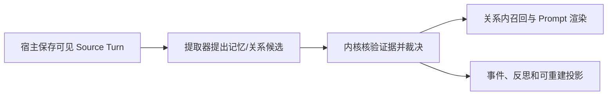

# E.R.I.I.

> Experiential Recall & Impression Integration — 让角色保留共同经历，并维持连续的人格与关系。

[](LICENSE)
[](https://github.com/bailong-Hakuryu/E.R.I.I/releases/tag/v0.4.0a8)
[](CHANGELOG.md)
[](pyproject.toml)

E.R.I.I. 是一个可嵌入 Python 应用的角色连续性与长期记忆内核，主要面向 AI
伴侣、虚拟角色和长期叙事型 Agent。

普通检索系统关心“哪些文本与当前问题相似”；E.R.I.I. 还关心：

- 这段经历属于哪个 `Agent × User` 关系；
- 角色为什么会记住、相信或重新理解一件事；
- 当前关系状态由哪些不可变事件推导而来；
- 一次说过的话能否成为记忆、关系或人格变化的权威依据；
- 数据升级、迁移、删除和重建之后，这条因果链是否仍然成立。

项目目前由单人维护，不提供 SLA。核心记忆内核和用户数据携带能力将长期开放；
正式产品仍需在内核外补齐身份、授权、加密、多租户隔离和运营能力。

## 项目原则

E.R.I.I. 的核心定义是：

> E.R.I.I. 是一个角色连续性与长期记忆内核。它让角色从既定人设与形成性经历出发，
> 在每段独立关系中继续生活；角色可以因真实经历而成长，但任何重要变化都必须保持
> 心理与经历上的因果连续性。

这意味着：

- **人设是底色，不是每轮重写的 Prompt。** 原始人设原文永久保留；结构化编译结果
  只能解释和激活它，不能静默覆盖它。
- **每段关系独立。** “我们第一次一起看雪”只属于发生过这件事的
  `Agent × User`；另一个 Agent 或用户不会自动继承记忆与亲密度。
- **成长需要来源。** 普通关系状态可渐进更新；触及核心人格或巨大跃迁时，只形成
  可审查提案，不能由一次模型输出自动生效。
- **连续性判断对情绪中立。** 温柔不天然正确，拒绝、生气或让用户受伤也不天然
  OOC；判断依据是角色、人设、经历、知识和关系是否连续。选择造成的关系后果及后续
  修复能力属于 v0.5 的领域工作。
- **模型提出，规则裁决。** LLM 可以提出候选事件、反思或语气解释；稳定 ID、关系
  边界、来源权威、状态变化和人格审批由内核确定。

更完整的领域术语见 [Domain Model](docs/domain-model.md)，未来版本边界见
[Roadmap](ROADMAP.md)。

## 当前版本

当前源码身份为 `0.4.0b1`，支持 Python 3.11–3.14。GitHub 上最后一个已经发布的
不可移动标签仍是 `v0.4.0a8`；创建 b1 标签和 prerelease 之前，二者不要混为一谈。

各版本轴独立：

| 轴 | b1 值 |
| --- | --- |
| Python 包 | `0.4.0b1` |
| Python | `>=3.11`，测试至 `3.14` |
| SQLite | schema `9` |
| FileStorage | format `1` |
| MemoryPack | `0.4.0a8` |
| Lifecycle Backup | `1` |
| Lifecycle Plan | writer `3`，readers `1`–`3` |

包升级为 b1 不会把现有 MemoryPack 重命名为 b1，也不会把 SQLite schema 改成
“b1”。机器可读版本目录位于 `erii.compatibility.COMPATIBILITY_CATALOG`。

## b1 已交付的能力

### 角色、关系与长期记忆

- 每个 `Agent × User` 独立、稳定的 relationship、persona 和 identity ID；
- 原始 Character Blueprint 与可审查、版本化的 Persona Compilation；
- 完整保存实际可见 User/Agent Source Transcript 的 Turn Record；
- `begin_turn()` / `complete_turn()` / `record_turn()` / `abandon_turn()` 生命周期；
- 带消息级证据的可靠归档，明确区分 `artifacts` 与 `no_memory`；
- Ordinary、Legacy Context 与 Quarantined History 三种召回权威；
- 追加式 Relationship Event 与可重建的当前认知、五维关系状态及解释；
- Promise、Condition、Open Loop 与显式 Resolution；
- Persona Reflection、关系处理 Run 和需宿主审批的 Persona Growth Proposal；
- Episode 与 Relationship Chapter 等可重建分层投影；
- 五轴 Continuity Review、Delivery Exception 与来源约束的 Contextual Voice；
- FileStorage、SQLiteStorage、结构化 Recall、MemoryPack 和可选 REST 参考宿主。

### 可验证数据生命周期

所有公开生命周期变更都经过同一个入口：

```python
assessment = lifecycle.inspect(target)  # 只读检查
plan = lifecycle.plan(request)          # 零写入 dry-run
report = lifecycle.execute(plan)        # 执行并做终态验证
```

b1 已实现：

- FileStorage、SQLite、MemoryPack 的 verified Backup v1；
- 保持原格式、发布到缺失目标的 no-replace restore；
- FileStorage `legacy → 1` 并排升级；
- SQLite schema `6 → 9` 并排升级；
- 所有已声明旧可读 MemoryPack 到 `0.4.0a8` 的显式升级；
- MemoryPack 到全新 FileStorage v1 / SQLite v9 的隔离 staging import；
- relationship、Source Turn、Relationship Event、complete-user 四种 backup-first
  删除范围；
- 删除早期历史时沿冻结账本依赖撤销派生 Run/Event/长期记忆，保留未命中的原始聊天，
  不伪造历史重审；
- 从剩余权威历史确定性重建关系投影，并在发布前执行真实 MemoryPack 语义往返；
- 分块文件复制、流式 SQLite 语义摘要、资源上限和崩溃恢复；
- FileStorage / SQLite 上三条固定长期轨迹与回归基线。

生命周期不提供任意在线 merge、覆盖 restore、通用 downgrade 或静默原地升级。详细
操作、恢复语义和可运行示例见 [Data Lifecycle Guide](docs/data-lifecycle.md)。

## 安装

当前源码要求 Python 3.11–3.14：

```bash
git clone https://github.com/bailong-Hakuryu/E.R.I.I.git
cd E.R.I.I
python -m pip install .
```

按需安装扩展：

```bash
python -m pip install ".[server]"  # FastAPI / Uvicorn
python -m pip install ".[openai]"  # 宿主选择的 OpenAI-compatible adapter
python -m pip install ".[vector]"  # ChromaDB / NumPy
python -m pip install ".[dev]"     # 测试、构建与静态检查
```

确认安装身份：

```bash
python -c "import erii; print(erii.__version__)"
```

当前源码应输出 `0.4.0b1`。若你安装不可移动的 `v0.4.0a8`，请使用该标签内的文档和
Python 兼容约定。

## 最小关系示例

下面的例子由可信宿主直接记录一条关系事件，适合展示内核边界。真实聊天产品应先走
Turn Recording，再让宿主提供的提取器提出候选，不能把未经裁决的模型文本直接当成
权威历史。

```python
from erii import ERIIEngine, RecallOptions, RecallRequest


with ERIIEngine(storage_dir="./erii-data") as engine:
    engine.initialize_relationship(
        "agent_lumi",
        "user_chen",
        persona_source="Lumi is gentle, candid, curious, and respects other people's choices.",
    )

    engine.record_relationship_event(
        "agent_lumi",
        "user_chen",
        "shared_experience",
        "Lumi and Chen watched the first snow together.",
        event_id="snow-001",
    )

    result = engine.recall_structured(
        RecallRequest(
            agent_id="agent_lumi",
            user_id="user_chen",
            query="What did we experience together?",
            audience="agent_private",
            # A real product should approve a Persona Manifest and use the
            # default planned delivery. FULL is the explicit compatibility
            # mode for this minimal uncompiled Blueprint example.
            options=RecallOptions(persona_delivery="full"),
        )
    )
    print(engine.render_recall(result))
```

完整聊天接入包含四个显式阶段：



请从[中文使用手册](docs/USAGE_zh-CN.md)或
[English User Guide](docs/USAGE.md)继续。官方例子位于 [`examples/`](examples/)。

## 后台处理由宿主控制

构造 `ERIIEngine`、配置参考服务器或运行 `erii serve` 都不会自动启动隐藏线程。
可靠归档使用：

- `archive_turn()` 接受任务；
- `process_pending()` 处理有限数量任务；
- `drain()` 显式排空；
- `close()` / `shutdown()` 做协作式关闭。

`start()` 只保留给旧 `remember()` 队列兼容路径。`remember()` 与接收 transient
Source Turn 的旧关系裁决入口在 b1 会发出 `DeprecationWarning`，计划于 v0.5 删除；
新接入不要再以它们作为主路径。

## 存储、携带与迁移

- FileStorage 适合可检查的本地目录；
- SQLiteStorage 提供单文件事务存储和 WAL；
- MemoryPack 是开放、可读取、关系范围内的数据携带格式；
- Lifecycle Backup 是物理恢复包，不等同于 MemoryPack；
- backup / restore 保持原格式，upgrade 改变格式，fresh import 把 Pack 语义写入新
  Storage——三者不能互相替代。

旧 SQLite 不再因构造 `SQLiteStorage` 而静默迁移。当前唯一经过真实 fixture 验证的
SQLite lifecycle 升级是 schema `6 → 9`；其他已识别旧 schema 必须先保留原数据，
等待或实现对应的显式升级策略。

## 安全边界

E.R.I.I. b1 是可信本地宿主中的内核，不是完整 SaaS 安全边界：

- 内置数据、MemoryPack 与 Backup 默认明文；
- SHA-256 用于完整性与执行漂移检测，不是签名、MAC 或来源认证；
- REST 参考服务器使用单一 owner API key，不是每用户授权；
- 未内置 TLS、速率限制、对象权限和多租户隔离；
- 生命周期锁只协调遵守协议的可信进程；
- 删除成功只证明选中数据已从当前受验证 live store 移除并重建本地投影。

特别注意：backup-first 删除会保留含删除前数据的 Lifecycle Backup；外部向量库、
导出的 Pack、日志、复制数据库、云端留存和模型提供商副本也不会自动消失。宿主必须
执行自己的留存和删除策略。

处理真实数据前请阅读 [SECURITY.md](SECURITY.md)。

## 长期评测与验证

仓库包含三条原创合成轨迹，并在 FileStorage 与 SQLite 上验证：

- 单关系 128 轮；
- 两段相似但隔离的关系，各 72 轮交错执行；
- 120 轮纠错、冲突与成长轨迹。

基线覆盖重启、重试、File↔SQLite 携带、重复导入、正负召回、来源权威、关系隔离、
删除和重建。性能数字只是维护者机器上的回归观测，不是 SLA。

```bash
python -m pytest -q
python -m ruff check erii tests examples benchmarks scripts
python scripts/freeze_contracts.py --check
python benchmarks/run_longitudinal.py --adapter both --scenario all
```

冻结契约位于 [`docs/contracts/`](docs/contracts/)；它们不含聊天、人设或记忆正文。

## 文档索引

- [中文使用手册](docs/USAGE_zh-CN.md)
- [English User Guide](docs/USAGE.md)
- [Data Lifecycle Guide](docs/data-lifecycle.md)
- [b1 Implementation Contract](docs/b1-implementation-contract.md)
- [Compatibility Policy](docs/compatibility.md)
- [Domain Model](docs/domain-model.md)
- [Security Policy](SECURITY.md)
- [Roadmap](ROADMAP.md)
- [Changelog](CHANGELOG.md)
- [Contributing](CONTRIBUTING.md)
- [b1 Release Notes](docs/release-notes-0.4.0b1.md)

## 项目状态与许可证

v0.4 在 b1 进入功能冻结；下一步是 `0.4.0rc1` 的兼容、缺陷、文档、构建和发布收口。
真实关系后果、伤害后的记忆与修复、角色内在审视仍属于 v0.5；完整产品安全边界属于
v0.6。

项目采用 [Apache License 2.0](LICENSE)。项目名称保留；第三方角色、人设和作品内容
不属于内核，也不应提交到仓库。使用者应自行确认其导入内容的著作权、商标、隐私和
平台合规责任。
