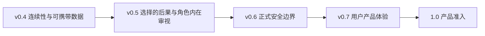

# E.R.I.I. Roadmap

本路线图表达当前方向，不是固定发布日期或 SLA。只有实现、迁移、文档和发布证据都
通过后，版本才会进入下一阶段。已经发布的标签、历史 ADR 和 CHANGELOG 不会因路线图
更新而回写。

## 总览

| 版本 | 状态 | 核心主题 |
| --- | --- | --- |
| `0.4.0a8` | 已发布 | 连续性审计、交付例外、消息级归档证据与权威召回 |
| `0.4.0b1` | 当前源码，功能完成 | 数据迁移、备份恢复、删除重建、长期评测与契约冻结 |
| `0.4.0rc1` | 下一阶段 | 缺陷、兼容、文档、构建和发布收口；不新增领域模型 |
| `0.4.0` / `0.4.x` | 计划 | 稳定角色连续性与长期记忆内核 |
| `0.5.x` | 计划 | 关系后果、伤害与修复、角色内在审视和认知修订 |
| `0.6.x` | 计划 | 身份、授权、加密、密钥和多租户安全边界 |
| `0.7.x` | 计划 | 面向真实用户的数据查看、解释、迁移和纠正体验 |
| `1.0` | 远期 | 产品级数据、评测、安全、支持、发布与法律准入 |

依赖顺序是有意固定的：先让长期数据可检查、可恢复、可迁移、可删除，再扩展会改变
关系含义的领域能力；先建立正式安全边界，再把数据管理能力暴露给不受信任的真实用户。

## 项目不变量

后续版本不能为了功能数量破坏以下原则：

1. 原始 Character Blueprint 是稳定底色；结构化解释不能静默覆盖原文。
2. 记忆、关系和亲密度严格属于一个 `Agent × User`。
3. 完整 Source Transcript 是“确实说过”的证据，不自动成为人格、知识或关系权威。
4. 普通关系状态可以渐进变化；核心人格变化和巨大跃迁需要可审查提案。
5. 连续性判断对情绪中立：温柔不等于正确，拒绝和生气不等于 OOC。
6. LLM 只提出候选；稳定身份、来源核验、状态裁决和审批边界由内核决定。
7. 已展示的话即使错误或 OOC 也保留为历史事实，不能通过删记录伪装未发生。
8. 后台处理生命周期由宿主显式控制，不自动启动隐藏线程。
9. 数据格式版本与包版本独立，破坏性变化必须有显式迁移路径。
10. 核心记忆和用户数据携带能力保持开放。

## v0.4：角色连续性与长期记忆基础

### Alpha 里程碑（已完成）

`0.4.0a1` 到 `0.4.0a8` 依次建立：

- 独立 relationship / persona / identity 与不可变人设原文；
- 不可信候选提取、规则裁决、Persona Reflection 和 Growth Proposal；
- Persona Compiler、Manifest、结构化 Recall 和显式受众；
- Promise、Condition、Open Loop 与世界时间；
- 统一 Source Turn、完整可见 Transcript 与两阶段 Turn 生命周期；
- 带来源的可靠归档、显式 worker 生命周期、Episode / Chapter 分层巩固；
- 自动关系处理 Run、反思决定和可恢复处理日志；
- 五轴 Continuity Review、Delivery Exception、Context Baseline 与 Voice Trace；
- 消息级 Archival Evidence、Ordinary / Legacy / Quarantined 召回权威；
- MemoryPack `0.4.0a8`、SQLite schema 9 与完整跨 Storage 携带。

精确历史变更见 [CHANGELOG.md](CHANGELOG.md)，设计决策见
[`docs/adr/`](docs/adr/)。

### `0.4.0b1`：数据生命周期与长期验证（已完成）

b1 是 v0.4 的 feature-complete Beta。当前源码已经交付：

#### 版本与兼容

- Python 下限提高到 3.11，测试范围为 3.11–3.14；
- Package、SQLite、FileStorage、MemoryPack、Backup 和 Plan 分别版本化；
- Lifecycle Plan writer 为 v3，reader 保持 v1–v3 的严格历史字段和摘要规则；
- 公共 Python API、REST OpenAPI、数据格式和 SQLite schema 形成机器可读快照；
- SQLiteStorage 对旧 schema 失败关闭，不再把构造操作当成静默迁移。

#### 检查、备份、恢复和升级

- `LifecycleInspector` 零写入区分 `missing | empty | current |
  migration_required`；
- FileStorage、SQLite 和 MemoryPack 使用 verified Lifecycle Backup v1；
- restore 保持原格式，只发布到缺失目标，不覆盖；
- FileStorage `legacy → 1` backup-first、源保留、并排升级；
- SQLite schema `6 → 9` backup-first、源保留、并排升级；
- 所有 declared-readable 旧 MemoryPack → `0.4.0a8` 显式升级；
- 合成历史 fixture 保存 producer/version/checksum，不包含真实用户或第三方角色数据。

SQLite schema `0–5`、`7`、`8` 可以被版本目录识别，但 b1 **没有**宣称为它们提供
经过验证的升级策略。不能把“可识别/可备份”写成“可直接打开/可升级”。

#### 导入、删除与重建

- current 或 declared-readable MemoryPack 可在隔离 staging 中验证，并原子发布到
  全新 FileStorage v1 / SQLite v9；
- fresh import 不向已有在线 Storage merge；
- backup-first erase 支持 relationship、Source Turn、Relationship Event 和
  complete-user 四种严格范围；
- relationship rebuild 不删除权威事件，只从剩余历史重算 Current Belief、关系状态、
  Episode 和 Chapter；
- 报告只包含 ID、计数、摘要与处置组，不复制被删正文；
- 报告明确列出 backup、外部向量库、导出 Pack、日志和远程副本等未验证删除工作。

#### 有界 I/O 与失败恢复

- 文件和目录以不超过 1 MiB 的块复制和摘要；
- SQLite 语义身份按规范行流式计算；
- MemoryPack、需物化 transform 和 backup manifest 上限分别是 256 MiB、512 MiB 和
  16 MiB；
- 链接、reparse point、硬链接、非普通文件、活跃 WAL/journal、来源漂移和已占用目标
  失败关闭；
- 发布使用 no-replace；精确重试只有在产物一致时返回 `already_complete`；
- 擦除/重建发布失败可恢复原 live store，预变更 backup 保留。

#### 长期验证

- 单关系 128 轮；
- 两段相似但隔离的关系各 72 轮交错运行；
- 120 轮纠正、冲突和成长轨迹；
- FileStorage / SQLite、重启、重试、双向携带、重复导入、正负召回、删除和重建；
- full baseline 的硬指标零失败；
- CI 提供定时/手动 full longitudinal job，普通提交保留快速门禁。

性能数字是合成数据在维护者机器上的回归观测，不是 SLA。

### `0.4.0rc1`：发布候选（下一阶段）

RC 只接受以下工作：

- 修复 b1 发现的正确性、恢复性、兼容性和性能缺陷；
- 让 Linux/Windows 上 Python 3.11 与 3.14 的全部 CI 稳定通过；
- 验证 wheel 与 sdist 的干净安装、CLI、参考服务和版本身份；
- 审计中英文文档、示例、链接、迁移指南和恢复演练；
- 冻结公开 API、OpenAPI、SQLite schema、MemoryPack、Backup 和 Plan 契约；
- 从真实但脱敏/合成化的旧数据形状增加迁移回归，不提交私人数据；
- 明确已知限制、升级资格、恢复步骤和 release checklist。

RC 不增加新的关系维度、记忆类型、人格变化渠道或 v0.5 后果模型。若 b1 暴露需要新
领域语义才能修复的问题，延后到下一个次版本，而不是偷偷塞进 RC。

### `0.4.0` / `0.4.x`：稳定维护

- 认真维护数据可读性、迁移与回归，但不承诺商业 SLA；
- 补丁版本只修缺陷、安全和兼容问题；
- 不在 patch 中静默改变权威、关系或人格语义；
- 保留开放导出和恢复路径；
- 为后续正式产品积累真实但不含私人正文的运行指标。

## v0.5：关系后果与角色内在审视

v0.5 回答的问题不是“如何让角色永远温柔”，而是：

> 如果角色经过人设、经历、知识、关系和连续性审查后，仍然作出一个可能伤害用户的
> 选择，系统如何保留这次选择的后果、记忆和后续修复可能，而不强迫角色迎合用户？

计划领域：

- Continuity Authority 与 Relationship Consequence 两条独立追加式结论；
- 角色拒绝、愤怒、疏远、边界表达和冲突都可成为合法输出；
- 伤害不是自动 OOC，温柔也不是自动正确；
- 角色的选择会影响关系状态、未完成事项、后续召回和行为前提；
- 修复是可能的行为，不是强制和解；角色与用户都可以不接受修复；
- Character Review 可被触发，但不能被强迫得出“用户是对的”；
- 角色敏感点来自批准的人设/形成性经历，不能由系统编造“平衡观点”；
- 历史连续性例外通过新记录解除或维持，旧 Turn、审查和拒绝记录不可改写；
- Belief Lineage、Memory Relation 与 Continuity Map 只有在证明必要后才进入公开模型。

进入 v0.5 前提：

- v0.4 数据生命周期和契约冻结完成；
- 例外解除与后果写入的权限边界有独立 ADR；
- 长期轨迹能区分“角色连续但让人不舒服”和“无来源漂移”；
- 评测不使用“越温柔越高分”的价值偏置。

## v0.6：正式安全边界

当前单一 owner API key 只适合可信本地参考宿主。v0.6 计划：

- 用户身份与会话认证；
- 对 Agent、User、relationship、Turn、MemoryPack 和 lifecycle object 的对象级授权；
- 多租户存储与缓存隔离；
- 传输加密、静态加密、密钥轮换和备份密钥策略；
- MemoryPack / Backup 的签名或 MAC 与来源真实性；
- 速率限制、配额、滥用检测和审计日志；
- 删除任务覆盖注册向量库、导出物和受控备份的可验证 disposition；
- 正向和负向授权测试、跨租户攻击测试和密钥泄露恢复。

这些能力不会假装由关系 ID、路径哈希或单一 API key 提供。

## v0.7：用户产品体验

- 在前端查看并理解记忆、标签、来源、关系事件和人格解释；
- 用户可导出、迁移、纠正、隔离和请求删除自己的数据；
- 清楚区分原文、摘要、推断、当前认知、反思和已批准人格变化；
- 展示 Legacy / Quarantined 标签，而不是隐藏不确定历史；
- 在不暴露 Agent-private 推理的前提下提供可解释处置；
- 支持恢复演练、设备迁移和数据所有权操作；
- 用真实可用性测试验证非维护者能正确完成常见流程。

## 1.0 准入

1.0 不由功能数量决定。至少需要：

- 持久格式、迁移、恢复与回滚经过长期维护；
- 角色连续性和关系隔离有稳定评测；
- 产品安全边界通过独立审计；
- 用户数据可携带、可解释、可纠正和可删除；
- 发布、漏洞响应、依赖、支持和兼容政策可执行；
- 名称、第三方内容、隐私、著作权和商标风险经过正式法律审查；
- 项目从“长期认真维护但不背 SLA”进入明确的产品支持承诺。

## 非目标

- 不把“零外部依赖”包装成核心卖点；
- 不发明算法只为宣传；
- 不把所有聊天自动提升为长期记忆或人格依据；
- 不把所有冲突自动修复成和解；
- 不让一个用户继承另一个用户的亲密度；
- 不在内核中捆绑第三方作品人设；
- 不在没有授权、加密和多租户边界时宣称可直接提供公开 SaaS。
