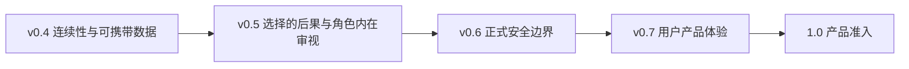

# E.R.I.I. Roadmap

本路线图表达当前方向，不是固定发布日期或 SLA。只有实现、迁移、文档和验证证据都
通过后，源码才会进入下一阶段。`0.x` 是源码演进里程碑，不要求逐个发布 GitHub
Release 或分发包；正式包发布链路留到 `1.0`。已经发布的历史标签、ADR 和 CHANGELOG
不会因路线图更新而回写。

E.R.I.I. 的 North Star 是**有因果来源的角色连续性**：角色从既定人设与形成性经历
出发，在每段独立的 `Agent × User` 关系中继续生活；角色可以因真实经历而成长，但
任何重要变化都必须保持心理与经历上的因果连续性。

> RAG 让角色找回相似文本；E.R.I.I. 决定这个角色在这段关系里可以记得什么、
> 相信什么，以及因为什么而改变。

版本级任务之外的用户、架构、准入与维护策略见
[中文发展战略](docs/development-strategy.md) /
[English Development Strategy](docs/development-strategy.en.md)。

## 总览

| 版本 | 状态 | 核心主题 |
| --- | --- | --- |
| `0.4.0a8` | 已发布 | 连续性审计、交付例外、消息级归档证据与权威召回 |
| `0.4.0b1` | 已接受源码基线 | 数据迁移、备份恢复、删除重建、长期评测与契约冻结 |
| `0.4.0rc1` | 已接受源码检查点 | 缺陷、兼容、采用路径、构建和源码收口；不新增领域模型 |
| `0.4.0` / `0.4.x` | 当前稳定源码线 | `0.4.0` 已完成；后续仅做缺陷、安全与兼容维护 |
| `0.5.x` | 计划 | 先交付关系后果最小纵切，再扩展角色内在审视与认知修订 |
| `0.6.x` | 计划 | 内核安全 Hook 与正式多用户产品宿主边界 |
| `0.7.x` | 计划 | 用户查看、解释、迁移、纠正与删除关系数据的体验 |
| `1.0` | 远期 | 产品级数据、评测、安全、支持、发布与法律准入 |



依赖顺序是有意固定的：先让长期数据可检查、可恢复、可迁移、可删除，再扩展会改变
关系含义的领域能力；先建立正式安全边界，再把数据管理能力暴露给不受信任的真实用户。

## 两条发展轨

E.R.I.I. 不再把不同稳定性的工作塞进同一版本承诺：

- **内核演进轨**维护角色、关系、来源、召回、数据格式与生命周期语义。进入这条轨道
  的能力必须具备明确 Interface、迁移与失败语义、跨 Storage 验证和长期维护证据。
- **Labs 与集成轨**承载 DeepSeek、其他模型、本地模型、KouriChat、Shadow 评测和
  未来 Deliberation Ensemble。它们必须可安装、可替换、可禁用、可整体删除，不能
  静默改变持久格式或角色身份。

实验只有在证明可重复的用户行为收益、形成 Provider-neutral 的领域含义，并能承担
内核兼容成本之后才可晋级。源码里程碑是否前进由这些证据决定，不以是否上传包为
门槛。某个 Provider 的价格、thinking 字段或 SDK 形状不能成为公开持久契约。

## 项目不变量

后续版本不能为了功能数量破坏以下原则：

1. 原始 Character Blueprint 是稳定底色；结构化解释不能静默覆盖原文。
2. 记忆、关系和亲密度严格属于一个 `Agent × User`。
3. 完整 Source Transcript 是“确实说过”的证据，不自动成为人格、知识或关系权威。
4. 普通关系状态可以渐进变化；核心人格变化和巨大跃迁需要可审查提案。
5. 连续性判断对情绪中立：温柔不等于正确，拒绝和生气不等于 OOC。
6. LLM 只提出候选；稳定身份、来源核验、状态裁决和审批边界由内核决定。
7. 已展示的话即使错误或 OOC 也保留为历史事实，不能通过删记录伪装未发生。
8. 后台处理生命周期由宿主显式控制，不自动启动隐藏线程。
9. 数据格式版本与包版本独立，破坏性变化必须有显式迁移路径。
10. 核心记忆和用户数据携带能力保持开放。

## v0.4：角色连续性与长期记忆基础

### Alpha 里程碑（已完成）

`0.4.0a1` 到 `0.4.0a8` 依次建立：

- 独立 relationship / persona / identity 与不可变人设原文；
- 不可信候选提取、规则裁决、Persona Reflection 和 Growth Proposal；
- Persona Compiler、Manifest、结构化 Recall 和显式受众；
- Promise、Condition、Open Loop 与世界时间；
- 统一 Source Turn、完整可见 Transcript 与两阶段 Turn 生命周期；
- 带来源的可靠归档、显式 worker 生命周期、Episode / Chapter 分层巩固；
- 自动关系处理 Run、反思决定和可恢复处理日志；
- 五轴 Continuity Review、Delivery Exception、Context Baseline 与 Voice Trace；
- 消息级 Archival Evidence、Ordinary / Legacy / Quarantined 召回权威；
- MemoryPack `0.4.0a8`、SQLite schema 9 与完整跨 Storage 携带。

精确历史变更见 [CHANGELOG.md](CHANGELOG.md)，设计决策见
[`docs/adr/`](docs/adr/)。

### `0.4.0b1`：数据生命周期与长期验证（源码里程碑完成）

b1 是 v0.4 的 feature-complete 源码里程碑。以下能力已在当前源码中实现；项目不要求
为它创建独立 GitHub Release 或分发包：

#### 版本与兼容

- Python 下限提高到 3.11，包元数据支持 3.11–3.14；b1 基线当时的 Linux CI 覆盖
  3.11 与 3.14，Windows 运行受针对性 smoke/regression 验证；当前 v0.4 工作流已把
  Linux 完整矩阵扩展为 3.11–3.14，并继续保留明确列出的 Windows smoke；
- Package、SQLite、FileStorage、MemoryPack、Backup 和 Plan 分别版本化；
- Lifecycle Plan writer 为 v3，reader 保持 v1–v3 的严格历史字段和摘要规则；
- 公共 Python API、REST OpenAPI、数据格式和 SQLite schema 形成机器可读快照；
- SQLiteStorage 对旧 schema 失败关闭，不再把构造操作当成静默迁移。

#### 检查、备份、恢复和升级

- `LifecycleInspector` 零写入区分 `missing | empty | current |
  migration_required`；
- FileStorage、SQLite 和 MemoryPack 使用 verified Lifecycle Backup v1；
- restore 保持原格式，只发布到缺失目标，不覆盖；
- FileStorage `legacy → 1` backup-first、源保留、并排升级；
- SQLite schema `6 → 9` backup-first、源保留、并排升级；
- 所有 declared-readable 旧 MemoryPack → `0.4.0a8` 显式升级；
- 合成历史 fixture 保存 producer/version/checksum，不包含真实用户或第三方角色数据。

SQLite schema `0–5`、`7`、`8` 可以被版本目录识别，但 b1 **没有**宣称为它们提供
经过验证的升级策略。不能把“可识别/可备份”写成“可直接打开/可升级”。

#### 导入、删除与重建

- current 或 declared-readable MemoryPack 可在隔离 staging 中验证，并原子发布到
  全新 FileStorage v1 / SQLite v9；
- fresh import 不向已有在线 Storage merge；
- backup-first erase 支持 relationship、Source Turn、Relationship Event 和
  complete-user 四种严格范围；
- relationship rebuild 不删除权威事件，只从剩余历史重算 Current Belief、关系状态、
  Episode 和 Chapter；
- 报告只包含 ID、计数、摘要与处置组，不复制被删正文；
- 报告明确列出 backup、外部向量库、导出 Pack、日志和远程副本等未验证删除工作。

#### 有界 I/O 与失败恢复

- 文件和目录以不超过 1 MiB 的块复制和摘要；
- SQLite 语义身份按规范行流式计算；
- MemoryPack、需物化 transform 和 backup manifest 上限分别是 256 MiB、512 MiB 和
  16 MiB；
- 链接、reparse point、硬链接、非普通文件、活跃 WAL/journal、来源漂移和已占用目标
  失败关闭；
- 发布使用 no-replace；精确重试只有在产物一致时返回 `already_complete`；
- 擦除/重建发布失败可恢复原 live store，预变更 backup 保留。

#### 长期验证

- 单关系 128 轮；
- 两段相似但隔离的关系各 72 轮交错运行；
- 120 轮纠正、冲突和成长轨迹；
- FileStorage / SQLite、重启、重试、双向携带、重复导入、正负召回、删除和重建；
- full baseline 的硬指标零失败；
- CI 提供定时/手动 full longitudinal job，普通提交保留快速门禁。

性能数字是合成数据在维护者机器上的回归观测，不是 SLA。

### `0.4.0rc1`：源码收口（已完成）

`rc1` 保留了现有版本命名，但只表示源码收口检查点，不表示即将分发 Release
Candidate 包。其证据固定于 commit
`58ea8e69df28bec8e755e0a0d2a175679c18a694`。

RC 完成了以下工作：

- 修复 b1 发现的正确性、恢复性、兼容性和性能缺陷；
- 决定并实测 Python/操作系统支持矩阵，区分完整 CI 与针对性 smoke，不作超出证据的
  平台承诺；
- 验证源码安装、本地 wheel/sdist 构建、CLI、参考服务和版本身份；这些属于工程验证，
  不代表要上传发行资产；
- 按 `Golden Path | Advanced | Experimental | Internal` 审计公共 Interface；
- 提供已经实现的 `erii demo` Golden Continuity Demo，并把 README 入口收敛为
  “安装 → 运行 → 看见关系隔离 → 再读完整手册”；
- 审计中英文文档、示例执行、内部链接、迁移指南、恢复演练、支持政策和 Issue 模板；
- 整理项目 URL、关键词、维护者与包发现元数据，但不在 `0.x` 建立 PyPI 发布承诺；
- 更新 GitHub About 等外部元数据，移除“零依赖”等已经过时的定位；
- 冻结公开 API、OpenAPI、SQLite schema、MemoryPack、Backup 和 Plan 契约；
- 从真实但脱敏/合成化的旧数据形状增加迁移回归，不提交私人数据；
- 明确已知限制、升级资格、恢复步骤和源码阶段 checklist。

Golden Continuity Demo 只展示 v0.4 已实现的能力：原创角色与 User A 共同看雪、进程
重启后仍能带来源召回、User B 不知道也不继承亲密度，以及 MemoryPack 导出检查。
“尖锐选择造成后果并在以后继续作用”属于 v0.5，不能在 RC Demo 中伪装成已经实现。

RC 没有增加新的关系维度、记忆类型、人格变化渠道或 v0.5 后果模型。若 b1 暴露需要新
领域语义才能修复的问题，延后到下一个次版本，而不是偷偷塞进 RC。

### `0.4.0` / `0.4.x`：当前源码稳定里程碑

`0.4.0` 已于 2026-08-04 完成源码身份、最终契约和 Golden Demo 的导出/全新 SQLite
导入往返收敛。它是稳定源码里程碑，不是已上传的 GitHub/PyPI 分发包。

- 认真维护数据可读性、迁移与回归，但不把 `0.4.x` 描述成已发布包，也不承诺商业 SLA；
- 补丁版本只修缺陷、安全和兼容问题；
- 不在 patch 中静默改变权威、关系或人格语义；
- 保留开放导出和恢复路径；
- 为后续正式产品积累真实但不含私人正文的运行指标。

稳定源码里程碑同时建立一条用户价值基线。以下是采用目标，不是阶段时间或兼容性硬门禁：

- 至少 5 次非维护者安装反馈；
- 新开发者在 10 分钟内看到关系隔离、重启召回与来源解释；
- 至少 3 个宿主完成真实 Turn 接入，基础集成目标不超过 2 小时；
- 至少 5 个使用原创合成数据、可稳定复现的外部 Issue；
- 所有跨关系泄漏回归保持为 0。

## v0.5：关系后果与角色内在审视

v0.5 回答的问题不是“如何让角色永远温柔”，而是：

> 如果角色经过人设、经历、知识、关系和连续性审查后，仍然作出一个可能伤害用户的
> 选择，系统如何保留这次选择的后果、记忆和后续修复可能，而不强迫角色迎合用户？

### `0.5.0a1`：关系后果最小纵切

第一版只交付一条可观察、可测试的完整路径：

```text
final delivered Turn
  → 有来源的角色选择
  → Relationship Consequence
  → unresolved Narrative Tension
  → 后续关系内 Recall
  → 有来源的结果投影
```

最小纵切必须支持拒绝、愤怒、边界表达、信任下降、暂时疏远、关系终止、修复尝试、
拒绝修复和边界稳定等结果，但不要求第一版自动完成所有复杂心理解释。Continuity
Authority 与 Relationship Consequence 是两条独立追加式结论：一段回复“符合角色”
不代表“没有伤害”，产生伤害也不反向证明它 OOC。

验收场景必须证明：

- 只有真正展示给用户的最终回复可以产生这类后果；
- 后果严格绑定同一 `Agent × User × relationship × source_turn_id`；
- 角色下一次能够召回选择及其未解决后果，而不是突然恢复到冲突前状态；
- 系统不会强制道歉、原谅、和解或继续关系；
- 历史 Turn、连续性审查与后果记录保持不可改写；
- FileStorage、SQLite、MemoryPack、删除与重建均保持因果链一致。

### v0.5 后续阶段

只有最小纵切出现真实行为证据后，才依次考虑：

- Character Review：从角色自身的人设、形成性经历与关系历史审视选择，不把用户满意
  当作裁决标准；
- 用户与角色各自的立场、修复条件、拒绝修复和关系结束；
- 历史 Delivery Exception 的追加式解除、维持与再处理；
- Belief Lineage、Memory Relation、Continuity Map 和复杂认知修订；
- Provider-neutral Character Deliberation；它必须先证明比现有确定性路径更好，不能
  因某个模型擅长 thinking 就直接成为内核领域对象。

角色敏感点只能来自批准的人设或形成性经历，不能由系统为了“平衡”临时编造。后续
阶段也不能把 Character Review 强迫成“用户总是对的”。

进入 v0.5 前提：

- v0.4 数据生命周期和契约冻结完成；
- 例外解除与后果写入的权限边界有独立 ADR；
- 长期轨迹能区分“角色连续但让人不舒服”和“无来源漂移”；
- 评测不使用“越温柔越高分”的价值偏置。

## Labs 与集成：模型 Provider 和多模型协同

DeepSeek 是后续角色审思实验中可优先尝试的可选 Model Provider，不是 E.R.I.I. 的
核心依赖。推荐理由来自维护者实测、thinking 能力和截至 2026-08-03 相对易于承担的
公开价格；该判断会随模型和定价变化，不构成长期质量或成本承诺。项目不要求使用者
为了接入 DeepSeek 而更换原本正常工作的宿主、存储、网络或部署架构。

演进顺序是：

- `0.4.0` 没有改变持久格式；只允许在内核外进行可整体删除、无心理持久化的
  Shadow 对照实验；
- 实验证明 thinking 相比同模型 non-thinking 和现有基线有稳定净收益后，v0.5 才
  考虑冻结 Provider-neutral 的 Character Deliberation 领域契约；
- DeepSeek 只通过独立、可安装、可禁用的 Adapter 接入；未安装时普通 Turn、Recall、
  Continuity、MemoryPack 与生命周期必须保持可用；
- 原始 thinking、Prompt、凭据和 Provider 错误正文不成为 Inner Monologue 或持久
  角色历史；
- 未来常称的“多 Agent 协同”在领域语言中使用 Deliberation Ensemble，避免与代表
  角色身份的 E.R.I.I. Agent 混淆；
- 一个 Ensemble 只有一名 Character Actor；多个 Reviewer 可混用 DeepSeek、其他
  远程模型和本地模型，但不以多数票决定人格，也没有直接历史写权限；
- 多模型在线编排只有在单模型/单 Reviewer 暴露可重复失败类型且评测证明净收益后才
  晋级；面向真实多用户的云端协同仍受 v0.6 授权、密钥、出站和隔离边界约束。

Labs 可以独立迭代、失败或删除，不决定 v0.5 的源码进度。多模型协同与 DeepSeek
没有设计依赖；如果单 Actor 或单 Reviewer 已经足够好，就不为“多 Agent”概念增加
每轮延迟、成本与维护负担。

架构理由与非目标见
[ADR-0117](docs/adr/0117-keep-character-deliberation-provider-neutral.md)。

## v0.6：安全内核 Hook 与产品宿主边界

当前单一 owner API key 只适合可信本地参考宿主。v0.6 不把 Core 扩张成一套难以由
单人维护的 SaaS 平台，而是冻结两边的责任：

**开放 Core 负责：**

- Principal / Capability 语义和可注入的对象级授权 Hook；
- Agent、User、relationship、Turn、MemoryPack 与 lifecycle object 的明确所有者
  和作用域；
- 关系、租户与缓存隔离所需的数据契约；
- 加密 Pack/Backup、来源认证与模型出站许可所需的 Provider-neutral Interface；
- 正向/负向权限测试、跨作用域攻击回归和可验证删除 disposition。

**正式产品宿主负责：**

- 用户身份、登录、会话认证和账号生命周期；
- TLS、静态加密、KMS、密钥轮换与备份密钥策略；
- 多租户 Storage/Cache 部署、限流、配额、计费、滥用检测和运营审计；
- 外部向量库、导出物、云副本和模型提供商留存的删除编排；
- 事故响应、监控和商业支持。

FileStorage 不承担完整多租户平台职责；关系 ID、路径哈希或单一 API key 也不会被
描述为对象授权。对外宣称产品级安全之前需要独立安全审计。

## v0.7：用户产品体验

- 在前端查看并理解记忆、标签、来源、关系事件和人格解释；
- 用户可导出、迁移、纠正、隔离和请求删除自己的数据；
- 清楚区分原文、摘要、推断、当前认知、反思和已批准人格变化；
- 展示 Legacy / Quarantined 标签，而不是隐藏不确定历史；
- 在不暴露 Agent-private 推理的前提下提供可解释处置；
- 支持恢复演练、设备迁移和数据所有权操作；
- 用真实可用性测试验证非维护者能正确完成常见流程。

## Feature Admission Gate

任何拟进入开放内核的新能力必须回答：

1. 它是否直接改善角色连续性、关系隔离或用户数据携带？
2. 是否存在用户可观察、可用原创合成数据复现的失败场景？
3. 为什么它不能留在宿主、Adapter 或 Labs Track？
4. 这个 Module 的 Interface 是否隐藏了足够多的来源、验证、迁移与失败复杂度？
5. FileStorage、SQLite、MemoryPack、备份、删除、重建和历史 reader 如何处理？
6. 能否在无网络、无私人数据的 CI 中完整验证？
7. 单人维护者能否承担后续兼容、安全、文档和回归成本？

以下任一情况成立时，不进入内核或停止晋级：

- 无法绑定精确 `Agent × User × relationship × final delivered Turn`；
- 模型可以直接改写人格、关系或长期记忆；
- 把“伤害 = OOC”“温柔 = 正确”或“道歉 = 修复”写成固定结论；
- Adapter 卸载后历史不可读、不可导出、不可纠正或不可删除；
- 只有一个真实实现，却先冻结了巨大的供应商形状 Interface；
- 行为收益不足以覆盖自然度、延迟、成本、隐私和维护退化；
- 源码阶段仍存在 flaky CI、干净安装失败、契约漂移或不实兼容承诺。

## 1.0 准入

1.0 不由功能数量决定。它也是项目计划建立正式 Git tag、GitHub Release、wheel/sdist
和包分发流程的首个正式发布阶段。该边界记录在
[ADR-0119](docs/adr/0119-defer-formal-package-distribution-until-v1.md)。至少需要：

- 持久格式、迁移、恢复与回滚经过长期维护；
- 角色连续性和关系隔离有稳定评测；
- 产品安全边界通过独立审计；
- 用户数据可携带、可解释、可纠正和可删除；
- 发布、漏洞响应、依赖、支持和兼容政策可执行；
- 正式包在干净环境构建、安装、签名/校验、发布和回读流程可重复；
- 名称、第三方内容、隐私、著作权和商标风险经过正式法律审查；
- 项目从“长期认真维护但不背 SLA”进入明确的产品支持承诺。

## 非目标

- 不把“零外部依赖”包装成核心卖点；
- 不发明算法只为宣传；
- 不做通用 RAG、向量数据库或万能 Agent 框架；
- 不在 Core 中生成最终聊天回复、编排通用工具或执行现实动作；
- 不把所有聊天自动提升为长期记忆或人格依据；
- 不把所有冲突自动修复成和解；
- 不让一个用户继承另一个用户的亲密度；
- 不在内核中捆绑第三方作品人设；
- 不把 DeepSeek 或任何 Model Provider 写进角色身份、关系权威或持久格式；
- 不把 Provider 的 raw thinking / chain-of-thought 当成角色内心或长期记忆；
- 不为了宣传多 Agent 而让多个模型投票定义角色，或把协同编排绑定到单一 Provider；
- 不把关系数值展示成恋爱进度条或角色人格真值；
- 不在没有授权、加密和多租户边界时宣称可直接提供公开 SaaS；
- 不承诺“永不 OOC”；承诺的是漂移可发现、历史不伪造、后果可延续、数据可纠正。
