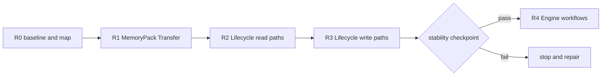

# E.R.I.I. Project Status

<!-- Generated by scripts/project_status.py; edit docs/project-status.json. -->

> As of: `2026-08-20`
>
> Source: `0.5.0a3` at `94a61d5c1b77b5aa8871521aa53b0dba58dedf38`
>
> Refactoring program: `R2` / `complete` (`2026-08-13` to `2026-09-27`)

This dashboard separates maintained Core, active Alpha surfaces, removable experiments, honest placeholders, and planned work. Status is curated in `docs/project-status.json`; file counts or the presence of code do not promote maturity.

## Maturity Summary

| Maturity | Modules | Meaning |
| --- | ---: | --- |
| `maintenance` | 2 | Accepted behavior under defect, security, and compatibility maintenance. |
| `active-alpha` | 4 | Implemented and tested source behavior that may still evolve before 1.0. |
| `experimental` | 4 | Removable evaluation surface without stable or production claims. |
| `placeholder` | 1 | Reserved seam that deliberately reports unavailable behavior. |
| `planned` | 2 | Direction only; not an implemented runtime capability. |

## Current Program



Current gate: Begin R3 Lifecycle write-path extraction with Backup/Restore and Upgrade/Import batches while preserving the R2 read-path checkpoint.

## Module Catalog

| Module | Track | Maturity | Interface | Persistence | CI |
| --- | --- | --- | --- | --- | --- |
| Continuity and relationship kernel | `core` | `maintenance` | `advanced` | `current-formats` | python-matrix, windows-smoke, longitudinal |
| ERIIEngine facade | `core` | `active-alpha` | `golden` | `orchestrates-current-formats` | python-matrix, windows-smoke, contract-snapshots, refactoring-benchmark |
| Storage and data lifecycle | `core` | `maintenance` | `golden` | `owns-current-formats` | python-matrix, windows-smoke, contract-snapshots, longitudinal, refactoring-benchmark |
| FastAPI reference server | `host` | `active-alpha` | `advanced` | `delegates-to-core` | python-matrix, windows-smoke, contract-snapshots, typescript-contract |
| TypeScript server client | `client` | `active-alpha` | `advanced` | `none` | typescript-build, typescript-test, typescript-contract |
| OpenAI and callable LLM adapters | `adapter` | `active-alpha` | `experimental` | `candidate-only` | python-matrix |
| Vector retrieval adapters | `adapter` | `experimental` | `experimental` | `derived-index-only` | python-matrix |
| Character Deliberation C0/G2 | `labs` | `experimental` | `experimental` | `none` | python-matrix, optimized-python |
| Deliberation Shadow evaluation | `labs` | `experimental` | `internal` | `none` | python-matrix |
| Claude Deliberation adapter | `adapter` | `placeholder` | `experimental` | `none` | python-matrix |
| DeepSeek Continuity Review | `experiment` | `experimental` | `experimental` | `none` | deepseek-offline |
| Principal and capability security hooks | `core` | `planned` | `internal` | `planned-format-impact` | python-matrix |
| User data management experience | `product` | `planned` | `none` | `uses-existing-lifecycle` | docs |

## Next Gates

### Continuity and relationship kernel

Relationship isolation, sourced continuity review, persona, temporal, consequence, and recall semantics.

Paths: `erii/core`, `erii/models`

Next gate: Accept only defect, security, compatibility, and source-backed v0.5 extensions.

### ERIIEngine facade

Primary host facade plus private MemoryPack analysis, export assembly, snapshot-bound transfer planning, and whole-import execution. SQLite schema 11 commits a versioned content-free operation receipt with the payload, so post-commit errors and identical retries resolve exactly once without replay; FileStorage retains restart-safe before-image journaling.

Paths: `erii/engine.py`, `erii/_engine`, `erii/__init__.py`

Next gate: Keep the R1B transfer boundary and completed R2 read-path checkpoint frozen while R3 extracts Lifecycle writes; do not move Engine workflows before the R3 checkpoint.

### Storage and data lifecycle

FileStorage v2 with recoverable flat-format MemoryPack payload journaling, SQLite schema 11 with receipt-backed exactly-once MemoryPack execution, MemoryPack 0.5.0a3, backup, restore, upgrade, import, erasure, and rebuild.

Paths: `erii/storage`, `erii/data_lifecycle.py`, `erii/lifecycle_erasure.py`, `erii/lifecycle_memory_pack_import.py`, `erii/lifecycle_sqlite_upgrade.py`, `erii/lifecycle_streaming.py`

Next gate: Complete R3 write-path extraction while preserving every declared reader, R2 observation identity, and atomicity invariant.

### FastAPI reference server

Trusted single-owner reference host with a frozen /api/v1 shape; not a multi-tenant SaaS boundary.

Paths: `erii/server`

Next gate: Wait for v0.6 principal, capability, object authorization, egress, quota, and audit seams.

### TypeScript server client

Node-oriented client at 0.5.0-alpha.3, verified against the live FastAPI contract.

Paths: `clients/typescript`

Next gate: Keep parity with stable Python host interfaces; do not add deliberation state before its Python interface stabilizes.

### OpenAI and callable LLM adapters

Optional generation and persona-compilation adapters; LLM output remains an untrusted candidate.

Paths: `erii/adapters`

Next gate: Add adapter-specific contract evidence only when a second behaviorally distinct implementation justifies a seam.

### Vector retrieval adapters

In-memory and optional Chroma retrieval adapters with relationship-isolation checks.

Paths: `erii/vector`

Next gate: Demonstrate stable host value and lifecycle behavior before any promotion.

### Character Deliberation C0/G2

Offline strict contracts, private Compact orchestration, Direct fallback, continuity review, and exact reply binding.

Paths: `erii/deliberation`, `tests/deliberation`

Next gate: After the R3 checkpoint, implement G3 Staged/Adaptive and P1 Session Residue, then run Pilot and human evaluation.

### Deliberation Shadow evaluation

D0-D4 synthetic fixtures, blinding, metrics, preregistration slots, and human-anchored promotion gates.

Paths: `erii/labs/deliberation/shadow_eval`, `tests/labs/deliberation/shadow_eval`

Next gate: Run a real Pilot with calibrated thresholds and human judgments; do not infer behavior quality from fake actors.

### Claude Deliberation adapter

Credential-free unavailable descriptor and stub methods; no Anthropic SDK construction or live transport.

Paths: `erii/deliberation/claude_adapter.py`

Next gate: Implement strict offline byte fixtures, explicit opt-in transport, deadline/cancellation, and raw-thinking destruction before live claims.

### DeepSeek Continuity Review

Removable continuity evaluator experiment with real client code and offline contract tests; historical accuracy claims are invalid.

Paths: `experiments/deepseek-continuity-review`

Next gate: Build a larger blind, independently labeled data set with confidence intervals, budgets, privacy assessment, and model-version baselines.

### Principal and capability security hooks

Current credential and sanitizer utilities exist, but formal object authorization and multi-user host seams are v0.6 work.

Paths: `erii/security`

Next gate: Design and validate provider-neutral principal, capability, egress, encryption, audit, and quota interfaces.

### User data management experience

User-facing inspection, explanation, migration, correction, and deletion workflows planned for v0.7.

Paths: `docs/development-strategy.md`, `ROADMAP.md`

Next gate: Wait for v0.6 authorization hooks and validate usability with non-maintainer users.

## Update Rule

Update `docs/project-status.json` in the same change when a Module changes track, maturity, public Interface, persistence impact, CI coverage, or promotion gate. Then run:

```powershell
python scripts/project_status.py --write
python scripts/project_status.py --check
```

A successful build, parser test, or live Provider call does not by itself promote maturity. Promotion requires the gate recorded for that Module and any applicable roadmap admission criteria.
