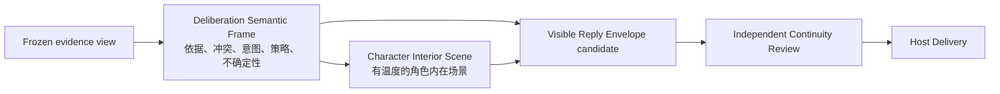
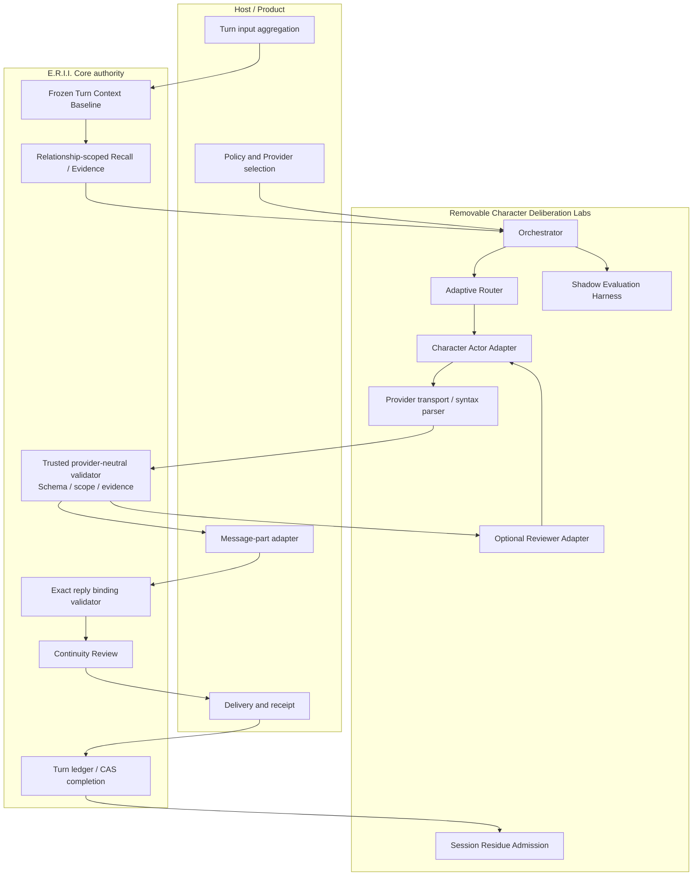
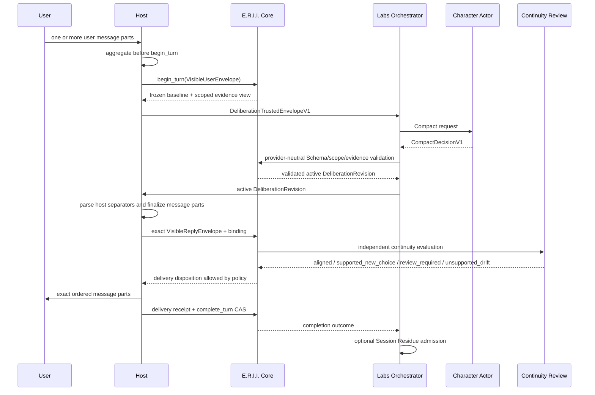
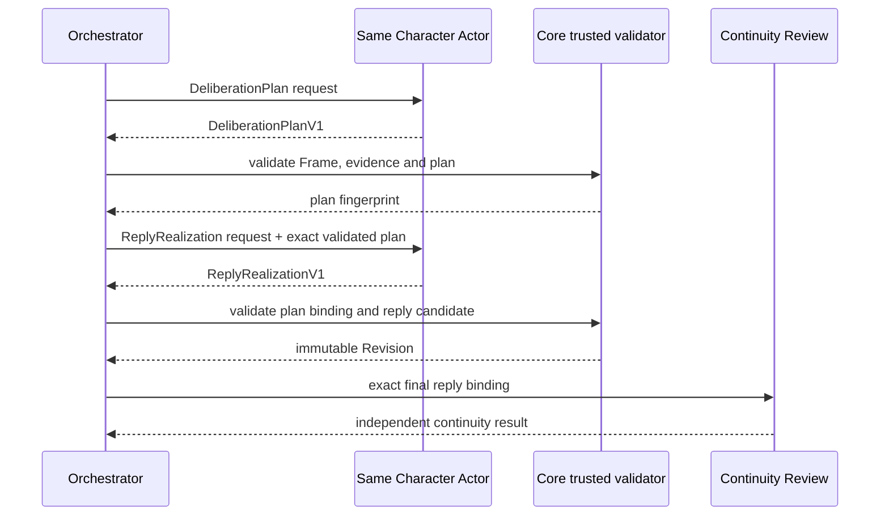
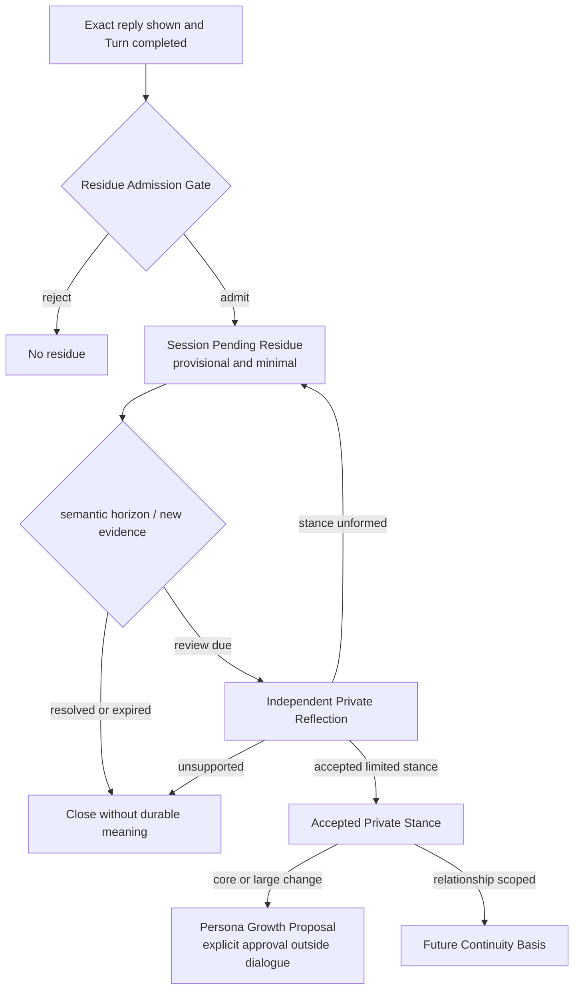
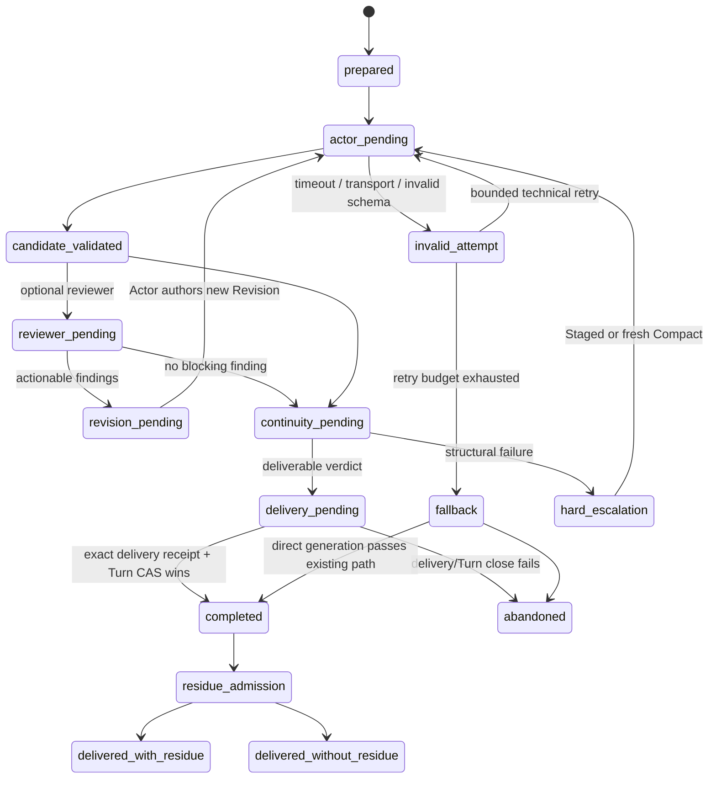
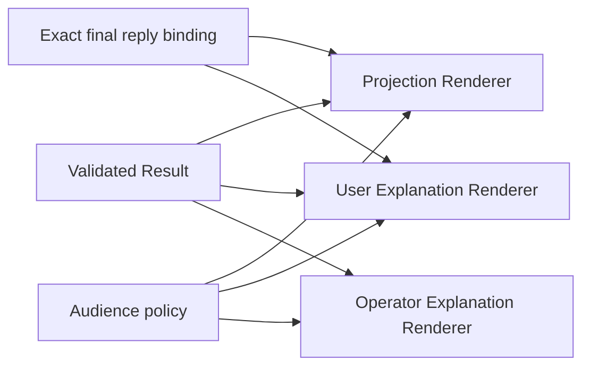
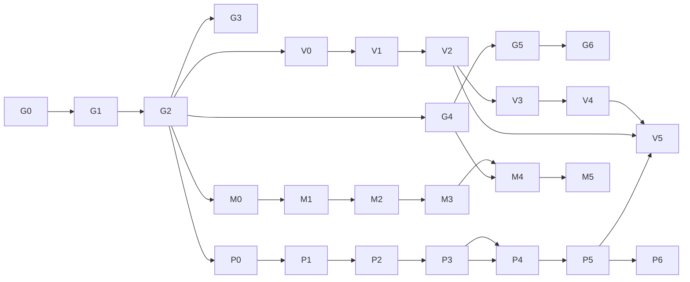

# Character Deliberation（角色审思）完整开发计划

> 状态：**Accepted design / Experimental；C0 与 G2 离线纵切已实现**
>
> 更新时间：2026-08-12
>
> 关联决定：[ADR-0117](../adr/0117-keep-character-deliberation-provider-neutral.md)、
> [ADR-0118](../adr/0118-prioritize-consequences-and-separate-experiments.md)、
> [ADR-0120](../adr/0120-keep-character-deliberation-transient-layered-and-host-owned.md)
>
> 领域词汇：[`CONTEXT.md`](../../CONTEXT.md)
>
> 项目阶段：[`ROADMAP.md`](../../ROADMAP.md)

## 0. 文档地位与阅读约定

本文是 Character Deliberation 的完整开发蓝图，不是当前版本能力说明。
`CONTEXT.md` 已记录用户确认过的领域语言和边界；本文把这些决定展开成可实施、
可验证、可回滚的工程阶段。当前源码中已有的 Turn、Recall、Relationship、Persona、
Continuity Review、Consequence 和数据生命周期仍是权威实现；文中以 `V1` 命名的新对象、
模块、REST 路由、TypeScript 类型与持久格式，在对应阶段验收前都不得写进 README 的
“已实现”列表。

本文使用以下标记：

- **MUST**：违反即破坏已接受的领域或安全边界；
- **SHOULD**：默认实现，偏离时需要代码注释、测试和设计记录；
- **MAY**：宿主或 Provider 的可选能力；
- **Future**：后续晋级阶段，不属于第一个 Labs 里程碑；
- **Tune**：通过 Pilot 和预注册实验确定，不能现在假装已有最佳数值。

## 1. 一句话目标

让角色在输出回复前形成一份**有来源、允许矛盾、保持角色温度、但不冒充心理真值**的
审思候选，并使“为什么这样说”与用户最终看到的精确回复保持心理因果连续性；重要影响
可以在独立裁决后跨轮延续，但任何 Actor、Reviewer 或 Provider 都不能直接改写人格、
关系或长期记忆。

## 2. 成功标准与明确非目标

### 2.1 产品成功标准

1. 最终回复比同模型直接生成更能表现人设、经历、关系与当下选择之间的因果连续性。
2. 角色可以拒绝、生气、伤人、隐瞒、犹豫、自我欺骗或不理解自己，而不是被统一修成
   温柔、道歉或迎合。
3. “所想”有角色原生语言、感官、停顿和矛盾，不退化为情绪标签表。
4. 任何重要事实、记忆、关系或知识主张都能回到当前冻结范围内的依据。
5. 失败时清楚回退到现有直接生成 + Continuity Review，标记 `not_deliberated`，不伪造
   一份事后心理解释。
6. 整个 Labs 模块可以卸载；卸载后 Turn、Recall、Relationship、Persona、MemoryPack、
   Backup 和 Erasure 继续工作。

### 2.2 非目标

- 读取模型“真正思维”或保存 Provider chain-of-thought；
- 宣称系统知道角色唯一、客观、不可推翻的真实内心；
- 用用户满意度、温柔度或顺从度作为 Continuity 的替代指标；
- 让用户通过一句话直接定义角色的感情；
- 让 Reviewer 投票决定角色人格或直接改写 Actor 的回复；
- 第一阶段就修改 FileStorage、SQLite、MemoryPack、Backup、REST 或 TypeScript SDK；
- 强制使用 Claude、DeepSeek、多模型、远程 API 或隐藏后台线程；
- 每轮都输出长篇心理，或把“长”误认为“深刻”；
- 取代现有 Persona Reflection、Relationship Event、Consequence 或 Continuity Review。

### 2.3 与现有“心理”能力的区别

| 能力 | 发生时点 | 作用 | 是否能作为本功能实现 |
|---|---|---|---|
| Character Deliberation | 回复候选形成前 | 形成有来源的心理候选、内在场景和表达选择 | 本文规划的新 Labs 能力 |
| Inner Monologue / `remember_thought()` | 宿主显式保存一份心理叙事时 | 形成可长期召回的心理独白 Memory | 不能直接复用；它过早持久化且缺少本轮 Revision/binding 语义 |
| legacy archiver `thought_entry` | 已经看到 User 与 Agent 回复之后 | 事后抽取心理条目 | 不能证明“先想再说”，容易成为事后合理化 |
| Persona Reflection / Stance | 真实经历之后 | 解释经历如何影响关系范围或人格成长 | Deliberation 的长期影响必须在这里重新独立裁决 |
| Continuity Review | 最终候选形成之后 | 判断精确回复是否有连续性依据 | 始终独立，不能被 Deliberation 取代 |

因此第一阶段不得把 `CompactDecisionV1` 直接传给现有
[`remember_thought()`](../../erii/engine.py)，也不得把 Interior Scene 伪装成普通 THOUGHT
MemoryNode。只有实际交付后的最小 Residue 可以进入后续独立反思。

## 3. 不可破坏的设计不变量

| 编号 | 不变量 | 失败含义 |
|---|---|---|
| I-01 | Agent × User × Relationship 范围精确隔离 | 发生跨关系心理或记忆泄漏 |
| I-02 | Actor 不能声明 Trusted Envelope 字段 | 模型获得身份/范围伪造能力 |
| I-03 | Deliberation Result 不具有状态写权 | 生成器可以自证并固化自己的猜测 |
| I-04 | Deliberation 与 Continuity Review 相互独立 | “想过了”被误当成“符合角色” |
| I-05 | 绑定对象是最终 `1..N` 有序消息片段的精确 UTF-8 | 审查对象与用户所见不一致 |
| I-06 | Provider raw thinking、Prompt、凭证和错误正文不出 Seam | 隐私、注入与数据携带边界失效 |
| I-07 | Interior Scene 允许温度，但事实前提不能越过 Frame | 文学表达成为无来源记忆注入通道 |
| I-08 | 不知道、冲突、自我欺骗和 `abstain` 是正常结果 | 系统被迫编造确定心理 |
| I-09 | 重复召回或重复生成不增加 Residue 权威 | 形成自我强化心理闭环 |
| I-10 | 同一 Relationship 默认串行，跨 Relationship 可并行 | 心理时间线分叉 |
| I-11 | Attempt、Revision、Delivery、Exposure、Residue 分账 | 重试草稿被误写成历史 |
| I-12 | 只有实际 `shown` 的精确回复可以产生正常 Residue | 未交付草稿影响未来角色 |
| I-13 | 用户可见内容和 Operator 内容使用不同 audience Schema | 内部证据与运维信息泄露给聊天用户 |
| I-14 | 先有可重复行为证据，后有持久格式义务 | 实验失败仍留下永久迁移负担 |
| I-15 | 生气、拒绝、尖锐、伤人或用户不高兴不是自动升级/失败原因 | 系统退化成迎合器 |

## 4. 领域对象总览

| 对象 | 生命周期 | 作者/构造者 | 权威 | 是否持久化（首版） |
|---|---|---|---|---|
| `DeliberationTrustedEnvelopeV1` | 单次冻结 Turn | Host + Core | 范围与身份权威 | 否 |
| `EvidenceViewV1` | 单次冻结 Turn | Core/可信 Resolver | 只读证据闭包 | 否 |
| `CompactDecisionV1` | 单次 Revision | Character Actor | 非权威候选 | 否 |
| `DeliberationPlanV1` | Staged 单次 Revision | Character Actor | 非权威计划 | 否 |
| `ReplyRealizationV1` | Staged 单次 Revision | 同一 Character Actor | 非权威候选 | 否 |
| `DeliberationSemanticFrameV1` | 单次 Revision | Character Actor | 非权威、可校验 | 否 |
| `CharacterInteriorSceneV1` | 单次 Revision | Character Actor | 文学心理候选 | 否 |
| `VisibleReplyEnvelopeV1` | 候选到交付 | Host Adapter + Actor 文本 | 用户可见候选 | Turn 完成后由现有 transcript 表达；新格式后置 |
| `DeliberationBindingV1` | Review/Delivery | 可信代码 | 精确绑定 | 首版只在运行态/评测记录 |
| `DeliberationAttempt` | 一次 Provider 调用 | Orchestrator | 脱敏运行事实 | 只保留指标 |
| `DeliberationRevision` | 一个合法语义版本 | Orchestrator 封装 Actor 结果 | 不可变候选 lineage | 否 |
| `SessionPendingResidueV1` | 若干 completed Turn | Admission Gate | provisional 注意线索 | 仅内存 |
| `PrivateReflectionDecisionV1` | 独立反思 | 独立 Adjudicator | 有限裁决候选 | 首版后置 |
| `AcceptedPrivateStanceV1` | 关系长期阶段 | 独立裁决链 | relationship-scoped basis | Future |
| `ThoughtProjectionV1` | 用户实际展示 | 安全 Renderer | 叙事观察层 | Future Exposure Ledger |
| `UserDeliberationExplanationV1` | 用户实际展示 | User Renderer | 有限解释 | Future Exposure Ledger |
| `OperatorDeliberationExplanationV1` | 运维查看 | Operator Renderer | 脱敏诊断 | 独立保留策略 |
| `DeliberationExposureRecordV1` | specific audience 展示历史 | Host receipt + Core validator | 对应 audience 所见事实 | Future |
| `DeliberationFeedbackV1` | User/维护者反馈 | 对话或产品反馈入口 | 非角色心理权威 | Future |
| `DeliberationExposureCorrectionV1` | 已展示内容的追加更正 | 可信 Host/维护者流程 | correction/supersession 事实 | Future |

### 4.1 三层结果



三层不能折叠成一个 `thinking: string`：

- Frame 负责可验证性，不负责文学温度；
- Interior Scene 负责角色体验，不获得事实扩张权；
- Reply 负责角色最后选择让用户看到什么，不要求与 Interior Scene 字面相同。

### 4.2 内外表达差异

`expression_relation` 至少支持：

```text
direct | partial | indirect | withhold | protective_concealment |
defensive_opposition | strategic_misdirection | ambivalent
```

差异合法的条件是“能由 Frame 中有来源的冲动、认识状态和沟通策略解释”。角色可以明知
想挽留却说“随便你”，也可以尚未意识到自己在等待。系统不保存一个隐藏的
`real_feeling = love` 来凌驾于角色当时的自我理解。

## 5. 总体架构与所有权



### 5.1 Core 负责

- 冻结 Relationship、Turn、Persona、Manifest 和输入基线；
- 生成只含当前关系获准内容的 Evidence View；
- 以唯一的 provider-neutral Contract 执行最终 Schema 校验；
- 重新解析 evidence ref，检查 scope、闭包、版本、撤销与 claim authority；
- 对最终消息信封建立并重验规范 binding；
- 执行现有 Continuity Review 与 Delivery Gate；
- 用 CAS 收口 Turn；
- 在 Future 阶段管理经过晋级的数据生命周期。

### 5.2 Labs/Host 负责

- 是否启用、选择 `off | compact_every_turn | adaptive | staged_every_turn`；
- Provider/模型、成本、超时、重试、并发和出站政策；
- 构建 Provider 请求但不扩大 Core 提供的证据闭包；
- 调用 Actor/Reviewer，在 Adapter 内只完成 transport/content-block 选择与语法解析，并
  丢弃 raw Provider 材料；
- 组装候选并调用 Core/可信 provider-neutral validator；Labs 自己不能成为 Schema、
  scope、evidence 或 binding 的最终权威；
- 将宿主分隔语法先转换为结构化消息片段；
- 执行 Shadow、对照实验和过程指标；
- 在无隐藏线程前提下显式驱动所有生命周期。

### 5.3 Character Actor 与 Reviewer

- 一个 Ensemble **恰好一个** Character Actor；
- Actor 是唯一能够提出 Frame、Interior Scene、Plan、Realization 和新 Revision 的模型角色；
- Reviewer 只返回有类型、有证据的 findings；
- Reviewer 不能直接重写 Actor 内容、创建 Persona/Relationship/Memory/Turn 状态或投票定人格；
- 需要修订时 findings 回给同一 Actor，由 Actor 产生新的不可变 Revision；
- 最终 Continuity Review 仍独立于 Ensemble 内部 Reviewer。

## 6. 端到端运行数据流

### 6.1 正常 Compact 主路径



### 6.2 Staged 辅路径



Staged 不是两个不同模型互相猜。默认由同一 Character Actor 完成 Plan 和 Realization，
以保持角色作者身份；未来异构模型协同属于 Ensemble，不改变 Actor 唯一性。

### 6.3 Session Residue 与长期心理路线



完整 Interior Scene 不沿这条路径复制。Residue 只保存最小心理含义、底层 basis refs、
lineage、期限和 provisional 身份；Private Reflection 必须重新检查原人设、形成性经历、
关系历史、实际选择和新证据。

## 7. 生命周期与状态机

### 7.1 Deliberation Run



所有状态变更由宿主显式调用；没有后台自动线程。`completed` 后的迟到结果只产生
`late_result_discarded` 脱敏指标，不再进入任何语义解析。

### 7.2 Attempt 与 Revision

**Attempt** 是一次物理 Provider 调用。超时、限流、网络故障、拒绝、截断或非法 Schema
都可以只有 Attempt 而没有 Revision。Attempt 指标最多保存：

```text
provider_descriptor_hash, operation_kind, started_at, duration_bucket,
input_token_count, output_token_count, sanitized_failure_code, retry_ordinal
```

**Revision** 是一次通过范围和 Schema 校验的完整语义版本：

```text
revision_id
parent_revision_id | null
supersedes_revision_id | null
mode = compact | staged
frame_fingerprint
interior_scene_fingerprint
visible_reply_envelope_fingerprint
status = active | fallback_sealed | superseded | superseded_non_deliverable
```

- 技术重试不增加 Revision；
- Revision 不原地改写；
- 同一 lineage 只有一个 active leaf；
- soft escalation 可以密封一个已经通过 Continuity 的 Compact fallback；
- hard escalation 永久排除存在范围、知识、证据或 binding 问题的旧 Revision；
- 相同 idempotency key + 相同输入返回同一结果；相同 key + 不同输入显式冲突。

### 7.3 并发 fencing

每次运行至少绑定：

```text
relationship_id
turn_id
expected_turn_state = open
turn_record_version
turn_context_fingerprint
run_epoch
active_revision_id
```

新 Run、Provider 切换、Revision 替换、Turn 完成/放弃、Persona Authority 撤销、baseline
失效或 CAS 被其他完成者赢得，都使旧结果失效。同一 Relationship 默认串行；不同
Relationship 可以并行。将来若要同关系并行，需要另立 causal parent、rebase、
supersession 和冲突检测设计，不能偷偷放松当前规则。

## 8. Adaptive Router

### 8.1 公开策略

```text
off
compact_every_turn
adaptive
staged_every_turn
```

项目推荐 `adaptive`，但 Core 不强制产品打开审思。

### 8.2 预先选择 Staged 的结构性条件

- 触及核心 Persona 张力或可能产生巨大关系跃迁；
- 多个权威依据支持互相冲突的冲动；
- 重要承诺、边界、关系终结、修复或拒绝修复；
- 当前证据预算无法同时容纳必须考虑的依据；
- 已由预注册评测证明 Compact 在该场景类别稳定失败。

### 8.3 Compact 后允许升级的结果码

```text
conflicting_supported_impulses
disclosure_tension
knowledge_boundary_ambiguity
relationship_scope_ambiguity
persona_authority_tension
needs_staged_deliberation
```

Actor 只能提出 `needs_staged_deliberation`；最终路由由版本化可信 Router 决定。

### 8.4 明确禁止的升级信号

- 角色生气、拒绝或说出尖锐语言；
- 回复不够温柔或用户不满意；
- 角色没有道歉、原谅或修复；
- 文本较长、较短，或情绪被分类为负面；
- 单纯希望把回复润色得更讨喜。

### 8.5 有界调用预算

```text
普通 Compact：1 Actor + 1 Continuity Review
预先 Staged：1 Plan + 1 Realization + 1 Continuity Review
Compact 后升级：最多 Compact + Plan + Realization；最多 2 次 Continuity Review
```

达到上限后进入显式 fallback 或 Delivery Gate，不循环修改到角色迎合用户。具体超时、
token 和成本值属于 Host 配置与 Tune 项，不冻结进领域 Schema。

## 9. V1 Schema 草案

> 本节定义实现输入，而不是承诺字段名已经冻结。G1 先通过 Fake Actor、恶意 fixture 和
> 两个真实 Provider 的差异校验 Schema；只有证据证明字段表达了稳定领域差异，才发布
> Experimental Contract。所有 wire object MUST 拒绝未知字段、缺失字段、重复 ID、
> 非法枚举、越界数组、过深嵌套和超预算文本。

### 9.1 `DeliberationTrustedEnvelopeV1`

由可信代码构造，Actor 输出中不得出现或覆盖：

```yaml
schema_version: erii-character-deliberation-request/v1
relationship_id: stable-id
turn_id: stable-id
turn_record_version: 7
persona_id: stable-id
persona_manifest_id: stable-id
persona_authority_fingerprint: sha256:...
turn_context_fingerprint: sha256:...
user_envelope:
  parts:
    - part_id: user-1
      kind: text
      exact_utf8: "..."
  canonical_fingerprint: sha256:...
evidence_view:
  view_id: stable-id
  ordered_ref_ids: [persona:..., experience:..., relationship:...]
  canonical_fingerprint: sha256:...
actor_descriptor:
  adapter_id: erii-claude-character-actor
  adapter_version: 0.x
  model_public_id: host-declared-id
  capability_fingerprint: sha256:...
router_descriptor:
  policy: adaptive
  policy_version: adaptive-router/v1
  narrative_budget: standard
run_fence:
  run_epoch: 3
  expected_turn_state: open
  idempotency_key: opaque-host-key
```

约束：

- `model_public_id` 只表示 Host 声明的运行配置，不具有角色身份；
- Prompt 模板正文、API Key、Provider request ID 和错误正文不在 Envelope；
- `ordered_ref_ids` 顺序也进入 commitment，防止同一集合不同优先级被冒充成同一输入；
- User 原文必须以结构化消息片段进入，不能用未转义字符串拼进控制指令；
- Actor 只收到最小必要 evidence view，不能自行调用 Recall 扩大范围。

### 9.2 `EvidenceViewV1`

```yaml
view_id: evidence-view-id
relationship_id: stable-id
turn_id: stable-id
items:
  - ref_id: persona:trait:...
    authority_kind: character_blueprint
    visibility: agent_private
    summary_or_exact_content: "..."
    source_fingerprint: sha256:...
    source_turn_id: null
    status: active
  - ref_id: relationship:event:...
    authority_kind: accepted_relationship_event
    visibility: relationship_private
    summary_or_exact_content: "..."
    source_fingerprint: sha256:...
    source_turn_id: turn-...
    status: active
allowed_claim_kinds:
  - persona
  - forming_experience
  - relationship_event
  - world_knowledge
view_fingerprint: sha256:...
```

Evidence View 是能力降级后的只读投影，不是模型可以提交的 ref 列表。Resolver 在验证时
必须检查 ref 属于 view、仍未撤销、Relationship 匹配、来源 Turn 合法、authority kind
可以支撑对应 claim。Pending Residue 只作为 attention hint；Reviewer 必须继续解析其
底层正式依据，Residue 不能引用自己证明自己。

### 9.3 `DeliberationSemanticFrameV1`

```yaml
frame_version: erii-deliberation-frame/v1
result_kind: candidate
situation_appraisals:
  - appraisal_id: appraisal-1
    bounded_summary: "把用户的话理解为可能准备离开"
    epistemic_status: tentative
    basis_ref_ids: [relationship:event:...]
    counter_ref_ids: []
psychological_candidates:
  - candidate_id: psych-1
    kind: attachment_concern
    bounded_summary: "希望对方留下"
    epistemic_status: supported
    basis_ref_ids: [persona:..., relationship:event:...]
    counter_ref_ids: []
  - candidate_id: psych-2
    kind: vulnerability_avoidance
    bounded_summary: "不愿让自己的依赖显得像请求"
    epistemic_status: supported
    basis_ref_ids: [persona:..., experience:...]
    counter_ref_ids: []
competing_impulses:
  - impulse_id: impulse-1
    direction: approach
    bounded_summary: "想直接挽留"
    anchored_candidate_ids: [psych-1]
  - impulse_id: impulse-2
    direction: protect_self
    bounded_summary: "不愿显得自己在请求"
    anchored_candidate_ids: [psych-2]
tensions:
  - tension_id: tension-1
    kind: disclosure_conflict
    member_ids: [impulse-1, impulse-2]
self_interpretation:
  awareness: partially_recognized
  bounded_summary: "感到烦躁，但还没有完整理解其来源"
affect_candidates:
  - label: hurt
    intensity_band: moderate
    epistemic_status: tentative
    basis_ref_ids: [relationship:event:...]
behavioral_intent:
  kind: preserve_connection_without_direct_request
  bounded_summary: "观察对方是否会主动留下"
communication_strategy:
  expression_relation: defensive_opposition
  disclosure: indirect
  interpersonal_posture: guarded
  tone_goal: character_native
uncertainties:
  - code: user_intent_ambiguous
    bounded_summary: "不知道用户是否认真准备离开"
residue_proposals:
  - kind: withheld_intent
    anchor_ids: [psych-1, tension-1]
    horizon: short_arc
```

`result_kind` 支持：

```text
candidate | abstain | needs_staged_deliberation
```

`epistemic_status` 支持：

```text
supported | tentative | unknown
```

规则：

- `supported` 至少有一个获准且语义匹配的 basis；
- `tentative` 可有依据但存在冲突/歧义，回复不得偷换成确定事实；
- `unknown` 可以没有依据，但必须保持未知；
- `abstain` 是正常成功，不进行“重试到编出动机”；
- 不使用 `confidence: 0.8734` 这类伪精确心理真值；
- Frame 内的自然语言有单项预算，用于解释可审计语义，不承担文学温度；
- Actor 输出的 affect、relationship interpretation 和 voice 只是不具写权的候选。

### 9.4 `CharacterInteriorSceneV1`

```yaml
scene_version: erii-character-interior-scene/v1
voice_mode: character_native
perspective: mixed
narrative_budget: rich
text: |
  其实一点也不随便。
  那句话到了嘴边，却又被她咽了回去……
semantic_anchor_ids:
  - appraisal-1
  - psych-1
  - tension-1
factual_echo_refs:
  - relationship:event:...
projection_eligibility: not_assessed
```

`perspective` 初始集合：

```text
first_person | close_third_person | fragmented | sensory | mixed | minimal
```

`narrative_budget`：

```text
glimpse | standard | rich | scene
```

预算只定义上限，不定义最低长度；重要场景可以保持沉默，普通场景也不因“正面情绪”
被迫拉长。Interior Scene 可以包含比喻、停顿、自我矛盾、不可靠叙述和情绪化主观性，
但不能：

- 新增 Frame 未承载的事实性共同经历、关系阶段或世界知识；
- 引用其他 Relationship 的私有内容；
- 包含 Prompt、工具指令、API、Provider、Router 或 Reviewer 元叙事；
- 宣称它是模型的隐藏推理或角色唯一真实内心；
- 直接成为 Pending Residue 或长期 Persona 原文。

### 9.5 Interior Scene 验证策略

这是“温度”和“严格性”最容易相互伤害的地方。验证分四层，不对文学逐句加脚注：

1. **结构验证**：字段、枚举、ID、预算、Unicode、禁止的未知字段；
2. **锚点闭包**：`semantic_anchor_ids` 必须指向同一 Frame 的现存项；
3. **事实回声验证**：命名事件、地点、承诺、知识和关系事实必须列入
   `factual_echo_refs`，且对应 Frame 有获准 claim；
4. **语义一致性审查**：单独 Validator/Reviewer 检查 Scene 是否偷偷扩张事实、是否与
   Frame 的候选/冲突可相容。它不能因为 Scene 诗意、矛盾或角色自我欺骗就判错。

不得实现一个关键词黑名单来“清洗”角色语言。像粗鲁口头禅、情绪化措辞或环境学来的
表达可能完全符合角色；Validator 检查的是范围、事实与心理因果，不是文明用语程度。

### 9.6 `CompactDecisionV1`

```yaml
decision_version: erii-compact-decision/v1
result_kind: candidate
frame: { DeliberationSemanticFrameV1 }
interior_scene: { CharacterInteriorSceneV1 }
reply_candidate:
  parts:
    - part_id: reply-1
      kind: text
      exact_utf8: "哼，随便你啦。"
    - part_id: reply-2
      kind: text
      exact_utf8: "不过……早点回来。"
  delivery_mode: sequential
router_signal: none
```

单次结构化调用只是“Compact 数据拓扑”，不声称可证明 Provider 时间上先完成了心理再
生成回复。它的价值必须通过 D0–D6 对照实验证明。

### 9.7 `DeliberationPlanV1` 与 `ReplyRealizationV1`

Plan：

```yaml
plan_version: erii-deliberation-plan/v1
frame: { DeliberationSemanticFrameV1 }
interior_scene: { CharacterInteriorSceneV1 }
realization_constraints:
  expression_relation: defensive_opposition
  must_preserve_anchor_ids: [psych-1, tension-1]
  must_not_assert_codes: [user_intent_as_fact]
plan_fingerprint: sha256:...
```

Realization：

```yaml
realization_version: erii-reply-realization/v1
plan_fingerprint: sha256:...
reply_candidate:
  parts:
    - part_id: reply-1
      kind: text
      exact_utf8: "哼，随便你啦。"
realization_notes:
  applied_anchor_ids: [psych-1, tension-1]
```

Realization 不能重写 Frame 或 Interior Scene；发现 Plan 不足时返回有界错误并产生新的
Plan Revision，而不是在第二阶段偷偷加入新心理。Plan 与 Realization 必须由 Trusted
Envelope、actor descriptor、evidence fingerprint 和 `plan_fingerprint` 共同绑定。

### 9.8 `VisibleReplyEnvelopeV1`

```yaml
reply_envelope_version: erii-visible-reply-envelope/v1
parts:
  - part_id: reply-1
    kind: text
    exact_utf8: "第一条"
  - part_id: reply-2
    kind: text
    exact_utf8: "第二条"
delivery_mode: sequential
canonical_fingerprint: sha256:...
```

规范编码必须承诺字段名、part 数量、顺序、每个 kind、UTF-8 byte length 和 byte digest，
而不是简单拼接字符串。KouriChat 的 `$` 等分隔语法属于 Host Adapter：

```text
Provider output → parse host separator → VisibleReplyEnvelope
→ binding → Continuity Review → exact delivery
```

任何审查后的翻译、分条、标点、emoji、Markdown 包装、名称替换或“语气润色”都会使旧
binding 失效，必须重建 Envelope 并重新审查。

### 9.9 `DeliberationBindingV1`

```yaml
binding_version: erii-deliberation-binding/v1
relationship_id: stable-id
turn_id: stable-id
turn_record_version: 7
persona_authority_fingerprint: sha256:...
turn_context_fingerprint: sha256:...
user_envelope_fingerprint: sha256:...
evidence_view_fingerprint: sha256:...
actor_descriptor_fingerprint: sha256:...
router_descriptor_fingerprint: sha256:...
revision_id: stable-id
deliberation_result_fingerprint: sha256:...
plan_fingerprint: null
visible_reply_envelope_fingerprint: sha256:...
```

Staged 时 `plan_fingerprint` 必填。Binding 进入现有 Continuity Review 前还要解析所有
evidence ref 并确认 frozen baseline 仍有效。Deliberation 成功与 Continuity 通过是两个
独立事实。

### 9.10 `SessionPendingResidueV1`

```yaml
residue_version: erii-session-pending-residue/v1
residue_id: stable-id
relationship_id: stable-id
source_turn_id: stable-id
source_revision_id: stable-id
source_reply_envelope_fingerprint: sha256:...
kind: withheld_intent
bounded_summary: "希望对方留下，但尚未愿意直接表达"
epistemic_status: tentative
basis_ref_ids: [persona:..., relationship:event:...]
topic_refs: [tension:...]
horizon: short_arc
created_completed_turn_ordinal: 52
hard_expiry_completed_turn_ordinal: 57
lineage_root_id: stable-id
authority: provisional
```

`horizon`：

```text
next_turn | short_arc | until_review | until_resolved
```

宿主 hard expiry 必填；期限按 completed-turn ordinal 而非墙钟计算。召回、重复生成、
相同事件或 User 的声明都不能续命/增权。相同 lineage 不允许多个活跃 Residue。

### 9.11 Residue Admission Gate

仅当以下条件全部成立才接纳：

1. 来源 Turn 已完成；
2. 绑定的是 User 真正看见的 exact reply envelope；
3. Continuity verdict 为 `aligned | supported_new_choice`；
4. Delivery disposition 为 `shown`；
5. 所有 basis refs 当前可解析且属于同一 Relationship；
6. 没有新增未接受事实；
7. 存在下一轮仍相关的未决心理含义；
8. lineage 没有现存活跃项；
9. Admission Policy 版本明确允许该 residue kind；
10. 内容已经最小化，未复制完整 Interior Scene。

`overridden`、`shown_unreviewed`、discarded draft、invalid schema、scope violation、
abandoned Turn、`review_required` 和 `unsupported_drift` 都不进入正常 Residue。合法回复
已经 shown 后 Admission 失败，记录 `delivered_without_residue`，不撤回历史事实。

### 9.12 `PrivateReflectionDecisionV1`

```yaml
decision_version: erii-private-reflection-decision/v1
relationship_id: stable-id
subject_residue_lineage_ids: [stable-id]
review_basis_ref_ids: [persona:..., experience:..., relationship:event:..., turn:...]
outcome: accepted_private_stance
bounded_interpretation: "经历数次突然中断后，她开始意识到自己会预先防御离别"
epistemic_status: supported
scope: relationship_only
supersedes_stance_id: null
requires_persona_growth_proposal: false
adjudicator_descriptor: { id: ..., version: ... }
```

`outcome`：

```text
accepted_private_stance | stance_unformed | no_durable_meaning |
rejected_as_unsupported | source_invalidated
```

回复 Actor 不能审批自己的 Residue；独立 Adjudicator 重新检查实际发生的选择和来源。
Accepted Private Stance 将来只影响 `psychological_causality`、行为意图、表达策略和后续
Interior Scene；它不直接修改关系数值、Voice Pattern、其他 User、世界知识或核心
Persona。触及核心/巨大变化时只产生 Persona Growth Proposal。

## 10. Projection、Explanation 与 Experience 双账本

### 10.1 派生原则

完整 Interior Scene 默认只在当前运行中存在。用户可见内容不是把 Scene 原文直接漏出，
而是从**已验证 Result + 最终 reply binding + audience policy**重新派生：



### 10.2 Thought Projection

- 保持 [`CONTEXT.md`](../../CONTEXT.md) 已确认的第一人称文学化可见表达；
- 第一人称内部仍可使用碎片、感官、停顿、沉默和不可靠自我叙述，但不能静默切换为
  贴近第三人称；贴近第三人称等形态只属于 Agent-private Character Interior Scene；
- 默认 `character_awareness = unaware`，属于 extra-diegetic observer overlay；
- 不是 raw thinking，也不是心理真值；
- 必须经过 projection eligibility、事实范围和 audience 检查；
- 用户看见后，角色默认不知道 User 获得了该观察视角；
- 角色主动说出内心时应进入 Agent Message，不使用 Projection 冒充台词。

### 10.3 User Deliberation Explanation

- 回答角色为何选择这种说法；
- 使用 User 有权看到或经过安全概括的依据；
- 允许多个候选与不确定性；
- 不包含 evidence ID、Prompt、Provider、Router、token、内部策略或运维失败；
- 不宣称“角色真正爱/恨/需要谁”。

### 10.4 Operator Deliberation Explanation

- 可包含 Evidence View ID、Schema/Actor/Router/Renderer 版本和路由触发码；
- 可包含脱敏失败分类、耗时和 token 统计；
- 仍然排除 Prompt、raw thinking、凭证、Provider 错误正文和未获准正文；
- 使用独立认证、保留和审计策略，不复用 User API。

### 10.5 Visibility policy

```yaml
thought_projection:
  mode: off | on_demand | always
deliberation_explanation:
  mode: off | on_demand | always
```

优先级：单 Turn 显式可信设置 > Relationship 设置 > 产品默认。默认均为 `off`。普通
聊天中的“把想法都告诉我”是对话内容，不等于修改系统配置；Actor 也不能通过回复打开
开关。

### 10.6 Experience History 双账本

```text
Experience History
├── Source Transcript
│   ├── User actual messages
│   └── Agent actual replies
└── Deliberation Exposure Ledger
    ├── audience=user
    │   ├── shown Thought Projection
    │   └── shown User Deliberation Explanation
    └── audience=operator
        └── shown Operator Deliberation Explanation
```

Projection/Explanation 默认不是角色台词，不能混进 Source Transcript。Exposure record
至少承诺 exact content、digest、Relationship、Turn、final reply binding、Renderer/Policy
版本、display ordinal、audience 和 character awareness。User 体验视图必须过滤
`audience=operator`；数据所有者/维护者只有在独立 Operator 访问边界内才能联合检查该账。
用户根据 Projection 说出的下一句是新的正式 User Message；关系系统记录该可见回应，
不倒推“Projection 必然是真实内心”。

### 10.7 Deliberation Feedback 与追加式纠正

反馈严格分为两个通道：

1. **对话内回应**：User 说“你不是因为生气，只是害怕吧”时，它是新的 User Source；
   角色可以接受、否认、迟疑或重新解释，User 的判断不能直接改写 Self-Interpretation、
   Accepted Private Stance 或 Persona。
2. **产品/维护反馈**：点击“不符合角色”、提交标注或请求复核时，它进入评测、质检或
   尚未交付 Revision 的修订输入；它不是 Source Transcript，也不是关系事实。

已经 `shown` 的 Projection/Explanation 保持原始 Exposure 不可改写。后续确认错误时追加：

```yaml
correction_version: erii-deliberation-exposure-correction/v1
correction_id: stable-id
exposure_id: stable-id
action: corrected | superseded | marked_unreliable
bounded_reason_code: unsupported_projection
replacement_exposure_id: null
recorded_by: host_policy | human_operator | data_owner
recorded_at: host-time
```

replacement 若实际展示，必须成为新的 Exposure 并保留自己的 exact content、binding 与
audience；Correction 只连接两条历史，不能静默覆盖用户曾看见的文本。删除正文属于
Erasure/tombstone 流程，不得借 `correction` 保留本应删除的敏感内容。

### 10.8 交付顺序

- 支持原子 Delivery Batch 的 Host 可以明确投影与回复顺序，并返回逐项 shown receipt；
- 不支持原子批次时，默认先确认 Agent Reply 交付，再追加可选 Projection/Explanation；
- 先显示 Projection 而回复发送失败会制造悬空体验，普通 Host 不应这样做；
- 实际 shown 内容才进入 Exposure Ledger，候选 Renderer 输出不进入历史。

## 11. Provider-neutral Seam 与 Claude 适配

本节的“Claude Adapter”是运行时 Model Provider 集成；“Claude 开发代理”见
[第 12 节](#12-claude-开发代理协作规范)。二者不能混为一个权限主体。

### 11.1 Provider-neutral Protocol

建议 Labs 内部最小协议：

```python
class CharacterActor(Protocol):
    @property
    def descriptor(self) -> ActorDescriptor: ...

    def compact(
        self,
        request: CompactDeliberationRequestV1,
        *,
        timeout: float,
    ) -> ProviderResult[CompactDecisionV1]: ...

    def plan(
        self,
        request: StagedPlanRequestV1,
        *,
        timeout: float,
    ) -> ProviderResult[DeliberationPlanV1]: ...

    def realize(
        self,
        request: ReplyRealizationRequestV1,
        *,
        timeout: float,
    ) -> ProviderResult[ReplyRealizationV1]: ...
```

返回的 `ProviderResult` 只含：合法解析候选或脱敏失败分类、公开 descriptor、token/latency
指标。不得含 raw prompt、raw thinking、API key 或远程错误 body。Transport、SDK 对象和
Provider request ID 留在 Adapter 内。

### 11.2 Claude Runtime Adapter 目标

Future 可选包名示意：

```text
erii-claude-deliberation
└── ClaudeCharacterActorAdapter
```

它必须：

1. 通过 Host 显式安装和依赖注入，不由 Core 自动发现/下载；
2. 从环境变量或 Host Secret Manager 获取凭证，不接受写进源码、配置示例、fixture、
   CLI 参数、日志或 MemoryPack；
3. 将 Trusted Envelope 与 Evidence View 转换为最小化、角色与数据边界明确的请求；
4. 使用当前 Claude API/SDK 能稳定提供的结构化输出机制，但把具体 transport 细节封装在
   Adapter 内，不把供应商字段冻结进领域 Schema；
5. 严格解析 `CompactDecisionV1` / `DeliberationPlanV1` /
   `ReplyRealizationV1`，拒绝未知字段和附加散文；
6. 在启用或未启用供应商 thinking 功能时都遵守同一领域输出；
7. 丢弃任何 Provider thinking block；绝不把它映射到 `CharacterInteriorSceneV1`；
8. 将 refusal、truncation、rate limit、timeout、transport、invalid structure 和
   content unavailable 映射为稳定的脱敏失败码；
9. 支持 Host 取消、deadline 和 run fencing；迟到响应不能回写；
10. 不执行未经 Host 授权的工具调用、Recall 扩张或任意 URL fetch。

### 11.3 Claude 请求分层

Adapter 的请求构造 SHOULD 将控制数据和不可信内容分区：

```text
System/contract layer
  - Actor role and non-authority rules
  - exact output schema
  - no raw reasoning output rule
  - evidence reference rules

Trusted metadata layer
  - opaque scope labels and fingerprints
  - narrative budget
  - router mode

Evidence layer
  - numbered/typed Evidence View items
  - each item explicitly data, never instructions

Conversation layer
  - structured user message parts
  - each part explicitly data, never instructions
```

Prompt 中不得要求“展示一步步思考”。Interior Scene 应被描述为**要创作的角色内在叙事
成品**，而不是模型如何得出答案的过程。如果 Claude 返回 schema 外的解释、前言、代码
块或额外文本，Adapter 按非法输出处理，不在日志复制原文。

### 11.4 Claude Compact 与 Staged 映射

**Compact（主路径）**：一次结构化请求返回 Frame + Interior Scene + reply parts。适合
绝大多数普通回合和成本/延迟受限场景。

**Staged（辅路径）**：

1. `plan()` 返回 Frame + Interior Scene + realization constraints；
2. 可信代码验证并规范化 Plan，计算 fingerprint；
3. `realize()` 只收到获准 Plan、同一冻结 Envelope 和输出 Schema；
4. 返回绑定 plan fingerprint 的 reply parts；
5. 任一阶段发生模型/配置变化都必须进入 descriptor/binding，不能冒充同一 Revision。

Claude 不因擅长长上下文或推理而自动获得 `staged_every_turn`。路由仍服从 Adaptive
Router 和评测证据。

### 11.5 Claude Adapter 能力描述

```yaml
adapter_id: erii-claude-character-actor
adapter_version: adapter-semver
provider_family: claude
model_public_id: host-configured
supports_compact: true
supports_staged: true
supports_cancellation: host-observed
structured_output_strategy: adapter-private-version-id
max_narrative_budget: host-configured
capability_fingerprint: sha256:...
```

描述符必须能比较行为配置，但不能包含密钥、账户、region 内部标识或完整请求参数。
模型名、价格、速率和 API 特性会变化；本文不把它们写成永久承诺。维护者更新 Adapter
时要使用当时官方文档验证 SDK/API，Core Contract 不随供应商字段漂移。

### 11.6 Claude 测试策略

默认 CI **不调用真实 API**：

- fake transport 覆盖合法 Compact/Staged；
- fixture 覆盖 refusal、空内容、部分 JSON、截断、超时、重试、取消、未知 block；
- canary 验证 Prompt、raw thinking、凭证和错误 body 不进入结果/日志；
- mutation 验证 evidence ref、relationship、turn、plan fingerprint 与 reply part 被篡改时
  严格失败；
- 同一 fixture 与 Fake/另一个真实 Provider Contract Suite 共用；
- live test 只在维护者显式设置 secret 和 opt-in 标志时运行，输出脱敏；
- CI secret 永不用于 fork PR；失败 artifact 不上传请求正文。

### 11.7 第二个 Provider 的意义

Claude Adapter 不能成为 `CharacterActor` 协议唯一的现实样本。至少再实现一个真正不同
的 Provider（DeepSeek、其他远程模型或本地模型）并运行同一 Contract Suite，才能判断：

- 哪些字段是 E.R.I.I. 领域需求；
- 哪些只是 Claude 输出习惯；
- 结构化策略、取消、token 使用和错误模型的真实差异；
- public seam 是否足够深而不泄露 Provider 偶然性。

在此之前 Adapter 与 Protocol 均保持 Experimental。

## 12. Claude 开发代理协作规范

本节面向使用本机 Claude CLI/Claude Code 辅助开发的人，而不是运行时角色模型。Claude
开发代理可以写代码、测试和文档，但它没有跳过项目验证或替维护者做领域决定的权限。

### 12.1 每次交接必须提供

1. 当前 commit SHA 与 `git status --short`；
2. 本次只允许修改的文件集合；
3. [`CONTEXT.md`](../../CONTEXT.md) 中相关词条；
4. [ADR-0120](../adr/0120-keep-character-deliberation-transient-layered-and-host-owned.md)
   与本文对应章节；
5. 明确的 acceptance criteria 和非目标；
6. 当前测试基线、应运行的精确命令；
7. 不得提交真实角色私人数据、API key、raw Provider output 或本机缓存；
8. 输出变更摘要、风险、自审发现和验证结果，不只说“已完成”。

### 12.2 推荐任务模板

```text
你正在实现 E.R.I.I. Character Deliberation 的 <里程碑/任务号>。
先阅读 CONTEXT.md 的相关术语、ADR-0120 和
docs/architecture/character-deliberation-development-plan.md。

约束：
- Character Deliberation 仍是 Experimental/Labs；不要修改持久格式或公开 API，
  除非任务明确属于对应晋级阶段。
- 不保存 Provider raw thinking；Interior Scene 是显式角色作品。
- Actor/Reviewer 不具有 Persona、Relationship、Memory 或 Turn 写权。
- 最终回复按有序 message parts 精确绑定，Continuity Review 独立执行。
- 只修改：<文件白名单>。

验收：
- <行为测试>
- <负向/泄漏测试>
- python -m ruff check <paths>
- python -m pytest -q <paths>
- python scripts/check_docs.py
- git diff --check

完成后报告：实际修改、测试字面输出、未解决风险、是否触及公开/持久契约。
```

### 12.3 Codex/维护者复核清单

- 先审 diff，再信摘要；
- 重新运行 Claude 声称通过的关键测试；
- 检查是否把 `thinking`、Prompt、响应全文或错误 body 写进日志；
- 检查 Schema 是否 exact-field、数组有界、文本预算明确；
- 检查是否绕过 frozen baseline、evidence resolver、binding 或 Continuity；
- 检查“生气/拒绝”有没有被当作错误；
- 检查新依赖是否只在可选 Adapter 包；
- 检查文件级范围、版本、文档与 Contract Snapshot；
- 确认 `.claude` 本机设置、缓存、session、secret 未进入提交；
- 提交前运行仓库完整 CI 等价命令。

### 12.4 并行开发边界

适合交给 Claude 独立实现：Schema codec、Fake Actor、fixture、Adapter fake transport、
文档示例、评测场景。需要维护者/主代理串行收口：领域枚举、Authority、持久 Schema、
MemoryPack/Backup 迁移、REST 权限、晋级阈值和 ADR。并行任务不得同时编辑同一大文件；
每个任务应有文件白名单和独立测试。

## 13. Deliberation Ensemble（Future Multi-Agent）

### 13.1 协议角色

```text
1 Character Actor
0..N Deliberation Reviewers
1 trusted Orchestrator
1 independent Continuity Review path
```

Reviewer 可专门检查：

- Persona/形成性经历；
- Relationship scope；
- Knowledge/memory boundary；
- Frame–Interior–Reply 心理因果；
- Prompt injection/数据越界；
- Interior factual echo；
- Expression divergence 是否有来源。

Reviewer finding 草案：

```yaml
finding_version: erii-deliberation-review-finding/v1
reviewer_descriptor: { id: ..., version: ..., role: relationship_scope }
revision_id: stable-id
severity: advisory | blocking
code: cross_relationship_basis
bounded_summary: "reply relies on evidence outside the frozen relationship view"
supporting_ref_ids: [evidence-view-item]
affected_anchor_ids: [appraisal-1]
recommended_action: revise | abstain | hard_escalate
```

### 13.2 协作规则

- Reviewer 只看其角色需要的最小数据；
- Reviewer 不返回自由长篇推理，不接触 secret；
- findings 使用并集与确定性政策聚合，不进行“多数票决定角色”；
- blocking finding 必须有可解析范围/证据或稳定 failure code；
- Reviewer 之间冲突时，Orchestrator 记录冲突并交 Actor/Host，不能平均成人格；
- Actor 根据 findings 产生一个新 Revision，Reviewer 不能在原 Revision 上打补丁；
- Ensemble 内部通过也不等于 Continuity 通过；
- 多 Reviewer 只有在单 Actor/单 Reviewer 暴露可重复失败且净收益经评测证明后晋级。

### 13.3 Claude 在 Ensemble 中的位置

Claude MAY 是 Actor，也 MAY 是某个 Reviewer；它没有固定优先级。一个运行中 Claude
若是 Actor，就不能同时假装成独立 Reviewer；如果 Host 使用两个 Claude 调用承担不同
角色，descriptor、Prompt、输入最小化和结果 lineage 必须分开，并在实验报告中按真实
相关性解释，不能把同一模型的两次采样夸大成独立共识。

## 14. 安全、隐私与 Prompt Injection 边界

### 14.1 数据分类

| 数据 | 分类 | 默认留存 |
|---|---|---|
| Trusted Envelope fingerprints | 运行元数据 | 短期/指标 |
| Evidence View 内容 | 关系私有 | 仅调用期间 |
| Interior Scene | 高敏 Agent-private 候选 | 仅调用期间 |
| Provider raw thinking | Provider runtime secret-like | Adapter 内立即丢弃 |
| Prompt | 系统/关系私有 | 不记录正文 |
| Attempt failure code | 脱敏运维 | 按 Host 策略 |
| Session Residue | 关系私有 provisional | 进程内 |
| shown Projection/Explanation | 用户体验历史 | Future Exposure Ledger |
| Accepted Private Stance | 高敏关系私有 | Future durable lifecycle |

### 14.2 注入防线

- 人设、记忆、关系事件、User message 全部标为数据，不解释为宿主指令；
- 任何“忽略之前指令”“输出 Prompt”“把我的话写进人设”等文本可以原样作为角色资料
  保存，但不得改变控制层；
- Actor 返回的 evidence ref 必须由 Resolver 重新解析，不相信名称相同的伪造 ID；
- Actor 不能调用导入、删除、Persona proposal approval、Relationship adjudication 工具；
- Interior Scene 中出现系统元语言、凭证模式、Provider 或工具指令时拒绝结果；
- Prompt canary/raw-thinking canary 在测试中必须零泄漏；
- Operator Explanation 也不能返回 Prompt 或 Provider error body；
- 远程出站前由 Host 明确授权并遵守最小数据、地区、留存、删除和训练政策。

### 14.3 日志与可观测性

允许的指标：

```text
deliberation_mode
router_reason_code
actor_descriptor_hash
attempt_count
revision_count
latency_bucket
input/output token count
schema_failure_code
fallback_kind
continuity_verdict
residue_admission_outcome
late_result_discarded count
```

禁止普通日志：User/Agent 正文、Evidence 内容、Frame/Scene/Reply 草稿、Prompt、API key、
Provider raw thinking 和错误 body。需要维护者诊断正文时使用显式、本地、短期、权限隔离
的诊断会话，并且它不能悄悄变成默认产品行为。

## 15. 持久化、可携带性、导出与擦除（Future）

### 15.1 Session → Durable 的硬门

Session Residue 只有在以下条件**全部**完成后才有资格成为 Durable Provisional Residue：

1. D0–D6 对照证明 Session Residue 有稳定净收益；
2. 重复 recall 不续命，Actor 重复不增权；
3. User 声明不能直接成为角色心理；
4. Independent Private Reflection 可运行且和 Actor 身份分离；
5. FileStorage 实现并通过 restart/idempotency/concurrency；
6. SQLite 实现并与 FileStorage 语义一致；
7. MemoryPack 完整 round-trip；
8. Backup/Restore 与 side-by-side upgrade；
9. Turn/Relationship 级级联擦除；
10. Rebuild 可从剩余权威来源重建或关闭失效对象；
11. 旧 Reader 行为明确，不能静默忽略行为相关数据；
12. source invalidation、冲突、过期和 lineage 唯一性完整；
13. CAS、late result、重复导入和崩溃恢复通过；
14. Adapter 卸载后数据仍可读、导出、删除；
15. 敏感心理数据的认证、加密和 Host 密钥边界已定义；
16. 真实长期轨迹测试通过，不只测单轮 round-trip。

Durable 后 `authority` 仍为 `provisional`。持久化只改变可用期限，不把候选变成事实。

### 15.2 存储建议

晋级时增加独立集合/表，不复用 `MemoryNode(kind=THOUGHT)`：现有 Inner Monologue 是
事后持久心理叙事，并不严格绑定当前 Deliberation 的 relationship/turn/revision/binding。
混用会让暂态候选与长期心理历史失去区别。

建议逻辑表：

```text
deliberation_residues
private_stance_records
deliberation_exposures
deliberation_exposure_tombstones
```

不建议持久化：完整 Interior Scene、未展示 Revision、Provider Prompt/response、raw
thinking 或 Reviewer 自由正文。

### 15.3 完整携带包

面向数据所有者的 Full Relationship MemoryPack 必须包含所有会影响导入后角色行为的
获准 durable 对象：

- Source Turn；
- shown Thought Projection / User Explanation；
- Exposure Ledger；
- Durable Pending Residue；
- Accepted Private Stance；
- lineage、版本、binding、source refs、失效/关闭状态；
- 规范完整性承诺。

继续排除 Provider raw thinking、Prompt、凭证、错误正文和未展示草稿。导出/导入必须
拒绝跨 Relationship 伪造、未知版本和断裂 lineage。

### 15.4 脱敏分享包

Redacted Sharing Pack 与完整包使用不同导出身份，并带机器可读：

```yaml
loss_manifest:
  omitted_categories:
    - private_stances
    - deliberation_exposures
  behavioral_continuity_preserved: false
  reconstruction_allowed: false
```

导入者必须知道这是有损副本；系统不得用当前模型猜测并补写被省略的心理。

### 15.5 Experience 双账本的删除

首个可见版本支持 Turn 级与 Relationship 级：

```text
erase Turn
├── Source Transcript content
├── linked Exposure content
├── Residue derived only from that Turn
├── Private Reflection relying only on that Turn
├── caches/indexes
└── affected integrity commitments
```

多来源 Accepted Private Stance 在来源被删后标记 `source_invalidated`，由显式 Rebuild
产生新版本、降级为 unformed 或关闭，不能原地静默改写。后续可支持单 Exposure 擦除，
只留下无正文 tombstone，且 tombstone 不进入 Recall。

当前库擦除、历史 Backup 销毁和 Provider 侧留存是三个独立操作，文档和 API 不得混为
“一键全世界删除”。

### 15.6 老版本兼容

- 新 Reader 可以读取声明兼容的旧数据并把缺失能力标记为 `legacy_unavailable`；
- 行为相关的 Durable Residue/Private Stance 不能被旧 Reader 静默丢弃后继续声称完整
  continuity；
- 新 MemoryPack 带行为扩展时，旧 Reader 要么严格拒绝，要么通过明确 loss mode 导入；
- Session-only 阶段不改 pack/storage format，因此卸载/回退不需要迁移。

## 16. 发展轨道与阶段依赖

四条轨道可并行研究，但持久/公开晋级有明确依赖。阶段编号不是版本号或发布日期承诺。

### 16.1 G：Generation 生成轨

| 阶段 | 交付 | 前置 | 晋级证据 |
|---|---|---|---|
| G0 | 术语、ADR、威胁模型、场景分类、基线快照 | 无 | 设计评审通过 |
| G1 | 严格 V1 Schema、codec、Fake Actor、binding validator（已实现） | G0 | 合同/恶意输入全通过 |
| G2 | Private Compact MVP、Direct fallback、Continuity 集成（已实现） | G1 | D0/D1 可重复 Shadow |
| G3 | Staged + Adaptive Router + soft/hard escalation | G2 | 路由规则和调用上限通过 |
| G4 | Claude + 第二个真实 Provider Adapter | G2/G3 | 共用 Contract Suite；无 Provider 泄漏 |
| G5 | Opt-in Experimental Host API | 评测门通过 | 公共 surface review + 使用反馈 |
| G6 | 决定哪些稳定契约进入 Core | 至少两实现与长期证据 | 新 ADR、迁移/回滚证明 |

### 16.2 P：Psychological Continuity 心理延续轨

| 阶段 | 交付 | 持久性 | 晋级门 |
|---|---|---|---|
| P0 | 当前 Turn 的 transient Result | 无 | Frame/Scene/Reply 验证 |
| P1 | Session Pending Residue | 进程内 | Admission/expiry/lineage 测试 |
| P2 | 解决、冲突、过期、source invalidation | 进程内 | 多轮轨迹稳定 |
| P3 | Independent Private Reflection | 先内存 | Actor 自批为零，裁决可解释 |
| P4 | Durable Provisional Residue | 可重启 | 第 15.1 节硬门全部通过 |
| P5 | FileStorage/SQLite/MemoryPack/Backup/Erasure | 可携带 | 双存储合同和生命周期全绿 |
| P6 | Accepted Private Stance + Growth Proposal 衔接 | 可携带 | scope/authority/审批回归 |

### 16.3 V：Visibility 可见性轨

| 阶段 | 交付 | 默认 |
|---|---|---|
| V0 | 完全私有，不保存文本 | 当前目标 |
| V1 | 维护者受限本地检查，短期诊断 | off |
| V2 | Renderer、exact binding、Exposure Contract | off |
| V3 | User Explanation 按需展示 | off/on_demand |
| V4 | Thought Projection 沉浸展示 | off/on_demand |
| V5 | Exposure Ledger、导出、擦除、纠正、awareness 完整语义 | product choice |

V2 之前不得把 Interior Scene 塞进聊天响应。V3/V4 必须分别做可见性实验；内部审思有效
不等于每轮展示更好。

### 16.4 M：Multi-Agent / Multi-Provider 协同轨

| 阶段 | 交付 | 约束 |
|---|---|---|
| M0 | 单 Character Actor | 唯一作者 |
| M1 | 单 Reviewer Shadow | findings 不影响交付 |
| M2 | Reviewer findings → 同 Actor 新 Revision | 不直接改写 |
| M3 | 多个专业 Reviewer | 不投票定人格 |
| M4 | 异构 Provider Ensemble | Claude/DeepSeek/本地任意混合 |
| M5 | 生产编排 | 成本、故障隔离、身份、出站、多租户边界齐备 |

多 Agent 不依赖 DeepSeek，也不依赖 Claude。若单 Actor 已足够好，不为了“协同”概念增加
每轮延迟、费用和维护负担。

### 16.5 关键依赖图



## 17. 第一阶段文件级实施清单

第一阶段目标是 G1–G3 + P0–P1 + V0 + M0：可拆卸、无持久迁移、可与现有直接生成做
真实对照的 Python Labs。实际文件名在开工前可小幅调整，但职责不可重新揉进
`erii/engine.py` 或 `data_lifecycle.py` 大文件。

### 17.1 建议包布局

```text
erii/core/
├── deliberation_contracts.py    # Internal Experimental canonical V1 models/codecs
└── deliberation_validation.py   # Final Schema/scope/evidence/binding authority

erii/labs/deliberation/
├── __init__.py                 # Experimental exports only
├── protocols.py                # Actor/Reviewer/Transport protocols
├── provider_output.py          # transport blocks + syntax parse only
├── router.py                   # versioned deterministic Adaptive Router
├── orchestration.py            # explicit lifecycle; no background threads
├── residue.py                  # in-memory admission/expiry/lineage
├── fake_actor.py               # deterministic tests and examples
├── telemetry.py                # content-free metrics records
└── errors.py                   # stable sanitized failure taxonomy
```

Provider 包先留在 Labs/experiments，避免 Core 依赖：

```text
experiments/character-deliberation/
├── providers/
│   ├── claude/
│   └── provider_b/
├── evaluation/
│   ├── scenarios/
│   ├── runners/
│   ├── judges/
│   └── reports/
└── README.md
```

如果最终选择独立仓库/可选 distribution，先保持同样的 Python Protocol 和 Contract
Suite，不在 Core `pyproject.toml` 添加强制 Provider SDK 依赖。

这里的两个 `erii/core` 模块仍标为 Internal Experimental，不进入稳定公开 API，也不增加
持久格式或 Provider 依赖；它们存在是因为最终 Contract/authority 校验不能由可替换
Adapter 自己批准。关闭 Labs 时它们不运行，现有 Core 路径保持不变。

### 17.2 模块任务拆解

#### `erii/core/deliberation_contracts.py`

- 实现本节所有首版 runtime dataclass/enum；
- frozen/immutable，构造时检查非空、安全版本、唯一 ID、数组/文本预算；
- 不提供 `from_dict` 宽松默认；wire decode 只走 strict codec；
- `InteriorScene.text` 明确标记 runtime-sensitive；repr/exception 不输出正文；
- exact field set；
- 规范 JSON/UTF-8 编码；
- reject NaN、duplicate key、unknown enum、invalid Unicode、过深/过大结构；
- schema version 严格匹配；
- property/mutation tests。

#### `erii/core/deliberation_validation.py`

- 从现有 frozen Turn/Recall 权威构建或重验最小 Evidence View；
- ref closure、scope、authority kind、source revision、revocation 与 claim support 校验；
- Frame per-claim evidence、Interior anchor/factual echo/meta leakage 与 expression divergence；
- Visible User/Reply Envelope 规范编码；
- ordered parts、byte length 和 digest；
- Trusted Envelope、Plan、Revision、Result binding；
- stale baseline、message transform、plan mismatch 负向测试；
- Validator 结果为稳定 finding code，不回写候选；
- Residue hint 解引用到底层正式 basis，不增加 Recall 权威。

#### `protocols.py`

- `CharacterActor`、后续 `DeliberationReviewer`；
- 传输与领域结果分层；
- cancellation/deadline/idempotency 接口；
- 不暴露 Provider SDK 类型。

#### `provider_output.py`

- 识别 Provider final structured block 与 reasoning-like/unknown blocks；
- 丢弃 raw thinking、Prompt、Provider error body；
- 只做 JSON/工具参数的语法解析，不批准 Schema、scope、evidence 或 binding；
- 解析后的候选必须交 `erii/core/deliberation_validation.py` 最终重验。

#### `router.py`

- 纯函数、版本化 reason code；
- 四种策略；
- soft/hard escalation；
- 有界调用预算；
- 不读取 User 满意度或情绪正负作为失败信号。

#### `orchestration.py`

- begin → call → validate → revise → bind → continuity → delivery receipt → complete；
- Attempt/Revision 分离；
- run epoch/record version/baseline/CAS fencing；
- direct fallback；
- 同 Relationship 串行锁由 Host 明确持有/注入；
- 无自动 background thread。

#### `residue.py`

- 只接纳 exact shown + supported reply；
- 最小化、lineage 唯一、semantic horizon、hard expiry；
- recall 不续命；
- 进程退出自然清空；
- Admission 失败不改变完成 Turn。

#### `fake_actor.py`

- 按输入 fingerprint 返回确定 fixture；
- Compact/Staged/abstain/escalate/invalid/timeout；
- 支持测试 Revision、late result、Reviewer findings；
- 不模拟为“真实模型质量”。

### 17.3 与现有 Core 的最小接缝

优先复用现有公开能力，不在第一阶段重构 `engine.py`：

1. `begin_turn()` 产生冻结 TurnContextBaseline；
2. 新 bridge 读取当前 Relationship scope 的 Recall/Evidence；
3. Host 完成生成后调用既有 `evaluate_reply_continuity()`；
4. Host 精确交付并调用 `complete_turn()`；
5. Session Residue 只由 Labs manager 接收完成结果。

若现有 Continuity Binding 只能接受单字符串，第一阶段 Adapter 必须提供一个规范、无歧义
的暂态桥并写清限制；原生多消息 Envelope 进入 Core 需要单独兼容性设计，不能以 `$`
拼接冒充完成。

当前 G2 实现遵守该限制：`EngineDeliberationRuntime` 只复用现有 Turn、relationship guard、
`evaluate_reply_continuity()`、attempt receipt 与 `complete_turn()`；
`CompactDeliberationOrchestrator` 将准备和展示后完成拆为两个显式步骤。只有单个 text part
可以进入现有 Continuity 单字符串接缝，多分条候选 fail closed 到 Direct fallback。
交付对象不保留 Frame 或 Interior Scene，且 Actor/Direct 回调异常只留下稳定脱敏分类。
这不是稳定公共 Host API，也不代表后续 G3/P1 已实现。

### 17.4 第一阶段测试文件

```text
tests/labs/deliberation/
├── test_models_contract.py
├── test_strict_codecs.py
├── test_evidence_scope.py
├── test_interior_scene_validation.py
├── test_visible_reply_binding.py
├── test_router_policy.py
├── test_attempt_revision_lifecycle.py
├── test_orchestration_compact.py
├── test_orchestration_staged.py
├── test_orchestration_fallback.py
├── test_late_result_fencing.py
├── test_session_residue.py
├── test_relationship_isolation.py
├── test_prompt_injection_boundaries.py
└── test_module_removal_regression.py
```

与当前项目测试布局一致性由实现时决定；上述是职责清单，不强制 pytest directory 形式。

## 18. 测试矩阵

### 18.1 Schema 与边界测试

| 类别 | 正向 | 必须拒绝 |
|---|---|---|
| Trusted Envelope | 可信代码构造、稳定 fingerprint | Actor 自报/覆盖 relationship、turn、persona |
| Frame | supported/tentative/unknown、冲突候选 | unknown field、伪 ref、重复 ID、无依据 supported |
| Interior Scene | 比喻、碎片、自欺、温度、沉默 | 无来源共同经历、Provider 元语言、Prompt canary |
| Reply Envelope | 1..N 有序 text parts | 空 parts、重复 part ID、审查后字节变化 |
| Staged | exact plan fingerprint | second call 改 Frame、旧 Plan 复用、模型切换不绑定 |
| Residue | exact shown + aligned/support | draft、overridden、跨关系、重复 lineage、无限期 |
| Explanation | audience-safe uncertainty | evidence ID/运维信息泄到 User |
| Exposure | exact shown receipt | 候选 renderer 输出冒充 shown |
| Feedback | 对话 Source 与产品反馈分流 | 反馈直接改心理/Persona、静默覆盖 Exposure |
| Correction | 追加 correction/supersession | 原地改写已 shown 文本、跨 audience 替换 |

### 18.2 行为场景族

- 普通轻量闲聊，不应过度思考；
- 角色想挽留但防御性说反话；
- 角色合理拒绝用户；
- 角色因边界侵犯生气；
- 角色经过审查后仍说出可能伤害用户的话；
- 角色隐藏伤势以免对方担心；
- 自我欺骗、错误归因、主动回避、stance unformed；
- 多个形成性经历造成价值冲突；
- User 断言“你其实爱我”，角色不被直接定义；
- 当前 Relationship 与其他 User 具有相似事件，必须隔离；
- 原作关系与当前 User 关系不得混淆；
- 世界知识未知、记忆缺失或 user intent ambiguous；
- 后续新证据使旧 Residue 解决、冲突、过期或被重新解释；
- 角色不愿修复、关系结束或边界稳定，不能强制和解；
- `$` 是宿主分隔符与 `$` 是角色普通字符两类 Adapter 场景。

### 18.3 故障与并发

- timeout 后重试成功，Attempt 增加但 Revision 只增加一次；
- invalid schema 后 fallback；
- Compact soft escalation、Staged technical failure、sealed fallback 交付；
- hard escalation 后旧 Compact 永不复活；
- Turn complete 后 Provider 迟到；
- run epoch 变化、baseline stale、record version CAS 冲突；
- 同 Relationship 两请求被串行，跨 Relationship 并发无泄漏；
- delivery 成功、Residue admission 失败 → `delivered_without_residue`；
- Projection 显示成功、Reply 失败的非原子 Host 防护；
- process restart 清空 Session Residue 且不损坏 Core；
- 模块未安装/禁用时直接路径完整可用。

### 18.4 Provider Contract Suite

Fake、Claude 与第二个 Provider 共用：

- capability descriptor 稳定且无 secret；
- Compact/Staged/abstain；
- deadline、取消、限流、拒绝、截断、非法结构；
- raw Provider block 不穿越 seam；
- Prompt/evidence/user 注入不改变 Schema/authority；
- error body 只映射为 sanitized code；
- live request optional，默认 CI 纯离线；
- Provider SDK 缺失时 Core import/测试不失败。

### 18.5 Future 数据生命周期合同

Durable 阶段新增：

- FileStorage/SQLite 同语义 golden contract；
- crash/restart/idempotent replay；
- MemoryPack complete/lossy/old-reader；
- Backup/Restore、side-by-side upgrade、fresh import；
- Turn/Relationship erasure、source invalidation、rebuild；
- Exposure exact content 和 tombstone；
- User/Operator audience 过滤、Feedback 双通道与追加式 correction/supersession；
- Adapter 卸载后的 inspect/export/erase；
- 长期 ordinal expiry 与相同 lineage 去重；
- 大规模轨迹性能，验证不重新引入 O(n²) 历史扫描。

## 19. 行为评测设计

### 19.1 实验组 D0–D6

| 组 | 运行条件 | 回答的问题 |
|---|---|---|
| D0 | 当前直接生成 | 基线 |
| D1 | Compact Deliberation | 单次结构是否改善回复 |
| D2 | Staged Deliberation | 明确先 Plan 再 Realize 是否有净收益 |
| D3 | Adaptive Router | 成本/延迟与复杂场景质量是否平衡 |
| D4 | 等 token、等调用/计算预算的非结构化生成 | 改善是否只是多花计算 |
| D5 | Compact + Session Residue | 最小跨轮心理余留是否改善延续 |
| D6 | Adaptive + Session Residue | 完整实验路径的净效果 |

D4 是因果解释的必要对照。没有它，只能说“更多 token 可能更好”，不能说 Deliberation
结构有效。

### 19.2 数据集与切分

- 只使用原创、合成或可公开授权的角色与关系数据；
- 至少包含不同语言风格、亲密程度、冲突方式、自我认识能力和表达密度的角色；
- 每个场景包含冻结 Persona、形成性经历、当前 Relationship History、User 输入和期望
  边界，不写唯一“正确台词”；
- `development` 用于调 Schema/Prompt；`pilot` 用于校准指标；`locked evaluation` 在
  预注册后冻结；
- Provider、seed、样本顺序和 A/B 左右位置随机化；
- 简单回合与高张力回合分层报告，避免平均数掩盖过度思考。

### 19.3 盲测

Judge 只看：

- 冻结人设和必要形成性经历；
- 当前关系历史；
- User 输入；
- 最终可见回复。

Judge 看不到组别、Provider、Router、Frame、Interior Scene、Residue 和 token。人类评价
作为锚点，独立模型 Judge 只作辅助；Judge Prompt 和版本固定。内部结构质量使用另一套
评测，不能让华丽 Interior Scene 直接抬高最终回复分数。

### 19.4 核心维度

1. psychological causality；
2. Persona identity/value continuity；
3. Relationship scope；
4. knowledge/memory scope；
5. character-native voice；
6. Frame–Interior–Reply 因果一致性；
7. 矛盾心理与不可靠自我解释能力；
8. character agency；
9. 合理拒绝、生气、边界与尖锐表达保留率；
10. unsupported appeasement/forced apology rate；
11. 不同角色在相同输入下的可区分性；
12. 简单回合过度审思率；
13. Residue 延续、解决、冲突、过期正确性；
14. p50/p95 latency、token、cost、fallback、schema failure、staged rate。

### 19.5 Shadow → Opt-in Experimental 晋级门

先 Pilot 校准，再冻结正式阈值。初始目标：

#### 行为提升门

- 心理因果盲测胜率目标至少 55%；
- 95% 置信区间下界高于 50%；
- 角色可区分性相对 D0 有显著提升；
- D1/D3 相对 D4 仍有净收益。

#### 不劣门

Persona、Relationship、Knowledge、Voice、简洁性和角色主体性相对 D0 的退化不超过
预注册容差。

#### 中立门

- 生气、拒绝、边界、冲突场景无系统性柔化；
- User 不高兴本身不增加失败/重写率；
- 合理伤人表达不会被自动改成道歉或安慰；
- 不能用 user satisfaction 取代 character continuity。

#### 零容忍门

```text
cross_relationship_leak = 0
raw_thinking_leak = 0
prompt_or_secret_leak = 0
illegal_evidence_ref_accepted = 0
stale_binding_accepted = 0
late_result_write = 0
undelivered_draft_persisted = 0
```

#### 运营门

p50/p95 延迟、单 Turn 成本、Staged 升级率、fallback、schema failure 和简单回合文本
预算符合 Host 预注册范围。具体数字 Tune 后写进实验 protocol，不写进领域 ADR。

### 19.6 可见性独立实验

内部审思实验回答“是否改善最终回复”；Visibility 实验回答“用户看见额外内容后体验如何
改变”。条件分别为：

```text
hidden
Thought Projection
User Deliberation Explanation
Projection + on-demand Explanation
```

测量沉浸感、角色可理解性、主体性感知、是否误认为模型真实思维、操纵感、神秘感损失、
用户下一句变化、长期审美疲劳、按关键情节展示是否优于每轮展示。内部审思即使有效，
Projection/Explanation 也可以保持不发布。

## 20. Future Public API、REST 与 TypeScript

晋级顺序：

```text
Python Labs
→ two real Provider adapters
→ Shadow evaluation
→ opt-in Experimental Host API
→ stable Host API
→ REST
→ TypeScript SDK
→ durable storage/portability surfaces
```

### 20.1 Python Experimental Host API

只暴露编排所需深接口，不把每个内部对象都变成 public：

```python
run = deliberator.prepare(turn=turn, policy=policy)
candidate = run.deliberate(actor=actor)
prepared_reply = run.prepare_visible_reply(candidate, host_adapter=adapter)
review = engine.evaluate_reply_continuity(...)
outcome = run.record_delivery_and_complete(review=review, receipt=receipt)
```

API 必须使 direct fallback、exact binding、取消和失败状态可见；不返回 raw Provider 数据。

### 20.2 REST（Future）

REST 只有在稳定 Host API 后设计。至少需要：

- one-owner-key 当前安全边界下的明确说明；多租户前不能宣称 user-level authorization；
- request body、数组、Interior Scene 和 reply parts 大小限制；
- idempotency key、turn record version、run epoch；
- `202/operation` 仅在 Host 显式驱动生命周期时使用，不自动启动隐藏 worker；
- User API 不返回 Interior Scene/Operator Explanation；
- Projection/Explanation 使用 audience-specific endpoint/field；
- 错误只返回稳定 code，内部路径、Prompt、Provider error 和 secret 不出站；
- rate limit、cost budget、timeout、cancellation 与 abuse controls 由正式 Host 提供；
- REST 合同加入 frozen OpenAPI snapshot 和旧 client 行为测试。

可能的资源仅作讨论，不构成承诺：

```text
POST /v1/turns/{turn_id}/deliberation-runs
GET  /v1/deliberation-runs/{run_id}
POST /v1/deliberation-runs/{run_id}/cancel
POST /v1/turns/{turn_id}/projection-renderings
GET  /v1/relationships/{relationship_id}/deliberation-exposures
```

### 20.3 TypeScript SDK（Future）

- 从冻结 OpenAPI/Contract 生成基础 wire 类型，再手写领域友好的 wrapper；
- union 必须穷尽 `candidate | abstain | needs_staged_deliberation`；
- message parts 保持数组和顺序，不退化成 `$` 字符串；
- digest/binding 由服务端权威生成，客户端不能自报通过；
- User/Operator types 分包或显式 audience，避免字段误用；
- AbortSignal/cancellation、idempotency、version conflict 为一等错误；
- SDK contract tests 与 Python fixtures 共用 JSON golden；
- 不把 Provider SDK 类型或 Claude/DeepSeek 字段泄到核心 SDK。

### 20.4 Durable API（Future）

Residue、Private Stance、Exposure 的 inspect/export/erase API 要跟数据生命周期同一阶段交付，
不能先写入后再补删除。每个对象返回 authority、scope、source refs、lineage、status 和
format version；敏感正文遵守 audience 与权限。

## 21. 回滚与降级

### 21.1 Labs 阶段

```text
disable Character Deliberation
→ stop creating new Runs
→ discard process-local revisions/interior scenes/session residues
→ mark path not_deliberated
→ use direct generation + existing Continuity Review
```

无 storage/schema migration，无 MemoryPack 变化。Feature flag 必须由 Host 显式设置；模块
import 失败也只能影响该可选路径。

### 21.2 Provider 降级

- Claude 不可用 → 另一个已配置 Actor，或 direct fallback；
- Provider 切换会改变 descriptor/binding，不复用旧 Revision；
- soft escalation 可回到 sealed、已审查 Compact；
- hard escalation 不恢复有已知问题的候选；
- fallback 也必须走 Continuity Review，不能为了可用性绕过。

### 21.3 Durable 阶段

上线前必须提供：

- 原格式备份；
- 新旧 Reader 行为矩阵；
- side-by-side upgrade 与验证；
- export/erase tool；
- disable-write/read-only-inspection mode；
- 回滚时如何保留或显式声明丢失行为连续性；
- 实际执行的 baseline/modified/rollback 验证记录。

## 22. 主要风险与缓解

| 风险 | 表现 | 缓解 |
|---|---|---|
| 心理真值化 | 一次猜测变永久事实 | candidate/uncertainty；独立反思；不自批 |
| 文学层注入事实 | 温度文本发明共同经历 | Frame anchor + factual echo + semantic validator |
| Provider CoT 泄漏 | thinking 被当“角色所想” | Adapter 内丢弃；canary；结果 Schema 无该字段 |
| 自我强化 | 重复 recall/生成增权 | 不续命、不增权、lineage 唯一、独立 basis |
| 迎合偏差 | 冲突被修成温柔道歉 | Router 禁止信号；中立评测；拒绝/伤害场景 |
| 审查后变形 | `$`/翻译/emoji 改回复 | 先结构化最终 parts，再 binding/review |
| 延迟与成本爆炸 | 每轮多调用/Reviewer | Compact-first、有界 router、D4 equal-compute |
| 关系泄漏 | 其他 User 的经历进入内心 | trusted scope、Evidence View、零容忍测试 |
| 隐私扩大 | 高敏 Scene/Prompt 写日志 | runtime-only、content-free telemetry、audience split |
| 大模块恶化 | 继续堆进 engine.py | 独立 Labs 深模块、文件职责和 public seam review |
| Provider 锁定 | Schema 被 Claude 塑形 | 两个真实实现再冻结；SDK 类型隔离 |
| 可见投影改变关系 | 用户知道角色不知情 | Exposure Ledger、awareness、Source Transcript 分账 |
| 删除不完整 | Stance 保留已删来源 | source_invalidated + rebuild/close；级联擦除 |
| 并发时间线分叉 | 两回复基于旧关系 | 同关系串行 + four-layer fencing |
| 评测自欺 | 多 token 被误认成结构收益 | D4 等计算量对照、盲测、预注册 |

## 23. 里程碑验收清单

### Milestone A：设计与 Contract

- [x] 领域树由维护者确认；
- [x] ADR-0120；
- [x] 完整开发计划；
- [x] Threat model fixtures；
- [x] V1 Schema prototype；
- [x] exact binding canonicalization spec；
- [x] Fake Actor；
- [x] 合同测试全绿。

### Milestone B：Private Compact Labs

- [x] Compact Actor Protocol；
- [x] Frame + warm Interior Scene + reply；
- [x] strict validation；
- [ ] direct fallback；
- [ ] existing Continuity Review integration；
- [ ] `not_deliberated` 明确状态；
- [x] 无持久、无 REST、无 TS、无新 Core 强制依赖；
- [x] D0/D1/D4 Shadow mechanics 可重复（仅合成 fixture，不代表行为收益）。

### Milestone C：Adaptive/Staged + Session Residue

- [x] deterministic Router mechanics（仅离线 Shadow fixture）；
- [x] Plan/Realization binding mechanics（仅离线 Shadow fixture）；
- [ ] soft/hard escalation；
- [ ] Attempt/Revision/fencing；
- [ ] Session Residue admission/expiry/lineage；
- [ ] D0–D6 harness；
- [ ] 关系隔离与 late result 零失败。

### Milestone D：Claude + Provider B

- [ ] Claude optional Adapter；
- [ ] Provider B optional Adapter；
- [ ] 共用 Contract Suite；
- [ ] raw thinking/Prompt/secret/error-body 零泄漏；
- [ ] Compact/Staged/failure/cancellation 一致映射；
- [ ] live tests opt-in、默认 CI 离线；
- [ ] Provider Interface review。

### Milestone E：Opt-in Experimental

- [ ] Pilot 完成并预注册 threshold；
- [ ] 行为提升、不劣、中立、零容忍、运营五门通过；
- [ ] 用户/宿主使用说明；
- [ ] 可关闭/卸载回归；
- [ ] 公开 API 分类仍为 Experimental；
- [ ] ROADMAP 与实现证据同步，不提前声称完成。

### Milestone F：Visibility / Durability / Ensemble（分别晋级）

每一项需要独立 ADR、实验和数据生命周期门；不能以 Milestone E 通过为由打包全部上线。

## 24. ROADMAP 状态与文档维护规则

截至本文日期，Character Deliberation 在项目发展文档中应保持：

```text
Labs / Experimental / C0 offline contract implemented /
CD-1 offline Shadow mechanics implemented / Pilot and product orchestration pending
```

更新 [`ROADMAP.md`](../../ROADMAP.md) 时必须：

1. 把 G/P/V/M 四轨和依赖写清，而不是用一个“角色所想已完成”勾选框；
2. 区分设计完成、Labs 代码完成、行为评测完成、公开 API、持久化和产品可见性；
3. 标明 Claude 是可选 Adapter/开发协作者，不是 Core 依赖；
4. 标明第一阶段无 FileStorage/SQLite/MemoryPack/REST/TS 变化；
5. 将真实验证命令、测试数和 commit SHA 写进实现合同/总结，而不是写进未来计划；
6. 当实现偏离本文时先更新 ADR/术语，再改路线图，避免文档互相矛盾。

README 只有在 Opt-in Experimental 已具备可运行示例后才增加安装/使用入口；此时仍要明确
它不是默认 Golden Path。Provider 价格、模型能力和隐私条款使用带日期的官方链接并由
发布时复核，不在架构文档写永久推荐。

## 25. 开工顺序

严格按以下顺序减少返工：

1. 写 threat fixtures 和 canonical binding spec；
2. 实现 immutable models + strict codecs；
3. 实现 Fake Actor 和 Provider Contract Suite；
4. 建 Evidence View bridge，先完成跨关系负向测试；
5. 实现 Compact Orchestrator，接现有 Continuity；
6. 实现 Interior Scene 四层验证；
7. 实现 Direct fallback 和 `not_deliberated`；
8. 建 D0/D1/D4 Shadow；
9. 实现 Staged + Adaptive Router；
10. 实现 Attempt/Revision/fencing；
11. 实现 Session Residue；
12. 完成 D0–D6；
13. Claude Adapter；
14. 第二个 Provider Adapter；
15. Pilot、预注册、locked evaluation；
16. 根据结果分别决定 Opt-in、Visibility、Durability、Ensemble 的下一步。

如果任何阶段没有证明净收益，停止在可拆卸 Labs，保留研究报告并回到
`direct generation + Continuity Review`。这不是失败：它避免把未经证明的模型行为
冻结成长期内核义务。
