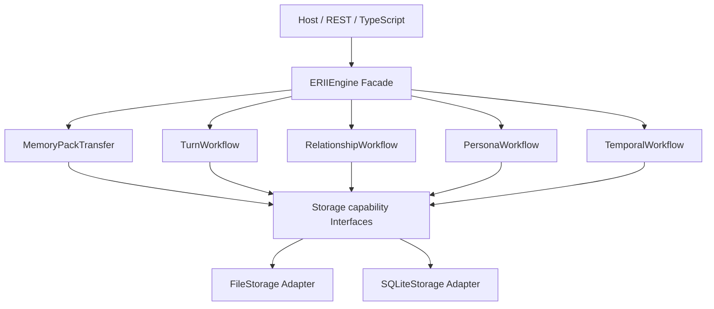

# ERIIEngine 深 Module 重构计划

> 状态：R1A 已完成，R1B 进行中
>
> 总控计划：[结构重构总控路线图](refactoring-program.md)
>
> 基线：`0.5.0a3`，提交 `94a61d5c1b77b5aa8871521aa53b0dba58dedf38`
>
> 首个实施窗口：2026-08-13 至 2026-09-13
>
> 后续工作流窗口：最早 2026-11-02，取决于 Lifecycle 检查点

## 1. 目标

本计划把 `ERIIEngine` 从“包含几乎全部工作流规则的巨型类”收敛为兼容 Facade 和组合根，
并将高复杂度行为提取为内部深 Module。

重构完成后，调用方仍然使用：

```python
from erii import ERIIEngine

engine = ERIIEngine(...)
turn = engine.begin_turn(...)
pack = engine.export_memory(...)
```

调用方不需要知道内部 Module 的存在，不需要重新构造依赖，也不需要迁移导入路径。内部
Module 的价值是集中规则和验证，而不是形成更多公共入口。

## 2. 当前问题

### 2.1 规模只是信号

`erii/engine.py` 当前约 5719 行，`ERIIEngine` 有 106 个方法，其中约 72 个为公开方法。
这些数字说明导航和并行修改成本很高，但不是拆分的唯一理由。真正的问题是一个
Implementation 同时拥有：

- 基础记忆、结构化 Recall 和 Renderer；
- Relationship 初始化与状态读取；
- Turn begin/complete/abandon、Reply Attempt 和 Archival；
- Relationship Processing、Persona Reflection 和 Continuity Review；
- Voice Activation、Promise、Open Loop 和 Temporal Event；
- Consequence、Narrative Tension 和 Persona Growth；
- Inner Monologue 和 Diary；
- MemoryPack 导出、导入、冲突验证、ID remap 和历史提交；
- worker 生命周期和关闭顺序。

这些工作流共享 Storage、锁、缓存和身份规则。任何一个新功能都容易修改 Engine 构造、
私有 helper、持久化和公共方法，导致变化扩散。

### 2.2 当前 Interface 过宽

`ERIIEngine` 的公开 Interface 包含的不只是方法签名，还包括：

- 必须先初始化 relationship 或 begin Turn 的顺序；
- Agent、User、relationship 和 Turn 的 exact binding；
- Storage 能力缺失时的失败行为；
- worker 是否显式启动、何时 drain 和 close；
- 导入导出的原子性、冲突和格式兼容；
- deprecated 调用的兼容警告；
- REST 和 TypeScript 对这些方法的间接依赖。

简单把方法分到多个 Mixin 文件不会缩小 Interface，也不会提高调用方 Leverage。新设计必须
让规则集中在更少的内部 Interface 后面。

### 2.3 并行开发冲突

Core、Storage、Server、Character Deliberation 和数据生命周期都可能触及 `ERIIEngine`。
在同一个 5000 行文件中同步开发会增加合并冲突；“想起来就开发”的能力也更容易绕过正式
接缝直接加入 Engine。

## 3. 非目标

本计划不做以下工作：

- 不重写 `ERIIEngine`；
- 不改变公共方法、返回类型、异常、日志脱敏或生命周期顺序；
- 不拆成多个需要用户自行组合的公开 Engine；
- 不公开内部 Workflow 类、Mixin 或 Storage Protocol；
- 不改变 FileStorage、SQLite、MemoryPack、Backup 或 Lifecycle Plan 格式；
- 不把 Character Deliberation、Claude、DeepSeek 或 Labs 并入 Core；
- 不在重构提交中增加新领域能力；
- 不以“每个文件少于 1000 行”作为唯一成功标准；
- 不同时创建 `erii/engine.py` 和 `erii/engine/` 包。

最后一点是 Python 导入结构约束。旧计划建议保留 `erii/engine.py` 又创建同名目录，这会导致
模块解析冲突。本计划使用私有 `erii/_engine/` 包，保留 `erii.engine` 兼容路径。

## 4. 目标结构

目标结构按已经证明需要独立变化的工作流逐步形成，不预先创建空文件：

```text
erii/
├── engine.py                         # 兼容 Facade、组合根、生命周期入口
└── _engine/
    ├── __init__.py                   # 不导出到 erii 根级
    ├── memory_pack_transfer.py       # 导入导出、验证、remap、执行
    ├── turn_workflow.py              # Turn、Reply Attempt、completion fencing
    ├── archival_workflow.py          # Archival 和 receipt
    ├── relationship_workflow.py      # Processing、adjudication、consequence
    ├── persona_workflow.py           # compilation、reflection、growth
    ├── temporal_workflow.py          # promise、condition、open loop
    └── recall_workflow.py             # 是否提取由 R4 检查决定
```

这不是最终文件承诺。只有一个工作流在至少两个调用场景中承担共同复杂度，或能显著减少
Facade 知识时，才建立对应 Module。

### 4.1 依赖方向



依赖只从 Facade 指向内部 Workflow，再指向能力 Interface。内部 Workflow 不导入 Server，
不构造具体 Storage，不反向调用 Facade 的任意公共方法。

## 5. 设计约束

### 5.1 Facade 的职责

最终 `ERIIEngine` 只应承担：

- 验证顶层配置并构造共享依赖；
- 组合内部 Workflow；
- 保留公开方法和 deprecated alias；
- 统一 `start/drain/close` 顺序；
- 在需要跨 Workflow 原子操作时充当唯一协调入口；
- 将公开参数转为内部请求，将内部结果按原类型返回。

Facade 不应继续拥有：

- MemoryPack 各字段的逐项兼容验证；
- 每种领域对象的 ID remap；
- 各 Storage 的能力探测分支；
- Turn/Relationship/Persona 的详细状态机；
- 可由一个 Workflow 内部完成的日志和错误归一化。

### 5.2 内部 Module Interface

内部 Interface 优先使用不可变请求/结果对象，避免十几个位置参数。示意形状：

```python
@dataclass(frozen=True)
class MemoryPackImportRequest:
    pack: MemoryPack
    target_agent_id: str
    target_user_id: str
    conflict_policy: ImportConflictPolicy


@dataclass(frozen=True)
class MemoryPackImportAnalysis:
    normalized_pack: MemoryPack
    id_mapping: Mapping[str, str]
    writes: tuple[PlannedWrite, ...]
    expected_target_identity: StorageIdentity


class MemoryPackTransfer:
    def export(self, request: MemoryPackExportRequest) -> MemoryPack: ...
    def analyze_import(
        self, request: MemoryPackImportRequest
    ) -> MemoryPackImportAnalysis: ...
    def execute_import(
        self, analysis: MemoryPackImportAnalysis
    ) -> MemoryPackImportReport: ...
```

示例不是当前公共承诺，实施前仍需根据现有类型设计。关键是把纯分析与写入分开，让验证可
重复、无副作用，并让执行阶段只消费已经绑定目标身份和源指纹的计划。

### 5.3 依赖注入

内部 Workflow 接受需要的依赖，不自行创建：

- Storage 能力 Interface；
- 时钟和 ID 生成器；
- 锁/事务协调器；
- 已存在的领域 adjudicator、reviewer 或 renderer；
- 脱敏 logger。

只有 `ERIIEngine.__init__()` 或明确组合根选择具体 Adapter。测试使用 FileStorage、SQLite 或
最小 in-memory fake，不能通过 monkeypatch 私有全局状态验证主要行为。

### 5.4 错误和日志

重构不得改变：

- 公开异常类别和关键消息合同；
- provider、prompt、用户正文、凭据和私有心理数据的脱敏规则；
- deprecated warning 的类别、触发条件和 stack level；
- 部分失败、冲突、stale 和能力不可用的区分；
- `__cause__`/`__context__` 中不泄漏敏感正文的要求。

内部异常可以更具体，但 Facade 必须映射为当前公开结果。不得用宽泛 `except Exception` 隐藏
一个本应失败关闭的状态。

## 6. R1：MemoryPack Transfer 纵切

### 6.1 为什么先做它

`ERIIEngine.export_memory()` 从当前文件约 2534 行开始；导入及其验证/remap/helper 一直延续
到 Engine 后部，占据最大的连续复杂区。它具备：

- 明确的用户行为：导出、导入、冲突或失败；
- 两个真实 Storage Adapter；
- 大量历史格式、关系隔离和失败原子性测试；
- 大部分可先提取为 in-process 纯逻辑；
- 与未来 Lifecycle、迁移和用户数据管理直接相关。

因此它比 Recall 或 Turn 更适合作为提取模式的第一证明。

### 6.2 R1A：纯分析阶段，2026-08-17 至 2026-08-30

目标：建立无写入的 `MemoryPackTransfer` 分析内核。

任务：

1. 盘点 `export_memory()`、`import_memory()`、`_import_memory_unlocked()` 和全部 helper；
2. 将 helper 分类为解析、身份验证、关系范围、冲突读取、ID remap、写入和提交；
3. 为当前未被 Interface 测试锁定的失败行为补特征测试；
4. 提取 pack 结构、版本、身份、来源和关系范围验证；
5. 提取 Turn、Temporal、Consequence、Persona Growth 和 Processing 的 source-pack 可移植验证；
6. 将依赖目标 Storage 快照的冲突、确定性 ID remap 和写入计划留给 R1B；
7. 保留所有真实写入在原 `ERIIEngine`，用已验证的 pack 驱动旧执行路径；
8. 验证新分析可以重复运行且不修改 Storage、pack 或 Engine 缓存。

R1A 禁止：

- 改写锁粒度；
- 改变导入提交顺序；
- 新增格式或冲突策略；
- 清理 deprecated 字段；
- 为了测试暴露内部 Module 到根级。

R1A 退出门：

- 分析阶段零写入；
- 同一 pack 与目标快照得到确定性相同分析；
- 所有拒绝理由与基线一致；
- Engine 原执行路径只剩必要写入，不再重复同一验证；
- 全套测试和冻结合同通过。

R1A 实施记录（2026-08-13）：

- 已建立私有 `erii/_engine/memory_pack_analysis.py`，未加入根级公开符号；
- 首个 Interface 为 `analyze_memory_pack(pack)`，返回冻结的 `MemoryPackAnalysis`；
- 已接管 instruction node、Temporal 完整图、Persona Growth 与 Relationship Consequence
  可移植结构验证；
- 已接管 Turn 包内关系闭包与 persisted-Turn adjudication 的 Source Turn、evidence、quarantine
  闭包，Engine 保留目标 Agent/User 与 exact relationship restore 检查；
- 已集中计算 bound archival history 与 exact relationship restore 派生事实；
- `ERIIEngine` 和 Lifecycle MemoryPack upgrade 已委托同一个分析 Implementation；
- 新增特征测试锁定确定性、不可变输入/结果、零 Storage 依赖和现有错误消息；
- relationship processing 的包内 Turn、event、adjudication、reflection decision 与 direct-event
  journal 索引/闭包已迁入只读 `RelationshipProcessingPackStructure`；
- processing run 的 frozen candidate/baseline 纯 replay、journal attachment 与 reflection outcome
  闭包已迁入 `validate_relationship_processing_runs(pack, structure)`，并返回冻结分析结果；
- reflection identity、evidence、Manifest/Growth 和 provenance 闭包已迁入两阶段只读 Interface；
- archival evidence 已由独立 Core Module 承担并由 Engine/Lifecycle 直接复用；
- target Storage prefix/conflict 检查仍由 Engine 直接执行；
  target conflict、锁、remap、写入计划和真实写入按当前批次定义留给 R1B；
- R1A 于 2026-08-13 通过零 Storage、输入不变、失败消息/顺序、完整测试、合同、文档和性能门禁。

R1B 首批实施记录（2026-08-14）：

- 已新增私有 `erii/_engine/memory_pack_transfer.py`，未加入根级公开符号；
- `analyze_memory_pack_source()` 在既有 portable analysis 成功后冻结 source pack 指纹和 analysis 指纹；
- `bind_memory_pack_transfer_plan()` 返回冻结的 source/target/overwrite 计划，target 当前以 Agent x User
  作用域和 relationship profile 内容寻址 revision 表示；
- `require_memory_pack_transfer_plan_current()` 在 Engine 进入关系创建和真实 payload writes 前复核 source/target
  没有 stale；
- Engine 仍保留 target conflict 读取、锁、事务、ID remap、历史提交、write planning 和 writes；本批没有移动这些
  Implementation，也没有改变公开异常、写入顺序或持久格式；
- 新增 Interface 特征测试覆盖确定性、冻结结果、输入/Storage 不变、source/target stale、overwrite 身份和
  File/SQLite target snapshot 等价；完整根测试在重生成结构清单后通过。

R1B target read-set 批次实施记录（2026-08-14）：

- 新增冻结的 `MemoryPackTargetReadObservation` / `MemoryPackTargetReadSet`，plan identity 现在同时绑定
  relationship snapshot 与完整 first-write target conflict read set；
- 私有 `MemoryPackTargetReadRecorder` 只允许显式读取方法，记录调用顺序、参数、能力结果和 canonical
  result fingerprint；不导入 FileStorage/SQLite，也不提供任何写方法；
- Engine 继续按原顺序执行 Timeline、Adjudication、Consequence、Processing、Persona Compilation/Growth、
  Archival 与 Turn conflict helper，但通过 Recorder 读取；全部 preflight 成功后冻结并在首个 write 前重放；
- FileStorage 与 SQLite 新增内部 archival validation-source observation，在各自全局锁/单一 SQLite read
  transaction 内按目标 relationship 或 incoming archival ID 捕获相关 tombstones 与 live archival records；
  observation 只投影 tombstone merge 实际读取的身份、绑定、terminal 与 commitment 语义，不绑定 lease、attempt、
  prepared batch 等 worker runtime 状态；旧 Adapter 若只返回 opaque `None`，在保留原 validation 冲突优先级后
  fail closed，不能伪装成完整 read set；
- relationship target snapshot 在 read-set replay 前后单独复核；Timeline、Turn、Processing 和相关 archival source
  stale 均在 `save_nodes` 前失败；无关 relationship archival 写入及相关 live record 的纯 worker runtime 变化不制造
  false stale；File/SQLite 相同逻辑状态产生相同 read-set fingerprint；
- locks、transactions、ID remap、history commit、write planning、write order 与所有真实 writes 仍留在 Engine，
  本批未改变公开 Interface、异常契约或持久格式。

R1B deterministic write-plan 批次实施记录（2026-08-14）：

- 新增冻结的 `MemoryPackWritePlan`、relationship/persona compilation 子计划及 nodes/core write mode；
  planner 接收已确定的 target profile，不读取 Storage，也不产生写入；
- decision、relationship event、nested temporal references、Persona Growth proposal、Persona Compilation
  proposal/Manifest 的 deterministic remap 迁入 transfer Module，exact target 继续保留既有 ID；
- write plan 冻结 legacy Timeline、structured Timeline、Turn、archival、relationship journals、Consequence、
  Growth、Reflection 和 Processing payload，并显式记录原执行批次顺序；MemoryNode 通过 canonical document
  冻结并在执行时重新物化，调用方不能修改计划内容；
- Engine 在 target profile 确定后生成并消费计划；Persona Compilation executor 只保留 target conflict 比较、
  状态转换、Manifest bind 后 profile 刷新与真实 writes；relationship history 继续由原 causal interleaving
  commit Implementation 提交；
- Engine 中重复的 decision/event/Growth/temporal/Compilation remap Implementation 已删除；锁、事务、target
  conflict enforcement、write order、真实 writes 与公共异常仍保留原位；
- Interface 测试覆盖 deterministic/frozen/input unchanged、零 Storage 参数、exact/remap ID、nested temporal
  references、Compilation proposal/Manifest、nodes/core modes 与 batch order，公共 Engine 回归继续覆盖 FileStorage
  与 SQLite。
- 同批新增冻结的 `MemoryPackExportSnapshot` 与 `assemble_memory_pack_export()`；Engine 只负责收集 Storage
  快照、relationship guard 和可选文件输出，assembly 负责 legacy Timeline 规范化、MemoryPack 构造及 portable
  archival/consequence/persisted-Turn 校验。Engine 的 persisted-Turn helper 已删除，导入和导出共用同一纯验证
  Implementation。

R1B relationship-history execution seam 首批实施记录（2026-08-15）：

- 新增 `execute_memory_pack_relationship_history(storage, plan)`，直接消费冻结的
  `MemoryPackRelationshipWritePlan`，Engine 不再拥有跨 direct/adjudication journal 的因果交错提交 helper；
- execution seam 在首个真实写入前计算完整 journal interleaving，同时保持两个 journal 各自顺序；缺失或循环依赖
  在零 history writes 状态失败，不再可能因排序死锁留下部分 relationship history；
- 新增冻结的 `MemoryPackHistoryExecutionResult`，只暴露 relationship identity、实际 unit order 与两类写入计数，
  不泄漏 FileStorage/SQLite Implementation；
- Interface 测试直接覆盖 FileStorage/SQLite 相同结果、跨 journal temporal dependency 顺序，以及 unresolved causal
  order 的写前失败；公共 Engine 回归继续覆盖原导入入口；
- relationship guard、target profile 创建、Persona Compilation、nodes/core/Timeline/Turn/Archival/Consequence/
  Growth/Processing 写入和完整失败注入仍留在 Engine，R1B 继续进行。

R1B frozen payload execution seam 实施记录（2026-08-15）：

- 新增单一深 Interface `execute_memory_pack_writes(storage, plan)`、窄型 `MemoryPackWriteStorage` Protocol 与冻结的
  `MemoryPackWriteExecutionResult`；不为每个 Storage 方法叠加浅 helper；
- `MemoryPackRelationshipWritePlan` 现在冻结 source relationship identity，executor 只消费 plan 即可在首写前检查
  Turn、Archival、Consequence/Tension 与 Processing/Reflection 的 exact-restore 约束；
- executor 在首写前重新计算完整 write-plan fingerprint，任何批次 payload、mode、target 或顺序变化均以
  `MemoryPack write plan changed after planning` 失败；
- nodes merge/replace、Core conditional write、legacy Timeline、Turn、structured Timeline、Archival tombstone、causal
  history、Consequence、Tension、Growth、Reflection 与 Processing 的既有顺序和真实写入已从 Engine 迁入 executor；
- 完整 batch order 与 relationship-history schedule 在首个 payload write 前验证；四类 exact-restore 约束和
  unresolved causal order 均通过完整语义快照证明所有 executor-owned payload 零写入；
- Interface 测试以同一 exact-restore pack 覆盖全部 non-compilation batches，并验证 FileStorage/SQLite 完整结果等价、
  冻结结果、node merge/replace、Core IF_EMPTY/ALWAYS、legacy Timeline、完整 history 写前检查和 source identity 绑定；
  Engine 运行时 spy 另行证明导入 Implementation 对 non-compilation payload 恰好委托一次；
- Persona Compilation 仍在 executor 之前由 Engine 执行，因为 Manifest bind 会刷新 target profile；guard、stale
  replay、target conflict、target 创建和竞态恢复也继续由 Engine 拥有；
- 本批只迁移编排并保持每个 Storage 方法已有的原子性。FileStorage 多文件与 SQLite 多次独立事务尚无整包
  MemoryPack transaction；legacy Timeline 也继续保持有序 best-effort append。完整执行期故障注入与无部分目标
  门禁仍未通过，下一批必须先定义版本化 Storage capability，而不是使用补偿删除伪造原子性。

R1B versioned payload transaction capability 实施记录（2026-08-15）：

- 新增可选的 `AtomicMemoryPackWriteStoreV1` 深 Interface；`BaseStorage` 保持 `None` compatibility fallback，
  FileStorage 与 SQLiteStorage 返回内建 capability，`execute_memory_pack_writes()` 仍只接收原 `storage, plan` 两参；
- write-plan batch order、fingerprint、target 与 exact-restore 的纯校验现在先于 capability discovery 和事务获取，
  因此篡改冻结计划继续保持原错误优先级；history schedule 在 adapter transaction 内读取并提交；
- SQLiteStorage 在取得 target scope 的全部既有 KeyLock 后使用一个 `BEGIN IMMEDIATE` connection；transaction view 延迟旧
  method-local begin/commit/rollback/close，operation `BaseException` 由 outer transaction 回滚。commit 报错而 transaction 仍 active
  时显式回滚；若 SQLite 已离开 transaction，则不以 TEMP/main 跨库 witness 猜测结果，也不对可能已提交的状态执行第二次 rollback，
  而是向调用方传播 indeterminate outcome；legacy Timeline identity 改为与 schema migration 相同的 rowid-based UUID5，失败重试与
  control snapshot 精确一致，同时成功重复 append 仍获新 identity；
- FileStorage 保持 flat v2 persisted format，不引入 HEAD/generation。root-wide writer barrier 覆盖所有现有 JSON RMW，
  callback 首次改写每个文件前把 exact bytes/existence 写入 durable before-image journal；异常立即恢复，reopen 会恢复
  active journal，committed journal 只清理，新文件只按 journal 中的 exact path 删除；commit publish 异常只在盘上仍是 exact
  active journal 时回滚，exact committed marker 胜出，且只有最终 journal absence 完成 parent-directory durability 后才报告成功；
- failure-injection matrix 在 FileStorage/SQLite 上覆盖最后 batch 写前与 durable-after-write 异常、同 journal 第二项失败、
  legacy Timeline 第二项失败、nodes 写后 read failure，以及 Turn/Tension/Growth/Reflection/Processing stored-return mismatch；
  每格均以新 adapter instance 证明 baseline 恢复，并用同一 frozen plan 证明 result 与完整 semantic snapshot 等于 control；
- commit-state matrix 另覆盖 File exact-active publish failure、durable-committed helper boundary error、持续 journal fsync failure，
  以及 SQLite active commit failure、automatic rollback 和 committed-after-wrapper-error；后两者都传播 commit error，并分别证明
  baseline 或完整 after-image，绝不以 `in_transaction == False` 伪报成功。这里的 durability 是 adapter 可执行的 fsync/restart 合同，
  Windows 不提供 parent-directory fsync，因而不扩张为掉电级保证；
- capability 当前只包住 executor-owned non-compilation payload，并以已存在 target relationship 为故障基线。
  target creation、Persona Compilation/Manifest bind、target profile refresh、relationship guard、stale read-set replay 和 conflict
  orchestration 仍在 Engine 外层；FileStorage 的合同是 writer serialization 与异常/重启恢复，不是跨多个 read call 的 MVCC
  snapshot。完整公共 `import_memory()` 的无部分新目标仍是下一门禁，不能由本批测试外推。

### 6.3 R1B：执行阶段，2026-08-31 至 2026-09-13

目标：让 `MemoryPackTransfer` 拥有完整导入导出 Implementation，Engine 只保留兼容入口。

状态：2026-08-14 提前开始。source、relationship target、完整 first-write conflict read set、deterministic
ID remap、zero-write payload batches 与 export assembly 已冻结；2026-08-15 已把 causal relationship-history 和
其余 non-compilation payload writes 迁入 preflighted execution seam，并为 FileStorage/SQLite 增加版本化 execution
capability。执行期故障、durable-after-write、stored-return mismatch、reopen recovery 与 frozen-plan retry 已证明
existing-target non-compilation payload 的异常原子性和双 Storage parity。下一门禁先为 SQLite main database 增加版本化
operation receipt，消除 commit-error 的 indeterminate exactly-once 缺口；随后把 target creation、Persona Compilation/
Manifest bind 与 target profile refresh 纳入一个冻结的公共 import execution 合同，并证明新目标失败也不留部分状态；
relationship guard、stale replay、target conflict 与竞态恢复在相应合同冻结前继续由 Engine 拥有。

任务：

1. 提取 MemoryPack 导出组装和摘要/指纹计算；
2. 定义已绑定源、目标、Storage revision 和分析指纹的执行计划；
3. 将锁、冲突复查、写入、历史提交和结果报告移入执行路径；
4. 在写入前复核目标没有从分析快照变成 stale；
5. 保持 FileStorage/SQLite 各自原子发布机制；
6. Engine 的 `export_memory()` / `import_memory()` 转为薄委托；
7. 删除已经被新 Module 接管的重复 helper；
8. 将主要测试移动到 MemoryPack Transfer Interface，同时保留公共 Engine 合同测试。

R1B 退出门：

- 公共签名、返回值、异常和 deprecated 行为不变；
- clean target 导入、冲突、重复导入、失败注入和跨 relationship 泄漏行为不变；
- FileStorage 与 SQLite 结果等价；
- MemoryPack 当前和 declared-readable 版本仍可读；
- 导入失败无部分目标，重试语义与基线一致；
- `ERIIEngine` 不再包含领域对象逐项 remap/冲突实现；
- 性能和内存没有超过总控门限。

## 7. R4：Engine 工作流提取

R4 只有 Lifecycle R3 检查点通过后才能开始。

### 7.1 R4A：Turn 与 Archival，2026-11-02 至 2026-11-15

目标 Module：`TurnWorkflow` 与必要时独立的 `ArchivalWorkflow`。

Interface 必须隐藏：

- OPEN/COMPLETED/ABANDONED 状态转换；
- reply attempt 记录与可见回复 exact binding；
- baseline、record version 和 completion fencing；
- archival lease、receipt 和重复提交；
- late/stale result 的拒绝；
- background worker 的显式生命周期。

实施步骤：

1. 以 `begin_turn` 至 `archive_turn` 的公共行为建立状态转换表；
2. 补齐跨方法顺序和并发特征测试；
3. 提取 Turn 读写和转换，Engine 保留方法名；
4. 提取 Archival 协调，但不改变 worker 默认关闭语义；
5. 让 Deliberation G2 Adapter 继续只依赖公共 Engine/Turn 接缝；
6. R4A 通过后，再决定 G3 是否可以针对新内部接缝设计 Host Adapter。

R4A 退出门：所有 Turn、Archival、Continuity、Deliberation G2、REST 和并发测试通过；状态
机规则只在一个 Workflow 中实现。

### 7.2 R4B：Relationship、Persona 与 Temporal，2026-11-16 至 2026-11-29

按以下顺序逐个提取，不能作为一个大提交：

1. Relationship Processing 与 adjudication；
2. Consequence 与 Narrative Tension；
3. Persona compilation/reflection/growth；
4. Promise、Condition、Open Loop 和 Temporal Event。

每个 Module 都必须维护 `Agent × User × relationship` 隔离、来源权威、append-only 历史、
幂等和 Storage 等价。Character Deliberation 的心理候选不能借此次重构获得这些 Module 的
直接写权限。

### 7.3 Recall 是否提取

Recall 已经有较多 `erii/core/recall.py` Implementation。是否再建立 `RecallWorkflow` 必须在
R4B 后重新做删除测试：

- 如果 Engine 只做少量参数转换，继续委托现有 Core 即可；
- 如果身份、预算、权威和 Renderer 规则仍散在 Engine 与多个调用方，再提取一个深 Module；
- 不为目录对称创建浅转发层。

## 8. 测试策略

### 8.1 Interface 测试优先

测试分三层：

| 层 | 目的 | 保留原则 |
| --- | --- | --- |
| 公共 Facade 合同 | 保护用户可见行为和导入路径 | 永久保留 |
| 内部 Module Interface | 验证复杂规则、失败和等价 Adapter | 作为主要重构测试面 |
| Implementation 细节 | 帮助短期搬迁 | 新 Interface 稳定后删除重复部分 |

不能让测试依赖私有 helper 调用顺序、Mixin MRO 或文件位置。一个内部重排如果没有改变
Interface，可观察测试不应需要重写。

### 8.2 MemoryPack 必测矩阵

- 当前 MemoryPack 导出与同 Storage/跨 Storage 导入；
- 所有 declared-readable 历史版本；
- Agent/User/relationship identity mismatch；
- duplicate ID、悬空引用、非法来源、错误 fingerprint；
- Turn、Temporal、Consequence、Persona、Processing 冲突；
- clean target、non-empty target、重复导入和并发变化；
- 写入中断、提交前 stale、提交后报告；
- FileStorage 与 SQLite 等价；
- erase/rebuild 后再导出和导入；
- pack 不包含凭据、raw thinking、prompt 或未批准私有内容。

### 8.3 Turn 必测矩阵

- begin、complete、abandon 和 legacy record；
- 重复完成、终态修改、late reply、stale baseline；
- reply attempt 与 exact delivered reply；
- archive/process 重试和 receipt；
- worker 未启动、显式启动、drain、close；
- Deliberation `off | compact` 和 Direct fallback；
- REST 和 TypeScript 合同；
- FileStorage/SQLite、进程重启和并发。

## 9. 提交和审查规则

一个 Engine 重构提交最多完成以下一种工作：

- 增加特征测试；
- 提取一个纯验证簇；
- 让 Facade 委托一个已提取 Interface；
- 删除已经被替代的旧 helper；
- 更新对应架构文档。

不能在同一提交中加入新产品能力、重命名公共符号、更新格式版本或全仓格式化。每个提交的
审查必须回答：

1. 调用方需要知道的规则是否减少？
2. 复杂度是集中还是仅被转发？
3. 依赖是否由组合根注入？
4. FileStorage 与 SQLite 是否通过同一个行为合同？
5. 原 Interface 和错误语义是否完全保留？
6. 新测试是否通过 Interface，而不是穿透 Implementation？

## 10. 风险和对策

| 风险 | 迹象 | 对策 |
| --- | --- | --- |
| Mixin 只移动代码 | Facade 仍依赖所有私有属性 | 使用组合，Module 接受明确依赖 |
| 转发层叠加 | 新旧两处同时验证同一规则 | 切换后删除旧规则，只保留 Facade 映射 |
| 循环导入 | 内部 Workflow 反向 import Engine | 移动共享类型或定义私有请求/结果 |
| 状态撕裂 | 分析和执行看到不同 Storage revision | 执行计划绑定身份、revision 和 fingerprint |
| 测试数量膨胀 | 每个 helper 都复制一套测试 | 用 Interface 测试替换旧实现级测试 |
| 性能退化 | 多次读取/重复序列化 pack | 记录基线，复用不可变分析结果 |
| 公共 Interface 扩张 | 为测试导出内部 Workflow | 用私有路径导入或 fixture，不进 `erii.__all__` |
| 并行冲突 | 多个分支同时修改 Engine 同一区域 | 一个批次一个 owner，短分支，频繁合并 |

## 11. 完成定义

Engine 重构在以下条件满足时完成，而不是在 `engine.py` 达到某个行数时完成：

- `ERIIEngine` 主要承担组合、兼容和跨 Workflow 协调；
- MemoryPack Transfer 拥有全部导入导出、验证、remap 和执行规则；
- Turn/Archival 及至少一个 Relationship/Persona/Temporal 工作流形成深 Module；
- 相同验证不会在 Engine、Lifecycle 和 Storage 三处重复；
- 公开 Interface、REST、TypeScript 和持久格式快照不变；
- 全套 CI、双 Storage、历史格式、Windows、安装和性能门通过；
- 新的 G3 或后续功能能通过一个明确接缝接入，不需要继续向 Engine 堆叠私有 helper；
- 维护者可以只读一个 Workflow Module 和其 Interface 测试理解一次变化。

如果 R1 完成后发现工作流提取会迫使公开行为变化，先结束 Engine 重构窗口并记录问题；不要
为了满足目录结构而制造兼容风险。
