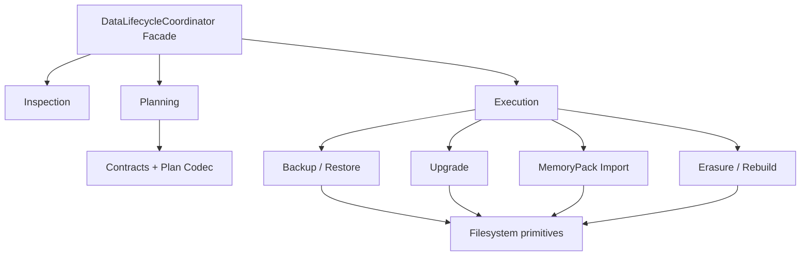

# Data Lifecycle 深 Module 重构计划

> 状态：已排期，尚未开始实现
>
> 总控计划：[结构重构总控路线图](refactoring-program.md)
>
> 基线：`0.5.0a3`，提交 `94a61d5c1b77b5aa8871521aa53b0dba58dedf38`
>
> 计划窗口：2026-09-14 至 2026-10-25
>
> 稳定检查点：2026-10-26 至 2026-11-01

## 1. 目标

本计划把数据生命周期从一个同时包含合同、Codec、Inspection、Planning、Backup、Restore、
Upgrade、Import、Erasure 和 Rebuild 的巨型 Implementation，收敛为若干内部深 Module，
同时保留现有 `erii.data_lifecycle` Interface 和全部持久格式兼容。

调用方继续使用：

```python
from erii import (
    BackupRequest,
    DataLifecycleCoordinator,
    LifecycleTarget,
    LifecycleTargetKind,
)

coordinator = DataLifecycleCoordinator()
assessment = coordinator.inspect(target)
plan = coordinator.plan(BackupRequest(source=assessment, destination=destination))
report = coordinator.execute(plan)
```

调用方不需要改用新的 Inspector、Planner 或 Executor。新的内部 Module 负责隐藏格式分支、
稳定读取、staging、锁、验证和失败恢复。

## 2. 当前真实结构

旧计划把 Lifecycle 描述为一个尚未拆分的 4000 行文件，但当前源码已经完成部分纵向提取：

| 路径 | 当前职责 | 状态 |
| --- | --- | --- |
| `erii/data_lifecycle.py` | 公共合同、Plan Codec、Inspection、Backup/Restore/Upgrade/Import/Erase 编排 | 仍是主巨型 Implementation |
| `erii/lifecycle_streaming.py` | 稳定文件/目录扫描、独占复制、identity | 已独立 |
| `erii/lifecycle_sqlite_upgrade.py` | SQLite 6/9 到 10 的迁移与语义摘要 | 已独立 |
| `erii/lifecycle_memory_pack_import.py` | MemoryPack staging import | 已独立 |
| `erii/lifecycle_memory_pack_import_contracts.py` | staging import 合同 | 已独立 |
| `erii/lifecycle_erasure.py` | FileStorage/SQLite 擦除、重建和 staged 验证 | 已独立但仍有 2826 行 |
| `erii/lifecycle_erasure_contracts.py` | 擦除 selector、inventory、proof | 已独立 |

因此本轮不是从零“把 Erasure 拆出去”，而是把已经存在的这些 Module 收敛到一致的内部
Interface，并从 `data_lifecycle.py` 移除剩余重复规则。

### 2.1 `data_lifecycle.py` 当前职责

约 4280 行的文件目前包含：

- 目标、状态、操作、结果、Request、Plan、Report 等公共合同；
- Lifecycle Plan v1 至当前的严格 JSON Codec；
- 策略选择、Plan shape 和 content identity 验证；
- 文件、目录、SQLite 和 MemoryPack Inspection；
- Payload Snapshot 与 format Adapter；
- FileStorage、SQLite、MemoryPack upgrade；
- durable file、fsync、no-replace rename 和 staging topology；
- Backup manifest、读取、验证和恢复；
- destination lock、owner document、recovery path 和 cleanup；
- `DataLifecycleCoordinator.inspect/plan/execute` 及所有操作分支。

问题不是这些行为不相关，而是它们的 Interface 和 Implementation 没有分层。Codec 和
Inspection 可以独立验证，写入执行需要更强的原子性和恢复门，但它们当前在同一个文件里
相互调用私有 helper。

## 3. 必须保持的不变量

Lifecycle 重构比普通代码移动风险更高，因为它直接处理用户数据。以下不变量不可改变：

1. **Plan 可审查**：写入前先生成绑定精确源、目标、内容身份和策略的 Plan；
2. **stale 拒绝**：执行时源或目标发生变化必须失败，不猜测继续；
3. **backup-first**：升级、擦除和需要备份的导入先完成可验证备份；
4. **不覆盖**：Restore 和发布到 fresh target 不静默覆盖已有目标；
5. **原子发布**：失败时不留下被当成成功目标的部分数据；
6. **源保留**：升级不就地破坏唯一历史源；
7. **格式诚实**：可识别不等于可读取，可读取不等于可升级；
8. **关系隔离**：Agent、User、relationship、Turn 和来源范围不能跨界；
9. **等价 Adapter**：FileStorage 与 SQLite 在相同生命周期操作下报告一致语义；
10. **历史可读**：所有 declared-readable Plan、Backup、MemoryPack 和 schema 行为不退化；
11. **脱敏报告**：Report 只包含身份、计数、摘要和处置，不复制已删或私有正文；
12. **无隐藏后台工作**：Lifecycle 不启动隐式线程或网络请求。

## 4. 非目标

- 不改变任何格式版本、manifest 字段、Plan 字段或 strategy ID；
- 不新增可升级的历史 schema 声明；
- 不新增擦除范围或 MemoryPack 对象；
- 不重写 FileStorage/SQLite 数据布局；
- 不把所有操作抽象成一个通用“步骤执行器”；
- 不把 Format Adapter 暴露为公共插件 Interface；
- 不合并 Engine MemoryPack 导入与 Lifecycle staging import 的用户语义；
- 不把文件系统原子性假设推广为数据库事务假设；
- 不在重构期间持久化 Character Deliberation 或 Session Residue；
- 不使用宽泛重试掩盖权限、占用、stale 或冲突错误。

## 5. 目标结构

为保留 `erii/data_lifecycle.py` 导入路径，内部实现进入 `erii/_lifecycle/`：

```text
erii/
├── data_lifecycle.py                    # 公共合同 re-export + Coordinator Facade
├── lifecycle_erasure.py                 # 旧内部导入兼容 wrapper，按阶段收窄
├── lifecycle_erasure_contracts.py       # 旧导入路径兼容
├── lifecycle_memory_pack_import.py      # 旧导入路径兼容
├── lifecycle_memory_pack_import_contracts.py
├── lifecycle_sqlite_upgrade.py          # 旧导入路径兼容
├── lifecycle_streaming.py               # 旧导入路径兼容
└── _lifecycle/
    ├── contracts.py                     # 公共 dataclass/Enum 的权威定义
    ├── plan_codec.py                    # 严格 Plan reader/writer
    ├── inspection.py                    # 无写入目标检查
    ├── planning.py                      # Request -> immutable Plan
    ├── snapshots.py                     # 稳定 payload snapshot 与 format 读取
    ├── backup_restore.py                # Backup bundle 与 restore
    ├── upgrades.py                      # 策略选择与格式 Adapter 调度
    ├── memory_pack_import.py            # fresh staging import
    ├── erasure.py                       # selector、transform、rebuild
    ├── filesystem.py                    # staging、锁、fsync、no-replace publish
    └── coordinator.py                   # inspect/plan/execute 编排
```

这是一张归属图，不要求一次生成全部文件。已有 `lifecycle_*` 文件先作为兼容路径，内部实现
逐步迁入；只有全部仓库内引用迁移并确认没有第三方兼容承诺后，才讨论后续弃用。

### 5.1 Interface 分层



Inspection 和 Planning 不依赖写入执行 Module。Format-specific 实现不能反向 import
Coordinator。Coordinator 选择操作并协调前置备份，不重复各 Module 内部的内容验证。

## 6. Module 设计

### 6.1 Contracts

`contracts.py` 是 Lifecycle 公共含义的权威定义，包括：

- `LifecycleTargetKind`、`LifecycleStatus`、`LifecycleOperation`、`LifecycleOutcome`；
- `LifecycleTarget`、`LifecycleAssessment`、`LifecycleContentIdentity`；
- Backup/Restore/Upgrade/Erase/Rebuild/MemoryPack Import Request；
- `LifecyclePlan` 与 `LifecycleReport`。

这些类型仍由 `erii.data_lifecycle` 和根级 `erii` re-export。迁移类型定义时必须保证 type
identity 不分叉，不能在旧文件和新文件各定义一套同名 class。

### 6.2 Plan Codec

`plan_codec.py` 独占：

- strict JSON duplicate-key 和非标准数值拒绝；
- v1 至当前 reader；
- target、assessment、content、selector 和 directory identity 编解码；
- intent/body/document fingerprint；
- Plan shape 和版本验证。

它是 in-process Module，输入字符串/Plan，返回不可变对象/字符串，不读写文件。旧版本字段、
默认值和拒绝行为由历史 fixture 测试。

### 6.3 Inspection

`inspection.py` 独占 FileStorage、SQLite、MemoryPack 和 Backup 的零写入检查：

- 符号链接/reparse point 拒绝；
- 稳定读取和内容 fingerprint；
- format/version/status 判定；
- SQLite schema 和 semantic identity；
- 目录 identity 与 runtime lock 排除。

Interface 保持接近：

```python
class LifecycleInspector:
    def inspect(self, target: LifecycleTarget) -> LifecycleAssessment: ...
```

Inspector 不创建目录、不清理 staging、不执行恢复。

### 6.4 Planning

`planning.py` 把一个已经验证的 Request 转为不可变 Plan，负责：

- 操作和 target kind 的合法组合；
- strategy ID 选择；
- source/destination 拓扑；
- prechange backup 需求；
- selector 和 import options；
- source/target/content identity 绑定。

Planning 不重新扫描目标，也不执行 I/O。若需要最新 assessment，由 Facade 在调用前通过
Inspector 获得。

### 6.5 Filesystem Primitives

`filesystem.py` 集中本地文件系统的高风险公共机制：

- stable file/tree streaming；
- regular file/directory 和 ancestor 验证；
- exclusive create/no-replace rename；
- private staging directory、owner document 和 recovery path；
- destination lock、fsync 和 cleanup；
- Windows 文件占用与 reparse point 行为。

该 Module 不知道 MemoryPack、Erasure 或 SQLite 领域含义，只提供可验证的本地原子发布
原语。现有 `lifecycle_streaming.py` 可先转为其兼容 re-export。

### 6.6 Backup/Restore

`backup_restore.py` 拥有：

- Payload Snapshot 与 materialization；
- Backup manifest 生成、读取和完整性验证；
- byte-preserving backup/restore；
- 历史 producer catalog；
- source/destination overlap 和 no-overwrite；
- report inventory。

它使用 Filesystem Primitives，不自行实现第二套 fsync/staging。

### 6.7 Upgrade

`upgrades.py` 选择并调用格式 Adapter：

- FileStorage legacy/1 到 2；
- SQLite 6/9 到 10；
- declared-readable MemoryPack 到当前 writer。

具体 SQLite 迁移继续由现有已验证 Implementation 承担。内部 Interface 接受冻结 Snapshot，
返回新 Snapshot 和语义验证结果；不直接发布到最终 destination。

### 6.8 MemoryPack Import

Lifecycle MemoryPack Import 的含义是：验证一个 Pack，在隔离 staging 中构建全新
FileStorage/SQLite，再原子发布到 fresh target。它与 Engine 对一个在线关系的
`import_memory()` 不是同一个 Interface，不能为了复用而合并用户语义。

两者可以共享纯验证/规范化 helper，但在线关系锁、fresh target 发布、报告和冲突规则必须
保持各自 Module 所有。

### 6.9 Erasure/Rebuild

现有 `lifecycle_erasure.py` 已包含大量 FileStorage/SQLite 对称分支。本轮目标不是立刻按表名
拆成几十个文件，而是先建立一个小 Interface：

```python
class StagedErasure:
    def inspect(
        self, storage_kind, staging_path, selector
    ) -> ErasureScopeInspection: ...

    def transform(
        self, storage_kind, staging_path, selector
    ) -> ErasureTransformResult: ...

    def validate(self, storage_kind, staging_path, selector) -> None: ...
```

它隐藏 cascade、authority revoke、processing closure、consequence dependency 和 rebuild
细节。Coordinator 只负责 backup、staging、调用 transform、验证和发布。

## 7. 实施阶段

### 7.1 R2A：Contracts 和 Plan Codec，2026-09-14 至 2026-09-20

任务：

1. 建立 `erii/_lifecycle/` 私有包；
2. 将公共类型迁到单一权威定义，旧路径 re-export；
3. 提取 Plan strict Codec 和 shape validation；
4. 保持所有 class identity、`__module__` 兼容要求和 frozen snapshot；
5. 让 `freeze_contracts.py` 继续通过生产 serializer 验证字段；
6. 增加旧 Plan fixture 的独立 Codec 测试。

退出门：根级符号和 data-format snapshot 无差异；当前和历史 Plan round-trip/拒绝行为不变。

### 7.2 R2B：Inspection 和 Planning，2026-09-21 至 2026-09-27

任务：

1. 提取零写入 Inspector；
2. 收敛 stable streaming、目录 identity 和 format 判定；
3. 提取 Request -> Plan；
4. `DataLifecycleCoordinator.inspect/plan` 委托新 Module；
5. 删除旧文件中的重复 helper；
6. 验证 inspect/plan 对文件树没有写入。

退出门：所有 target kind/status/strategy/selector 组合与基线一致；`execute` 仍留在原路径且
可以消费新 Plan。

### 7.3 R3A：Backup/Restore、Upgrade、Import，2026-09-28 至 2026-10-11

按三个独立提交簇执行：

1. **Backup/Restore**：提取 bundle、manifest、验证、staging 和发布；
2. **Upgrade**：统一 format Adapter 调度，保留现有 SQLite/MemoryPack 实现；
3. **MemoryPack Import**：迁移 fresh target staging import，保留双 Storage 等价。

每个簇先让 Coordinator 委托，再删除原路径重复逻辑。不得同时改 strategy ID 或格式版本。

R3A 退出门：

- backup/restore 字节和语义 identity 与基线一致；
- 升级仍是 backup-first、源保留、并排发布；
- MemoryPack Import 只发布到 fresh target；
- 中断和 stale 失败不会留下成功目标；
- Windows 文件占用和 no-replace smoke 通过。

### 7.4 R3B：Erasure/Rebuild 和 Coordinator，2026-10-12 至 2026-10-25

任务：

1. 将 Erasure contracts 迁到权威 contracts Module 并保持旧 re-export；
2. 把 FileStorage/SQLite cascade 置于 `StagedErasure` Interface 后；
3. 统一 inspect/transform/validate 顺序；
4. Coordinator 只负责 verified prechange backup、staging、发布和 report；
5. 收敛 destination locks、owner/recovery 和 cleanup；
6. 删除 `data_lifecycle.py` 中已迁出的执行分支；
7. 明确 Rebuild 与 Erasure 的共享和不同不变量；
8. 保持所有 scope、inventory、proof 和脱敏 report 不变。

R3B 退出门：

- relationship、Turn、Event、complete-user 擦除范围全部通过；
- authority revoke、dependency cascade、processing closure 和 consequence rebuild 与基线一致；
- FileStorage/SQLite inventory 和可观察结果等价；
- 失败注入、重复执行、stale plan 和恢复路径通过；
- `DataLifecycleCoordinator.execute()` 只负责编排，不包含格式逐项删除规则。

### 7.5 稳定检查点，2026-10-26 至 2026-11-01

该周不提取新代码，只处理验证和发现的问题：

- 运行全套 Python、DeepSeek 离线、TypeScript、文档、合同、secret 和 build；
- GitHub Linux Python 3.11-3.14 矩阵；
- Windows Python 3.11/3.14 lifecycle smoke；
- 全部 declared-readable fixture；
- 双 Storage longitudinal 和导入导出；
- backup/restore/upgrade/import/erase/rebuild 失败注入；
- 进程和线程并发；
- 性能与峰值内存对照；
- clean wheel/sdist 安装和 Golden Demo。

只有检查点通过，Engine R4 才能在 2026-11-02 开始。未通过则冻结 R4，继续修复 R1-R3。

## 8. 测试策略

### 8.1 保护公共 Interface

永久保留：

- `erii` 根级导出快照；
- `erii.data_lifecycle` 导入路径；
- Plan v1 至当前 reader/writer fixture；
- `DataLifecycleCoordinator.inspect/plan/execute` 合同；
- REST/TypeScript 间接生命周期行为；
- FileStorage/SQLite/MemoryPack/Backup 格式快照。

### 8.2 内部 Module 测试

| Module | 核心测试 |
| --- | --- |
| Plan Codec | duplicate key、unknown/missing field、版本、fingerprint、历史 fixture |
| Inspection | missing/empty/current/migration-required、link/reparse、稳定读取 |
| Planning | 操作矩阵、strategy ID、拓扑、selector、stale identity |
| Filesystem | exclusive create、fsync、锁、cleanup、Windows 占用 |
| Backup/Restore | manifest、checksum、source identity、no-overwrite、partial failure |
| Upgrade | 每条声明策略、语义摘要、源保留、目标发布 |
| MemoryPack Import | 双 Storage、fresh target、graph validation、失败原子性 |
| Erasure/Rebuild | scope cascade、authority、inventory、proof、等价 Adapter |

测试主要通过 Module Interface。只有平台原语需要针对私有 helper 的窄测试；重构完成后删除
重复验证同一行为的旧 helper 测试。

### 8.3 历史兼容矩阵

每次涉及 Codec、Inspection 或 Upgrade 时，必须明确列出：

- 当前 writer；
- declared-readable 版本；
- 仅可识别但不可读版本；
- 有升级策略的版本；
- 明确不支持升级的版本；
- 历史 Backup producer identity；
- 预期失败类型。

不得因为测试 fixture 可以被当前模型解析，就扩大 compatibility catalog。

## 9. 与 Engine MemoryPack Transfer 的关系

Engine R1 在 Lifecycle R2 之前执行，为 Lifecycle 提供一个已经验证的 pack 分析 Module。两者
共享规则的原则是：

- 纯 MemoryPack schema、identity、reference graph 和 fingerprint 验证可以共享；
- Engine 在线关系导入的锁、冲突和提交属于 `MemoryPackTransfer`；
- Lifecycle fresh target 构建、staging、backup 和 publish 属于 Lifecycle；
- 不让 Lifecycle 调用 `ERIIEngine` 完成数据导入；
- 不让 Engine 直接使用 Lifecycle 私有 filesystem/staging helper；
- 共享类型放在一个无 I/O 的内部 Module，避免循环导入。

若共享会迫使两个 Interface 合并成一个包含大量模式开关的浅 Module，宁可保留少量重复的
适配代码，也不合并不同用户语义。

## 10. 风险和对策

| 风险 | 迹象 | 对策 |
| --- | --- | --- |
| 类型 identity 分叉 | 旧新路径产生不同 class | 单一定义，旧路径只 re-export |
| 历史 reader 漂移 | 新 Codec 自动接受缺失字段 | 保留版本专用严格 fixture |
| staging 规则重复 | 各操作自己创建/清理路径 | 集中到 Filesystem Primitives |
| 原子性退化 | 失败后目标目录存在且看似有效 | no-replace 发布和失败注入 |
| 平台差异 | Linux 通过、Windows 文件占用失败 | 每个写入批次跑 Windows smoke |
| Adapter 抽象过宽 | 一个方法含多种 mode/flag | 分操作深 Module，公共 Coordinator 编排 |
| Erasure 文件仍很大 | 仅按 File/SQLite 切开后规则重复 | 先形成 Interface，再按共同规则聚合 |
| 动态 import 掩盖循环 | 函数内部到处 import | 调整依赖方向和共享类型归属 |
| 性能/内存退化 | Snapshot 被多次 materialize | 不可变快照复用和流式基准 |
| 新功能插队 | 新格式与重构混在一起 | 延后到检查点后，独立 ADR 和迁移 |

## 11. 提交和审查规则

每个提交只允许一种变化：合同移动、Codec 提取、Inspector 委托、单个执行操作迁移、删除重复
Implementation 或文档更新。审查时必须回答：

1. 是否保持所有格式和 strategy ID？
2. 是否保持原 type identity 和导入路径？
3. 读路径是否仍然零写入？
4. 写路径是否仍是 verify -> stage -> validate -> publish？
5. 失败时是否没有部分成功目标？
6. FileStorage 和 SQLite 是否具有相同报告语义？
7. 是否减少 Coordinator 或调用方必须理解的格式细节？
8. 新 Module 是否通过自己的 Interface 测试？

## 12. 完成定义

Lifecycle 重构在以下条件满足时完成：

- `data_lifecycle.py` 主要提供公共合同 re-export 和 Coordinator Facade；
- Contracts、Plan Codec、Inspection、Planning、Backup/Restore、Upgrade、Import、
  Erasure/Rebuild 各有明确内部 Interface；
- 已存在的 `lifecycle_*` Implementation 被纳入一致依赖方向，不再由 Coordinator 动态拼接
  私有 helper；
- 格式和平台原子发布机制集中，不在每个操作中重复；
- 当前与历史合同、双 Storage、Windows、失败注入和性能门全部通过；
- 没有新增公共符号、格式版本或迁移承诺；
- 后续新持久对象必须通过 Lifecycle Module Interface 和数据准入门，而不是直接向
  Coordinator 增加分支。

如果 R2 的只读提取稳定但 R3 写入提取不能在 2026-10-25 前安全完成，保留 R2 成果并延期
R3；不能留下两套写入路径，也不能为了日历强行进入 Engine R4。
