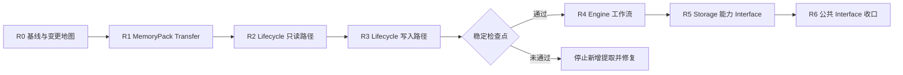

# E.R.I.I. 结构重构总控路线图

> 状态：R1B 已完成，R2 待启动
>
> 基线日期：2026-08-12（R0），2026-08-17（R1B 收口）（R0），2026-08-17（R1B 收口）
>
> 基线提交：`94a61d5c1b77b5aa8871521aa53b0dba58dedf38`
>
> 当前源码：`0.5.0a3` Alpha
>
> 维护方式：按可独立停止的批次执行，不设一次性“大重构”分支

## 1. 决策摘要

E.R.I.I. 从 2026-08-13 起进入一个受控的结构重构窗口。重构的直接目标是降低
`ERIIEngine`、数据生命周期和 Storage 实现的维护耦合，同时保持所有公开行为、导入路径、
持久格式和离线验证不变。

重构不是重写。`ERIIEngine` 继续作为兼容 Facade；`from erii import ERIIEngine`、现有
Lifecycle Interface、REST `/api/v1`、TypeScript 合同、FileStorage、SQLite、MemoryPack、
Backup 和历史 reader 都必须继续工作。新的内部 Module 默认放在私有包中，不增加稳定公共
Interface。

执行顺序固定为：



在 R3 通过前，不把 Character Deliberation G3、Session Residue、真实 Provider 或新的持久
对象并入 `ERIIEngine`、Storage 或数据生命周期写入路径。Labs 中的纯合同、Fake Adapter、
Shadow/Pilot 工具和真实 Provider Adapter 的独立实验可以并行，但必须保持可拆卸、无格式
变更，并单独通过其合同测试。

## 2. 为什么现在重构

当前主线已经具备足够稳定的行为基线：

- v0.4 角色连续性、关系隔离、Turn、归档、召回和数据携带能力已经完成源码收口；
- v0.5.0a3 的 Python、REST、TypeScript、格式身份和安装路径由 CI 与冻结快照保护；
- Character Deliberation 已经有独立合同和 G2 Private Compact 接缝，尚未开始 G3 与持久化；
- `main` 在基线提交上的 GitHub CI 已通过；
- 当前没有必须先合入 `ERIIEngine` 或 Lifecycle 的紧急产品功能。

如果继续直接增加 G3、Session Residue、更多 Provider、REST 和 SDK 能力，现有复杂度会被
复制到更多调用方。相反，现在提取内部深 Module，可以让后续能力接入一个更小、更明确的
Interface。

## 3. 当前结构基线

以下数字只用于定位风险，不作为“按行数拆文件”的目标：

| 路径 | 当前规模 | Interface/维护风险 |
| --- | ---: | --- |
| `erii/engine.py` | 5719 行，106 个方法，72 个公开方法 | 多个领域工作流共享同一实现和状态 |
| `erii/__init__.py` | 330 个根级导出 | 稳定、兼容、实验和内部符号不易区分 |
| `erii/data_lifecycle.py` | 4280 行 | 合同、Codec、检查、计划和执行集中 |
| `erii/lifecycle_erasure.py` | 2826 行 | 擦除语义已独立，但仍有大量格式分支 |
| `erii/storage/base.py` | 57 个 Adapter 方法 | 调用方通过 `NotImplementedError` 探测能力 |
| `erii/storage/sqlite_storage.py` | 4216 行 | 数据访问、格式兼容和领域操作集中 |
| `erii/storage/file_storage.py` | 2608 行 | 与 SQLite 等价行为的维护成本较高 |

基线测试中有 115 个 Python 测试文件，其中约 50 个直接引用 `ERIIEngine`，19 个以
Lifecycle 为主要测试范围。根级 Python Interface、REST、数据格式和 SQLite schema 已有
冻结快照。因此最安全的迁移方式是保留原 Interface，在其后逐段替换 Implementation。

## 4. 重构原则

### 4.1 以深 Module 为目标

每次提取必须让调用方需要理解的规则更少，而不只是让源文件变短。一个合格的内部 Module
需要满足：

1. 有一个明确 Interface，包含输入、输出、不变量、错误和操作顺序；
2. 将多处分散的验证、兼容和失败处理集中在 Implementation 内；
3. 调用方不需要了解其内部格式分支和 Storage 差异；
4. 测试通过同一个 Interface 验证可观察结果；
5. 删除该 Module 时，复杂度会重新扩散到多个调用方，而不是直接消失。

### 4.2 保持兼容 Facade

重构期间以下 Interface 不改变：

- `from erii import ...` 的已冻结公开符号；
- `from erii.engine import ERIIEngine`；
- `ERIIEngine` 的公开方法签名、返回值、异常和顺序约束；
- `erii.data_lifecycle` 及现有 `erii.lifecycle_*` 导入路径；
- `/api/v1` OpenAPI；
- TypeScript SDK 已有方法与服务合同；
- 当前可读写的 FileStorage、SQLite、MemoryPack、Backup 和 Lifecycle Plan 格式。

内部 Module 使用 `erii/_engine/` 和 `erii/_lifecycle/` 之类的私有路径。不能同时保留
`erii/engine.py` 又创建 `erii/engine/` 目录；Python 模块名会冲突。专项计划使用私有包，
旧计划中“文件与同名目录并存”的结构不再采用。

### 4.3 一个批次只做一种变化

同一批次不得同时进行：

- 代码移动和领域行为修改；
- 内部提取和公共 Interface 新增；
- Storage 重构和格式升级；
- Lifecycle 重构和新擦除范围；
- Engine 重构和 Character Deliberation 产品晋级；
- 大量弃用删除和模块迁移。

先以原行为建立特征测试，再移动或提取，再删除被替代的旧 Implementation。旧测试只有在新
Interface 测试覆盖同一可观察行为后才能删除，不能长期叠加两套实现级测试。

### 4.4 不用行数定义完成

“每个文件少于 1000 行”可以是导航结果，但不是成功条件。完成由以下事实决定：

- Facade 的职责只剩组合、兼容和工作流入口；
- 格式/来源/冲突规则只在一个 Module 中实现；
- FileStorage 与 SQLite 通过相同能力 Interface 验证；
- 新功能不需要修改多个无关模块才能接入；
- 测试只依赖可观察 Interface，不依赖私有调用顺序。

## 5. 具体日历

日期是当前维护计划，不是发布 SLA。若某批次未通过退出门，该批次顺延，后续高风险批次
不得按原日期强行开始。

| 批次 | 计划日期 | 主要工作 | 到期结果 |
| --- | --- | --- | --- |
| R0 | 2026-08-13 至 2026-08-16 | 冻结基线、组件清单、调用图、变更规则 | 可重复基线和首批提取清单 |
| R1A | 2026-08-17 至 2026-08-30 | 提取 MemoryPack 导入的纯验证、规范化和冲突分析 | 无写入的 `MemoryPackTransfer` 内核 |
| R1B | 2026-08-31 至 2026-09-13 | 提取导出、导入计划和执行编排，Facade 委托 | `ERIIEngine` 导入导出行为不变 |
| R2 | 2026-09-14 至 2026-09-27 | 提取 Lifecycle 合同 Codec、Inspection 和 Plan 只读路径 | `inspect/plan` 由内部 Module 承担 |
| R3A | 2026-09-28 至 2026-10-11 | 收敛 Backup/Restore、MemoryPack Import、SQLite Upgrade 调度 | 写入操作有统一执行与验证语义 |
| R3B | 2026-10-12 至 2026-10-25 | 收敛 Erasure/Rebuild、Coordinator 和旧导入路径 | Lifecycle Facade 与格式兼容检查点 |
| 检查点 | 2026-10-26 至 2026-11-01 | 完整 CI、双 Storage、历史格式、Windows、性能对照 | 决定是否进入 R4 |
| R4A | 2026-11-02 至 2026-11-15 | 提取 Turn/Archival 工作流 | Turn 状态机和迟到/并发语义集中 |
| R4B | 2026-11-16 至 2026-11-29 | 提取 Relationship/Persona/Temporal 工作流 | Engine Facade 显著收窄 |
| R5 | 2026-11-30 至 2026-12-13 | 建立内部 Storage 能力 Interface 并迁移调用方 | 减少可选方法探测和宽基类依赖 |
| R6 | 2026-12-14 至 2026-12-20 | 清理重复 Implementation、整理公共符号分类和文档 | 重构收口报告及下一阶段建议 |

### 5.1 R0：准备周（2026-08-13 提前完成）

R0 不移动生产代码。必须完成：

- 记录 full commit SHA、Python/Node 版本和全套验证结果；
- 生成 Module 清单：轨道、成熟度、公开性、持久化影响、CI 覆盖、最近变更、下一门禁；
- 列出 `ERIIEngine.import_memory()`、`export_memory()` 和 Lifecycle 的直接/间接调用方；
- 标记哪些测试是 Interface 测试，哪些测试越过 Interface；
- 记录关键性能基线：MemoryPack 导入导出、Lifecycle inspect/plan/execute、双 Storage；
- 冻结 R1 不允许改变的异常、报告字段、幂等和原子性语义。

R0 退出门：任何维护者能够从清单中判断一个 Module 属于 Core、Adapter、Labs、Experiment
还是 Client，并知道它当前能否进入生产路径。

R0 的版本化证据入口：

- [项目状态看板](../PROJECT_STATUS.md)及其唯一状态源 `docs/project-status.json`；
- [R0 调用与结构清单](refactoring-r0-inventory.md)，由 Git 已跟踪和未忽略的提交候选
  Python 源码生成；
- `benchmarks/baselines/v0.5.0a3-refactoring-r0.json`，记录双 Storage 的 MemoryPack 和
  Lifecycle 本地性能基线；
- `scripts/project_status.py --check` 与 `scripts/refactoring_inventory.py --check`，在 CI
  中拒绝状态和结构清单漂移。

R0 的本地退出证据：根测试 `965 passed, 5 skipped, 96 warnings, 493 subtests passed`；
DeepSeek 离线测试 `45 passed`；TypeScript lint/build、10 个 Jest 测试和 live FastAPI 合同
通过；包构建和双 Storage longitudinal 通过。默认 pytest 临时根受旧 ACL 产物影响，重跑时
使用 `.scratch` 下新建的 `--basetemp`；两个 Git-ignored 真实 API 草稿不属于 clean checkout
或 CI，按仓库既有规则显式忽略。

### 5.2 R1：MemoryPack Transfer

R1 是 Engine 的第一纵切，因为当前导入导出和冲突验证占据 `engine.py` 最大的连续复杂度，
又有较强测试基础。先提取纯验证，再提取执行；锁、事务和历史提交顺序不能在第一步重写。

2026-08-13 已开始 R1A：新增私有无写入 `MemoryPackAnalysis` Interface，已接管节点可持久化、
Temporal 图、Turn、Persona Growth、Relationship Consequence 验证及 exact-restore 派生事实。
Engine 和 Lifecycle upgrade 共用其基础分析 Implementation；Storage 冲突、锁、remap 与执行尚未
移动。persisted-Turn adjudication 的 Source Turn、evidence 与 quarantine 闭包也已迁入私有
分析 Interface，target exact-restore 仍留在 Engine。relationship processing 的包内 Turn、event、
adjudication、reflection decision 和 direct-event journal 索引/闭包也已迁入该 Interface，并返回
只读分析结果。processing run 的 frozen candidate/baseline 纯 replay、journal attachment 与 reflection
outcome 闭包也已迁入；target Storage prefix/conflict 检查仍留在 Engine 并继续先于 replay 执行。
reflection identity、evidence、Manifest/Growth 和 provenance 闭包也已迁入两阶段只读 Interface，
由 Engine 显式传入合并后的 adjudication 上下文，不读取 Storage。archival evidence 继续由既有
Core Module 直接复用。R1A 已于 2026-08-13 完成；R1B 已冻结绑定 source、relationship target、完整
first-write conflict read set、deterministic ID remap、有序 payload batches 与零写入 export assembly。
Engine 继续独占 target conflict enforcement、锁、事务、causal history commit、write order 与真实 writes。
下一门禁冻结 transfer execution seam 合同并验证 parity、失败原子性和 stale 目标；在各自合同冻结前不提前移动上述执行职责。

R1 退出门：

- 原 `ERIIEngine.export_memory()` / `import_memory()` Interface 完全不变；
- 所有当前 MemoryPack、跨 Storage、冲突、擦除、历史兼容测试通过；
- 导入失败时目标 Storage 的可观察状态与基线一致；
- ID remap、来源、relationship 隔离和指纹验证只有一个权威 Implementation；
- 性能没有超过第 8 节的退化阈值；
- `git diff` 不包含格式版本、公开符号或 OpenAPI 变化。

### 5.3 R2 和 R3：Lifecycle

R2 只移动无副作用的合同、Codec、Inspection 与 Planning。R3 才处理 Backup/Restore、升级、
导入、擦除和重建。读取和写入分开可以在风险出现时停在 R2，而不留下半迁移的写入路径。

R3 退出门：

- `DataLifecycleCoordinator.inspect/plan/execute` 保持现有 Interface；
- Lifecycle Plan v1 至当前 reader、Backup、MemoryPack 和 SQLite 历史路径全部通过；
- 每种写入先验证、再发布，失败时没有部分目标；
- FileStorage 与 SQLite 的报告、幂等和冲突语义等价；
- 现有 `erii.lifecycle_*` 路径仍可导入；
- 删除 `erii/_lifecycle/` 会让生命周期复杂度重新回到 Facade，而不是散到调用方。

### 5.4 R4：Engine 工作流

只有 2026-10-26 检查点通过后才进入 R4。提取顺序按状态耦合和后续开发压力确定：

1. Turn 与 Archival；
2. Relationship Processing 与 Consequence；
3. Persona 与 Temporal；
4. Recall 仅在前三项证明相同模式可行后再决定是否提取。

不预先创建十个空 Module，也不把所有方法改成 Mixin。每个工作流通过组合获得依赖，返回
结果，由 `ERIIEngine` Facade 保留兼容方法。

### 5.5 R5：Storage 能力 Interface

FileStorage 和 SQLite 是两个真实 Adapter，因此 Storage seam 有实际价值。R5 不增加第三套
Storage，而是在内部按调用需求定义较小能力集合，例如 Turn、Relationship、Recall、
MemoryPack 和 Lifecycle 能力。它们首先是私有 Protocol，不成为根级公开符号。

R5 不能为了类型整洁改变持久格式，也不能要求每个 Adapter 实现不相关能力。可选能力需要
显式声明，不再由业务调用方捕获 `NotImplementedError` 猜测。

## 6. 并行开发安排

### 6.1 可以并行

- 修复有明确回归测试的 P0/P1 缺陷；
- 文档、组件状态清单和只读诊断工具；
- Labs 内部的合成场景、盲测、指标、人评流程；
- Provider Adapter 的独立合同与离线 fixture；
- 不修改 Engine、Storage、Lifecycle 或持久格式的 TypeScript 文档和客户端修复；
- 0.4.x 的安全与兼容维护，前提是改动与当前批次不重叠。

### 6.2 暂停或排队

从 2026-08-13 到 R3 检查点通过前，以下工作只允许设计或 Labs 原型，不进入主运行链：

- Character Deliberation G3 Staged/Adaptive 的 Engine 集成；
- Session Residue 或其他新持久对象；
- 新的 MemoryPack、Backup、FileStorage 或 SQLite 格式；
- 新 Lifecycle 操作和擦除范围；
- 新的根级公开符号；
- 公开 REST/TypeScript 心理状态 Interface；
- 为“插件化”而新增尚无第二个 Adapter 的 seam。

### 6.3 恢复功能开发的时间

最早在 2026-11-02 恢复会修改 Engine/Lifecycle 写入链的大型功能开发，前提是 R1 至 R3
全部通过。届时优先允许 G3 使用已提取的 Turn/Reply 接缝做集成设计；真正合入 Engine 主链
仍需等 R4A 的 Turn/Archival 工作流稳定。

真实 Claude/其他 Provider Adapter 可以在重构期间作为独立实验继续开发，但在至少两个
行为不同的真实 Adapter 通过同一合同、Pilot 有人类锚点、并且出站/凭据门禁明确之前，不能
冻结为 Core Interface。

## 7. 每批执行流程

每个批次使用同一流程：

1. **定义 Interface**：写清输入、输出、不变量、失败、幂等、并发和性能要求；
2. **补特征测试**：只覆盖基线尚未锁定的可观察行为；
3. **提取纯逻辑**：优先移动 in-process 验证和规范化；
4. **注入依赖**：Storage、时钟、锁和外部 Adapter 由组合根提供；
5. **Facade 委托**：旧方法只转发，不复制规则；
6. **替换测试**：新 Interface 测试稳定后删除重复的旧实现级测试；
7. **完整验证**：运行第 8 节命令和 GitHub CI；
8. **独立提交**：一次提交只完成一个可回滚提取，不混入功能或文档清理。

重构分支使用 `codex/refactor-<batch>-<topic>` 或等价短期分支。分支应在一个批次内合并，
不保留跨月的大分支。多个 Agent/工具同时工作时，同一时刻只能有一个任务修改
`engine.py`、`data_lifecycle.py` 或同一个 Storage Adapter。

## 8. 验证门禁

每个生产代码批次至少执行：

```powershell
python -m ruff check erii tests examples benchmarks scripts `
  clients/typescript/scripts experiments/deepseek-continuity-review
python -m compileall -q erii tests examples benchmarks scripts `
  clients/typescript/scripts experiments/deepseek-continuity-review
python -m pytest -q tests
python -m pytest -q experiments/deepseek-continuity-review/tests
python scripts/check_docs.py
python scripts/freeze_contracts.py --check
python scripts/check_secrets.py
git diff --check
```

修改 REST 或 TypeScript 接缝时还必须执行：

```powershell
Push-Location clients/typescript
npm ci
npm run lint
npm run build
npm test -- --coverage
Pop-Location
python clients/typescript/scripts/verify_server_contract.py
```

修改 Storage、MemoryPack 或 Lifecycle 时还必须：

- 在 FileStorage 与 SQLite 上运行相同合同测试；
- 验证当前和所有 declared-readable 合成历史 fixture；
- 验证失败注入、重复执行、并发 fencing、备份恢复和擦除后重建；
- 在 Windows smoke 覆盖文件占用、路径和原子发布行为；
- 对比重构前后的 MemoryPack 导入导出和 Lifecycle 基准。

默认性能门：同一环境、同一 fixture、至少 5 次取中位数，单项中位时间或峰值内存退化超过
10% 时暂停合入并解释原因。若基线抖动超过 5%，先改善基准，不用不稳定数字阻塞或放行。

## 9. 停止和回滚条件

出现以下任一情况，当前批次停止，不进入下一批：

- 公开 Python、REST、TypeScript 或数据格式快照发生非预期变化；
- FileStorage 与 SQLite 出现行为分歧；
- 导入、升级、恢复、擦除出现部分提交或不可重复结果；
- 需要同时维护新旧两套业务规则才能保持测试通过；
- 新 Module 的 Interface 与原 Implementation 一样宽，只是增加转发层；
- 出现循环导入，需要通过动态 import 或全局状态绕过；
- 完整 CI 有 flaky 或无法解释的失败；
- 性能退化超过门限且没有明确、被接受的交换；
- 合并冲突表明并行功能仍在持续改写同一区域。

回滚以批次提交为单位。不得使用历史兼容 reader、格式升级或双写来掩盖一个仅为代码组织
服务的失败重构。若一个提取不能在保持原行为的前提下完成，恢复原 Implementation，记录
阻塞关系，再重新设计 Interface。

## 10. 完成定义

本计划完成不意味着 1.0，也不意味着所有大文件必须消失。2026 年重构窗口在以下条件满足
时收口：

- `ERIIEngine` 是兼容 Facade 和组合根，不再拥有 MemoryPack/Lifecycle 的详细规则；
- MemoryPack Transfer、Lifecycle 和至少两个 Engine 工作流形成内部深 Module；
- Storage 调用方只依赖需要的能力 Interface；
- 根级符号有 stable、compatibility、experimental、internal、deprecated 分类；
- 所有旧导入路径、当前格式和历史 reader 继续工作；
- 全套 CI、合同快照、双 Storage、Windows、安装和性能门通过；
- 后续 G3、Session Residue 或 Provider 集成能指出明确接缝，不再向巨型文件继续堆叠；
- 维护者可以从组件清单判断项目进度，不依赖聊天交接或提交记忆。

若截至 2026-12-20 只完成 R1 至 R3，但上述路径已经显著收敛，也应先结束当前重构窗口，
恢复功能开发并重新评估 R4 至 R6；不能为了按日历完成而扩大风险。

## 11. 专项计划

- [Engine 重构计划](engine-refactoring-plan.md)
- [Lifecycle 重构计划](lifecycle-refactoring-plan.md)
- [Character Deliberation 开发计划](character-deliberation-development-plan.md)
- [项目路线图](../../ROADMAP.md)
