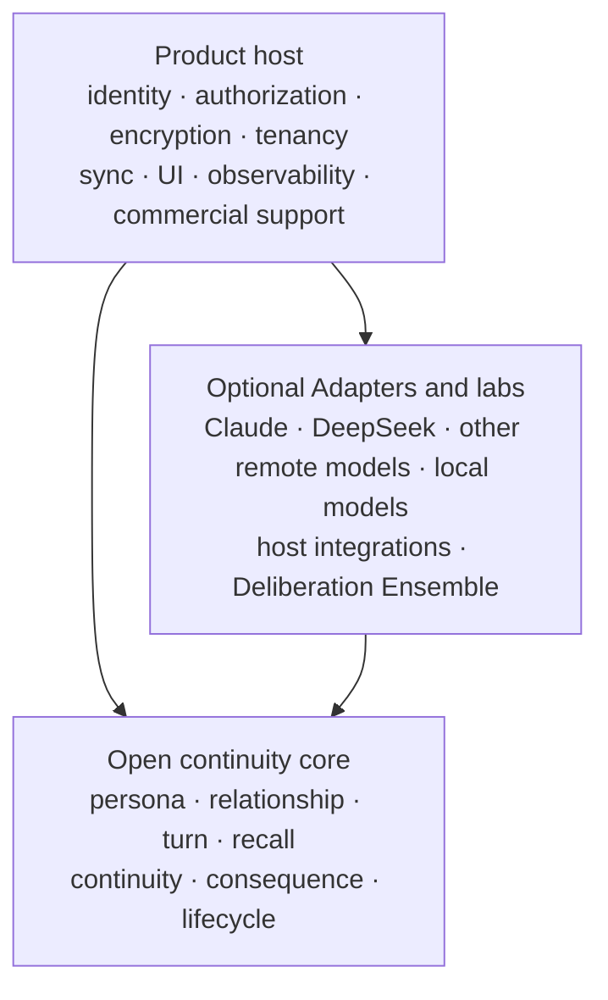

# E.R.I.I. Development Strategy

**English** · [简体中文](development-strategy.md)

> Status: project direction, not a release-date promise or an SLA
> Last reviewed: 2026-08-11

This document explains how E.R.I.I. should grow, what it should deliberately
avoid, and what evidence is required before an experiment becomes part of the
durable kernel. It complements the version-level work in
[`ROADMAP.md`](../ROADMAP.md); it does not rewrite released history,
compatibility policy, or accepted ADRs. `0.x` versions are source-development
milestones; the project plans to establish formal package distribution at
`1.0`, not for every intermediate milestone.

## 1. North Star: causal character continuity

E.R.I.I.'s North Star is **causal character continuity**:

> A character starts from an established Character Blueprint and formative
> experiences, continues living independently in each `Agent × User`
> relationship, and may grow through real experiences, while every important
> change remains psychologically and historically explainable.

This is more specific than "long-term memory" or "RAG." Similarity retrieval
can find related text. E.R.I.I. must additionally decide:

- which relationship an experience belongs to;
- whether the character is allowed to know or believe it;
- which durable evidence supports the current relationship state;
- whether a reply is continuous with the character's personality, knowledge,
  history, and relationship;
- whether a later change has enough causal support to become authoritative;
- whether that causal chain survives export, restart, migration, correction,
  erasure, and rebuild.

The desired character is not always agreeable. Kindness is not automatically
correct, and anger, refusal, distance, or a painful choice is not automatically
out of character. The kernel should preserve the consequences of a
character-consistent choice and make later response, repair, refusal of repair,
or separation possible without rewriting the original history.

### North Star invariants

New work must preserve all of the following:

1. Character Blueprint source text remains available and is not silently
   replaced by a generated interpretation.
2. Memory, relationship state, and intimacy remain scoped to one
   `Agent × User` relationship.
3. A visible Source Transcript proves what was said, but does not automatically
   become authoritative memory, knowledge, relationship change, or personality
   change.
4. Ordinary relationship state may change gradually; core-personality changes
   and large jumps require reviewable proposals.
5. Continuity review is emotionally neutral.
6. Models propose; deterministic identity, scope, provenance, state-transition,
   and approval rules remain kernel decisions.
7. Delivered replies remain part of history even when they were mistaken or
   out of character.
8. Background processing is explicitly controlled by the host.
9. Data format changes have explicit versions and migration paths.
10. Core memory and user-data portability remain open.

## 2. Who the project is for

### Primary users

The initial audience is technical users who already feel the cost of character
drift:

- independent developers of AI companions and character-chat applications;
- maintainers of long-running original or self-hosted character Agents;
- interactive-fiction, virtual-character, and narrative-game developers;
- host authors dealing with cross-user leakage, unjustified intimacy jumps,
  forgotten promises, contradictory beliefs, or recurring OOC replies;
- researchers evaluating relationship-scoped memory and character continuity
  with synthetic or consented data.

The adoption path should optimize for a developer who can integrate a Python
library but should not need to understand the entire domain model before seeing
the first useful result.

### Deliberate non-users, for now

E.R.I.I. is not currently trying to be:

- a generic enterprise RAG platform;
- a universal Agent framework or workflow engine;
- a turnkey consumer chat application;
- a public multi-tenant SaaS;
- an enterprise support product with uptime or response-time guarantees;
- a marketplace of copyrighted third-party character definitions;
- a reason to replace a host, model, storage system, or deployment that already
  works.

These are not statements that such products can never exist. They define what
the open kernel and its sole maintainer should not be required to support now.

## 3. Three-layer architecture

E.R.I.I. should develop as three layers with different stability and support
expectations.



### Layer 1: open continuity core

The open core owns stable domain meaning and durable data:

- Character Blueprint, Persona, relationship identity, and isolation;
- Source Turn and exact delivered transcript;
- provenance-aware memory and structured Recall;
- relationship events, current projections, open matters, and promises;
- continuity review and relationship consequences;
- storage, MemoryPack, backup, migration, erasure, rebuild, and compatibility.

The core should expose deep Modules: a small Interface should hide substantial
validation, provenance, lifecycle, and failure-handling implementation. This
creates Leverage for host authors and Locality for maintainers.

### Layer 2: optional Adapters and labs

This layer contains things that may vary or be removed:

- Model Provider Adapters, including optional Claude and DeepSeek Adapters;
- local-model and other remote-provider Adapters;
- KouriChat and other host integrations;
- Shadow evaluations and experimental character-deliberation implementations;
- a future Provider-neutral Deliberation Ensemble.

An Adapter sits at an explicit Seam and must not redefine durable core meaning.
Provider packages are installed and injected by the host. Removing one must not
make ordinary Turn, Recall, Continuity, MemoryPack, export, or erasure unusable.
A public Provider Interface should be frozen only after at least two real
Adapters prove that the Seam represents actual variation.

### Layer 3: product host

A formal product or hosted offering owns concerns that the kernel cannot safely
pretend to solve:

- user identity, authentication, and object-level authorization;
- encryption, key management, tenant isolation, quotas, and abuse controls;
- remote retention, backup disposition, and deletion orchestration;
- user-facing inspection, correction, export, migration, and deletion;
- model routing, product analytics, incident response, support, and SLA.

The long-term commercial opportunity is reliable hosting, safety, operations,
and product experience—not locking the core memory format or the user's data.

## 4. Two development tracks

Kernel evolution and model/integration research move at different speeds and
must not block or destabilize each other.

### Track A: kernel evolution and adoption

This track has compatibility obligations without requiring a package release
for each `0.x` milestone. Its current sequence is:

```text
0.4.0b1
  → 0.4.0rc1
  → 0.4.0 / 0.4.x
  → v0.5 consequence vertical slice
  → v0.6 secure product host
  → v0.7 user ownership experience
```

Track A accepts work only when its storage meaning, migration behavior,
authority model, failure behavior, documentation, and long-term tests are
understood.

### Track B: labs and integrations

This track may move quickly and be deleted:

- Claude, DeepSeek, and other Provider Adapter/Shadow comparisons;
- provider and local-model experiments;
- host integration examples;
- offline or selectively triggered multi-model review;
- evaluation fixtures, blind comparisons, and latency/cost measurements.

Track B must not silently change persistent formats or public core contracts.
An experiment graduates only when it demonstrates a repeatable improvement,
has a Provider-neutral domain meaning, and can meet Track A's lifecycle and
support requirements.

This separation allows the project to learn from inexpensive or unusually
capable models without making one Provider part of E.R.I.I.'s identity.

## 5. Current implementation and planned work

The distinction in this section is normative: **current** means present in the
`0.5.0a3` source tree; **planned** means it must not be advertised as already
implemented.

### Current in `0.5.0a3`

The current source is an active Alpha milestone. It includes the stable v0.4
continuity/data-lifecycle foundation plus:

- stable, independent relationship, persona, and identity IDs;
- preserved Character Blueprint source plus reviewable Persona Compilation;
- complete visible Source Turn transcripts and explicit Turn lifecycle;
- provenance-aware archival and Ordinary, Legacy Context, and Quarantined
  recall authority;
- append-only relationship events and rebuildable current projections;
- promises, conditions, open loops, Episodes, and Relationship Chapters;
- Persona Reflection and approval-gated Persona Growth Proposals;
- multi-axis Continuity Review, Delivery Exception, Context Baseline, and
  Contextual Voice handling;
- FileStorage, SQLiteStorage, structured Recall, MemoryPack, and a reference
  REST host;
- versioned backup, restore, upgrade, import, erasure, rebuild, bounded I/O,
  compatibility snapshots, and long-horizon regression scenarios;
- the v0.5 Relationship Consequence and Narrative Tension vertical slice,
  including later relationship-scoped recall and result projection;
- `0.5.0a3` source-identity, SDK, Turn-documentation, performance, and isolation
  stabilization work.

The current reference host is designed for a trusted local owner. It is not a
complete public multi-user security system.

### Accepted design and work not yet implemented

The following remain planned or experimental:

- a first-class Character Deliberation Module;
- a Claude, DeepSeek, or other runtime character-deliberation Adapter;
- a Deliberation Ensemble or general multi-model orchestration;
- per-user identity, authorization, encrypted storage, and multi-tenant
  isolation;
- a user-facing interface for inspecting, correcting, exporting, and deleting
  relationship data;
- a product SLA.

> **Character Deliberation status: Experimental; the offline C0 contract slice
> is implemented, while product integration has not started.** The implementation remains in removable Python Labs:
> Compact is the main path and Staged is an evidence-driven auxiliary path.
> Session Residue, independent Private Reflection, durable state,
> Visibility/Exposure, REST/TypeScript, and a Deliberation Ensemble each have
> separate behavior, security, lifecycle, and removability admission gates.

See the [complete development plan](architecture/character-deliberation-development-plan.md),
the [removable Claude Adapter guide](integrations/character-deliberation-claude.md), and
[ADR-0120](adr/0120-keep-character-deliberation-transient-layered-and-host-owned.md).

### Source and published state

As of this review, `0.4.0` identifies the stable maintenance line and
`0.5.0a3` identifies the active Alpha source milestone. The
accepted b1 baseline is
`f6dca322379c4ea88320c69d752cab471d035e95`, and the rc1 source-closure evidence
is `58ea8e69df28bec8e755e0a0d2a175679c18a694`. The latest immutable historical
Alpha tag/package cited by the repository is `v0.5.0a2`; `0.5.0a3` remains a
source milestone. The project does not plan to publish every later `0.x`
source milestone. Reproducible integrations should pin a reviewed full commit
SHA until the formal `1.0` release line exists.
This decision is recorded in
[ADR-0119](adr/0119-defer-formal-package-distribution-until-v1.md).

## 6. Version path and exit criteria

### `0.4.0b1`: accepted source baseline

The accepted checkpoint is fixed at commit
`f6dca322379c4ea88320c69d752cab471d035e95`. Its evidence applies to the complete
Linux gates and targeted Windows paths actually named by that baseline
workflow; it does not imply validation on every platform.

It preserves the accepted documentation and architecture decisions, exact
package/schema/format identities, source installation, build smoke, contract,
and longitudinal evidence. RC work starts from that immutable source state.

### `0.4.0rc1`: accepted source closure and first adoption

The existing `rc1` name is retained as a source-closure checkpoint; it did not
produce an uploaded Release Candidate package. Its evidence is fixed at commit
`58ea8e69df28bec8e755e0a0d2a175679c18a694`.

RC1 did not add new relationship dimensions, memory kinds, personality-change
channels, consequence semantics, or durable deliberation data.

Its completed work is:

- correctness, compatibility, recoverability, and performance fixes;
- stable CI across the explicitly declared Python/platform matrix, without
  extending claims to combinations the workflow does not run;
- clean source installation, local build, and reference-host verification;
- a clear supported public Interface and explicitly advanced/internal surface;
- documentation, migration, recovery, and source-state audits;
- a one-command Golden Continuity Demo;
- a documented canonical host-integration path.

The Golden Continuity Demo shows, without private or copyrighted data:

1. User A and an original synthetic character experience the first snow
   together.
2. User B cannot recall or inherit that experience or intimacy.
3. User A's relationship survives a process restart.
4. Recall explains the relationship scope and source.
5. The relationship can be exported as a MemoryPack and inspected without
   carrying User B data.

The target is for an unfamiliar developer to install the project and see the
relationship-isolation result in no more than ten minutes.

### `0.4.0` and `0.4.x`: stable maintenance line

`0.4.0` completes the final source identity, contract snapshots, and the Golden
Demo export/fresh-import round trip. The stable source line maintains data
readability, migration, recovery,
regression coverage, and open export. `0.4.x` source identifiers describe
defect, security, and compatibility work; they are not a promise that a package
has been distributed and do not silently change persona, relationship, or
authority semantics.

### `0.5.0a1` through `0.5.0a3`: consequence and stabilization

`0.5.0a1` established the Relationship Consequence and Narrative Tension
vertical slice. `0.5.0a2` added credential, logging, error, and lifecycle
compatibility work; `0.5.0a3` is the active source-stabilization milestone.
These are Alpha source milestones, not a production SLA.

### `v0.5`: consequence vertical slice and deliberation Labs gate

The first v0.5 slice has established this complete path; the active source now
stabilizes its contracts and integrations:

```text
exact delivered reply
  → continuity evidence for a character-consistent choice
  → Relationship Consequence
  → unresolved Narrative Tension
  → later relationship-scoped Recall
  → later response, repair, refusal, stable boundary, or relationship ending
```

It must support a character making a coherent but painful choice without
classifying discomfort as OOC or forcing agreement. It must also preserve the
consequence when later participants do not reconcile.

The Provider-neutral Character Deliberation design is accepted. An offline,
removable C0 contract slice now covers a real open Turn snapshot, host commitment,
fake Claude-shaped SSE parsing, strict validation and exact result binding. It is
not wired into ERIIEngine, a real provider, continuity delivery, persistence or a
public API. Only a Shadow experiment and
the applicable lifecycle gates can qualify a persistent meaning for later Core
admission. Claude-, DeepSeek-, or other Provider-specific fields, raw thinking,
full prompts, credentials, and provider error bodies must not become character
history.

### `v0.6`: security hooks and product-host boundary

This phase does not turn the open kernel into a complete SaaS platform.

The core owns Principal/Capability semantics, explicit object scope,
authorization hooks, relationship-isolation contracts, portable encrypted-pack
contracts, outbound-model policy seams, and positive/negative security tests.

A formal product host owns identity and session authentication, TLS, at-rest
encryption, KMS and key rotation, deployed tenant isolation, rate limits,
quotas, abuse controls, billing, operational audit, and verified deletion
across controlled replicas and external stores. Signed or MAC-authenticated
packs and backups must have an explicit owner on this boundary.

FileStorage is not a complete multi-tenant platform. A path ID, hash, or single
owner API key is not a substitute for object authorization, and production
security claims require an independent review.

### `v0.7`: user ownership experience

This phase makes open data rights usable by non-maintainers:

- inspect memories, labels, sources, relationship events, and explanations;
- distinguish source text, summaries, inference, current belief, reflection,
  and approved personality change;
- correct, quarantine, export, migrate, and request deletion;
- expose Legacy and Quarantined labels rather than hiding uncertainty;
- verify backup recovery, device migration, and deletion workflows;
- explain dispositions without exposing raw Provider thinking, prompts, drafts,
  or unapproved private deliberation; validated Projection/Explanation follows
  its own visibility contract.

## 7. Claude, DeepSeek, and Provider-neutral collaboration

Claude may have a dedicated, separately installable and disableable Adapter for
the Character Actor and, only in a later stage, a Reviewer. It is not a Core
dependency, receives no identity/history-write authority, and does not make
Staged deliberation the default. The implementation boundary is defined in the
[Claude Adapter guide](integrations/character-deliberation-claude.md).

DeepSeek may have a dedicated, separately installable, disableable Adapter. It
is not required by E.R.I.I., and users should not redesign an otherwise working
host or deployment merely to use it.

As of **2026-08-03**, the maintainer considers DeepSeek a useful option for
budget-sensitive experiments because of hands-on results with thinking mode and
its then-accessible public pricing. This is a dated recommendation, not a
permanent cost, privacy, availability, or quality promise. Users should check
the current [DeepSeek pricing](https://api-docs.deepseek.com/quick_start/pricing/),
[thinking-mode documentation](https://api-docs.deepseek.com/guides/thinking_mode/),
and [privacy policy](https://cdn.deepseek.com/policies/en-US/deepseek-privacy-policy.html?locale=en_US)
before enabling a remote Adapter.

The future multi-model design is unrelated to any privileged DeepSeek role. A
Provider-neutral Deliberation Ensemble may combine:

- one Character Actor using Claude, DeepSeek, another remote Provider, or a local
  model;
- zero or more Reviewers using any mixture of Providers;
- selective escalation for high-risk continuity decisions instead of
  mandatory multi-model calls on every ordinary Turn.

Reviewers do not vote to define the character and cannot directly write persona,
relationship, memory, or Turn state. The core remains the continuity authority.
The accepted architecture decisions are recorded in
[ADR-0117](adr/0117-keep-character-deliberation-provider-neutral.md) and
[ADR-0120](adr/0120-keep-character-deliberation-transient-layered-and-host-owned.md).

## 8. Adoption targets

Adoption work is not marketing deferred until the kernel is "finished." These
targets are not hard source-milestone gates or an SLA, but the project should
seek this evidence before freezing more durable formats:

- at least five non-author developers can install and run the Golden
  Continuity Demo without maintainer intervention;
- first visible relationship isolation takes no more than ten minutes;
- at least three real host applications complete a minimal integration;
- a normal host integration can be completed in approximately two hours when
  its chat lifecycle already exposes exact delivered messages;
- cross-relationship leakage remains zero in the committed regression suite;
- at least five useful continuity or integration failures are contributed as
  synthetic, reproducible tests rather than private user-data fixtures;
- package metadata, source, docs, examples, and locally built artifacts agree
  on version and current/planned capabilities.

Useful evidence includes setup time, failure modes, export/restart results,
recovery behavior, and relationship-isolation outcomes outside the maintainer's
own host—not only stars, download counts, or benchmark numbers.

## 9. Feature admission and kill criteria

Writing an implementation is not sufficient reason to make it part of the
kernel.

### Admission criteria

A proposed core feature must satisfy all of the following:

1. **North Star relevance:** it improves causal character continuity, data
   ownership, or the reliability required to preserve them.
2. **Observed problem:** it addresses a reproducible failure, not feature-count
   pressure or novelty.
3. **Correct authority:** it identifies which model may propose and which kernel
   rule may validate, persist, reject, quarantine, or rebuild.
4. **Complete vertical slice:** its source, Turn binding, Recall effect,
   lifecycle, export, migration, correction, erasure, and failure behavior are
   specified together.
5. **Deep Module:** its Interface is smaller than the behavior it hides and
   gives callers real Leverage and maintainers Locality.
6. **Real Seam:** at least two implementations or a demonstrated variation
   justify a public Adapter Interface.
7. **Compatibility plan:** persistent or public changes have versions,
   fixtures, migration/reader behavior, and rollback or recovery guidance.
8. **Evaluation evidence:** the improvement survives blind or automated
   comparison without increasing relationship leakage or emotional-value bias.
9. **Support fit:** the sole maintainer can document, test, release, and
   deprecate it honestly.

### Kill or remain-in-labs criteria

An experiment should be deleted, externalized, or kept outside the stable core
when any of these remain true:

- the same result is achievable as a host policy or prompt without changing
  durable domain meaning;
- it introduces Provider-specific fields into character identity or stored
  history;
- removing it only removes pass-through code while complexity reappears in
  callers—the deletion test shows insufficient Depth;
- it needs a large public Interface for one implementation;
- it improves warmth or verbosity but not character continuity;
- a Shadow evaluation shows only small or noisy benefit;
- latency, privacy exposure, cost, or naturalness regression outweighs the
  continuity improvement;
- multi-model orchestration adds calls but does not repair a repeatable
  single-model failure class;
- it creates a support or compatibility obligation the project cannot sustain.

For Character Deliberation experiments, an initial promotion bar should include:

- zero raw thinking, prompt, credential, or provider-error leakage;
- zero persistence of discarded drafts;
- zero cross-relationship leakage;
- a material reduction in severe OOC or unsupported drift (target: at least
  about 15%);
- a material blind-preference gain for character continuity (target: at least
  about 10 percentage points);
- no more than about a 5% loss in ordinary-conversation naturalness;
- an explicit non-deliberation path for ordinary Turns.

The exact thresholds may evolve with the evaluation set, but a two- or
three-point noisy improvement is not enough to create a permanent data contract.

## 10. Solo-maintainer support boundary

E.R.I.I. is intended to be maintained seriously over the long term, but today
it is maintained by one person and carries no SLA.

The practical support order is:

1. prevent data loss, relationship leakage, and invalid authority changes;
2. preserve documented compatibility, migration, export, and recovery paths;
3. maintain the documented Golden Path;
4. fix correctness and security defects;
5. improve adoption documentation and integration diagnostics;
6. evaluate new domain features;
7. maintain optional labs and Provider-specific convenience.

Accordingly:

- the open stable core receives the strongest compatibility and regression
  commitment;
- `0.x` source milestones may still change before stable contracts are frozen;
- optional Adapters and labs are best-effort unless separately documented;
- no response time, model uptime, Provider availability, or hosted-data
  retention is guaranteed;
- unsupported combinations may be declined instead of becoming permanent
  maintenance obligations;
- issue reports should use synthetic or explicitly consented data;
- private character files and copyrighted source material should not be added
  to the repository;
- a future commercial product may define paid support and SLA terms separately
  without reducing open core portability.

The project should prefer fewer, deeper, recoverable capabilities over a broad
surface that a sole maintainer cannot verify.

## 11. Near-term execution status and order

As of the current `0.5.0a3` Alpha source milestone, completed and remaining work
is ordered as follows unless new evidence changes the priority:

1. **Accepted:** preserve the verified `0.4.0b1` source checkpoint at its
   immutable full commit SHA;
2. **Completed:** accept the `0.4.0rc1` public-Interface, adoption, contract,
   build, and documentation closure;
3. **Completed:** deliver the v0.5 Relationship Consequence vertical slice and
   advance it to the `0.5.0a3` stabilization milestone;
4. **Current:** Character Deliberation CD-0 terminology, ADR, strict offline
   contracts, trusted Host Bridge, fake Claude SSE, threat boundaries, and regressions;
5. **Next:** CD-1 Shadow/Pilot comparisons across Direct, Compact, and Staged
   under explicit host orchestration, without persistence or a public API;
6. **Evidence-gated continuation:** CD-2 real Adapters/Shadow, followed by the
   separately admitted psychological-continuity, durable, visibility/API, and
   Ensemble stages;
7. continue external-host adoption and `0.4.x` defect/security/compatibility
   maintenance, with formal package-release commitments reserved for `1.0`.

The full CD-0 through CD-6 dependency and stop conditions live in the
[Roadmap](../ROADMAP.md#character-deliberationc0-与-g2-离线编排已实现产品晋级待开发). Claude, DeepSeek,
other model, and host experiments may proceed independently in Labs; one
promising result never grants a durable compatibility commitment.

This order changes the measure of progress from "how many domain objects were
added" to "can a non-author install, understand, trust, integrate, recover, and
continue a character relationship without violating its causal history?"
